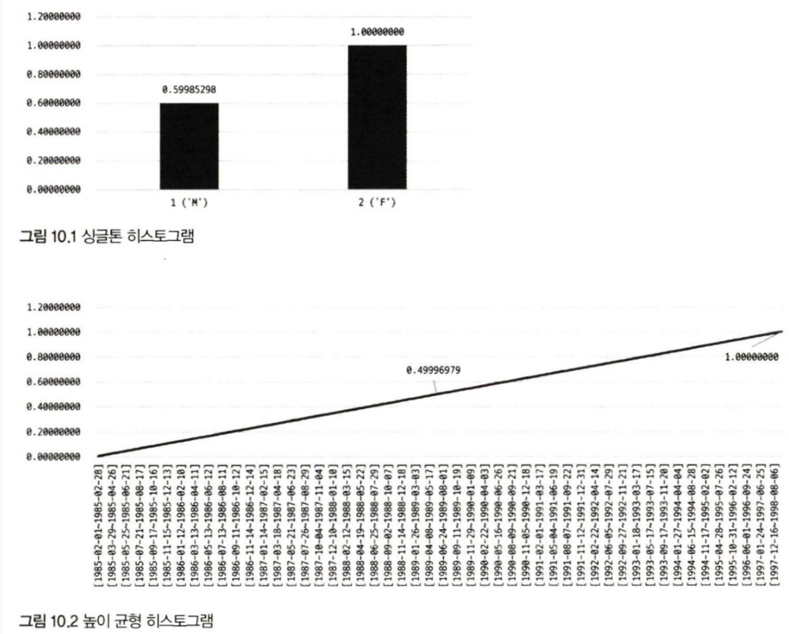
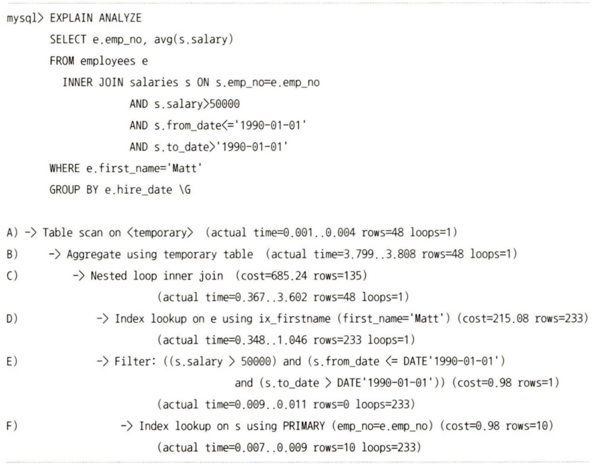
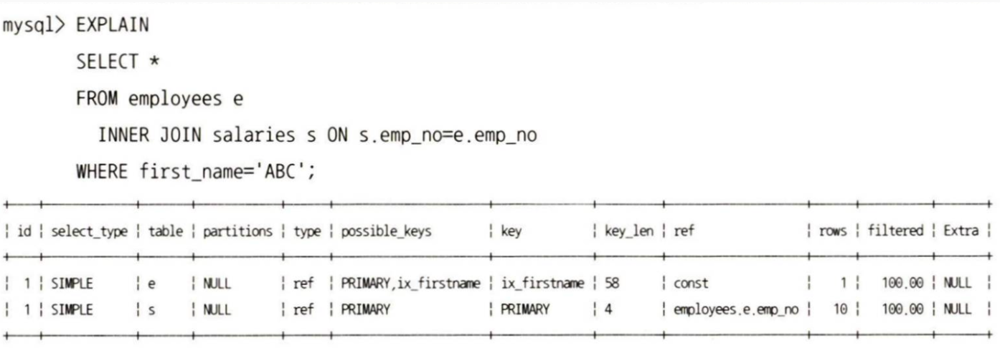
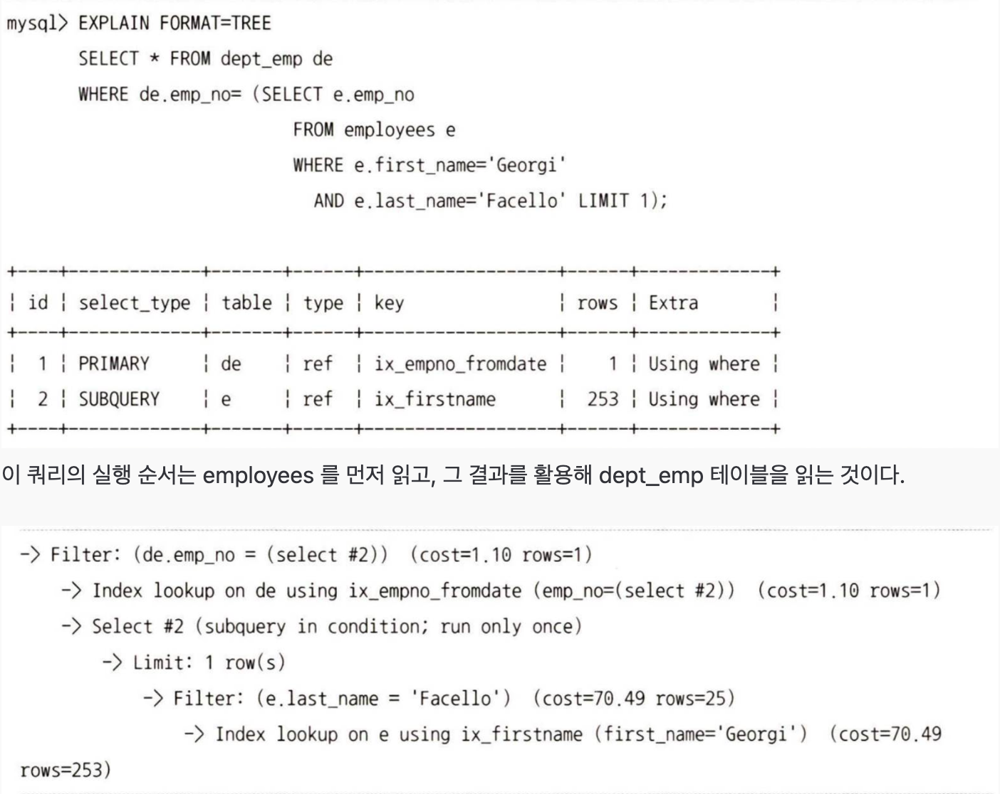
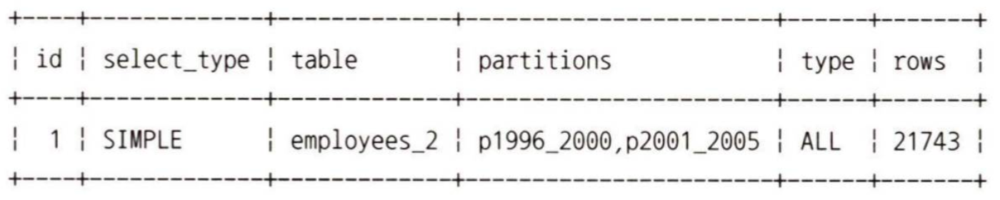
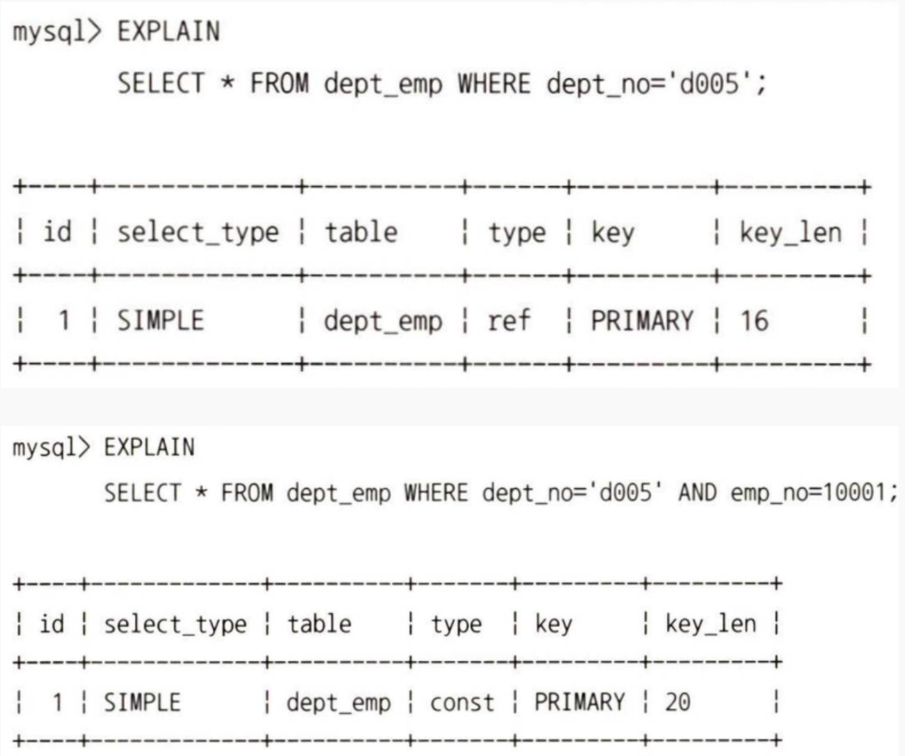

# 10.1. 통계 정보

9장의 옵티마이저에서 배웠던 최적화 방식에서는 이전 DBMS들은 **테이블과 인덱스에 대한 정보 없이 실행 계획을 수립**했었다가, 이후에 테이블과 인덱스에 대한 통계를 수집하게 바뀌었다고 했다. 이때 사용하던게 통계 정보 - 히스토그램 정보 이다.

> 히스토그램은 인덱스되지 않은 컬럼들까지 데이터 분포도를 수집해서 저장한다.

## 10.1.1. 테이블 및 인덱스 통계 정보
비용 기반 최적화에서 가장 중요한 것은 **최신 통계 정보**이다.
예를들어, 1억 건의 레코드가 저장된 테이블의 통계 정보가 10건 미만 이라고 저장되어 있다면, **해당 레코드를 전부 읽는 계획**을 세울 수도 있다.

### 10.1.1.1. MySQL 서버의 통계 정보

mysql 데이터베이스의 `innodb_index_stats` 테이블과 `innodb_tabel_state` 로 관리할 수 있다.
테이블 생성시 `STATS_PERSISTENT` 옵션을 설정해서 테이블 단위로 영구적인 통계 정보를 보관할지 결정할 수 있다.

이렇게 저장되는 통계 정보가, 갱신되는 트리거(사건들)은 다음과 같다.
- 테이블이 새로 오픈되는 경우
- 테이블의 레코드가 대량으로 변경되는 경우
- ANALYZE TABLE 명령이 실행되는 경우
	- 테이블의 **통계 정보**를 분석하고 갱신하는 명령
- SHOW TABLE STATUS 명령이 실행되는 경우
- InnoDB 모니터가 활성화되는 경우

특정 테이블 블록을 샘플링할지 결정하는 옵션도 제공된다.
- `innodb_stats_transient_sample_pages` : 기본값은 8이며, 자동으로 통계 정보 수집이 실행될 때 8개 페이지만 임의로 샘플링해서 분석하고, 그 결과를 통계 정보로 활용함을 의미.
- `innodb_stats_persistent_sample_pages` : 기본값은 20이며, ANALYZE TABLE 명령이 실행되면 임의로 20개 페이지만 샘플링해서 분석하고 그 결과를 연구적인 통계 정보 테이블에 저장하고 활용함을 의미.

## 10.1.2 히스토그램

히스토그램은 **버킷 단위**로 구분되어 레코드 건수나 칼럼값의 범위가 관리된다. 
MySQL에서는 다음 2종류의 히스토그램 타입이 지원되고, 둘 다 만들어진다.

- Singleton(싱글톤 히스토그램) : **칼럼값 개별**로 레코드 건수를 관리하는 히스토그램으로,Value-Based 히스토그램 또는 도수 분포라고도 불린다.
	- 칼럼이 가지는 값별로 버킷이 할당된다.
	- 각 버킷은, 칼럼의 값과 발생 빈도의 비율 총 2개의 값을 가진다.

- Equi-Height(높이 균형 히스토그램) : 칼럼값의 범위를 균등한 갯수로 구분해서 관리하는 히스토그램으로, Height-Balanced 히스토그램이라고도 불린다.
	- 개수가 균등한 칼럼값의 범위별로 하나의 버킷이 할당된다.
	- 범위 시작 값과 마지막 값, 발생 빈도율과 각 버킷에 포함된 유니크 값의 갯수 등 4개의 값을 가진다.


유니크 값의 갯수란? : 해당 범위에서, **실제로 데이터가 존재하는 고유한(중복되지 않는) 값**이 총 몇 개 인지
#### 📊예시
`AGE` (나이) 칼럼에 대해 10개의 Equi-Height 버킷을 만들었다고 가정.

- 테이블의 총 레코드(로우) 수는 10,000건.
    
- Equi-Height(높이 균형)이므로 각 버킷은 약 **1,000건**의 레코드를 담당.
    
- 이 중 **버킷 #3**이 `AGE` 값 **20부터 25까지**의 범위를 담당.
    

이 버킷의 4가지 정보는 다음과 같다.
1. **범위 시작 값:** 20
2. **범위 마지막 값:** 25
3. **발생 빈도율 (레코드 수):** 1,000건
4. **유니크 값의 개수:** ?

이제 이 버킷(#3)에 포함된 1,000개의 레코드를 자세히 분석해 보면
- `AGE` = 20 인 레코드 : 500건
- `AGE` = 22 인 레코드 : 500건
(즉, `AGE`가 21, 23, 24, 25인 레코드는 이 버킷에 하나도 없음)
이 경우, 이 버킷의 값 범위(20~25) 안에 실제로 존재하는 고유한(Unique) 값은 **'20'**과 **'22'** 두개 뿐.

따라서 이 버킷의 **"유니크 값의 개수"는 2**.




싱글톤 히스토그램 : ENUM('M','F') 타입인 gender 컬럼이 가질 수 있는 2개의 값에 대해 누적된 레코드 건수의 비율을 가지고 있음. 그림 10.1 을 보면, 싱글톤 히스토그램은 F 비율을 1로가져가고, M 비율을 0.5998로 가져감.

높이 균형 히스토그램 : 각 범위에 대해 레코드 건수 비율이 **누적**으로 표시됨. 따라서 마지막 범위의 누적은 1.0.
그래프 기울기가 일정하다 -> 각 범위가 비슷한 값(레코드 건수)를 가짐.


### 10.1.2.3 히스토그램과 인덱스

완전히 다른 객체이기 때문에 서로 비교할 대상은 아니지만, MySQL 서버에서 **인덱스는 부족한 통계 정보를 수집하기 위해 사용**된다는 측면에서 어느 정도 공통점을 가진다고 볼 수 있다.

쿼리의 실행 계획을 수립할 때, 사용 가능한 인덱스들로부터 **조건절에 일치하는 레코드 건수를 예측하기 위해** 옵티마이저는 실제 인덱스의 B-Tree를 샘플링해서 살펴봄. 
이 작업을 메뉴얼에서는 "인덱스 다이브" 라고 표현.

쿼리의 검색 조건으로 많이 사용되는 컬럼에 대해서는 일반적으로 **인덱스를 생성**. 그런데 이렇게 인덱스된 칼럼에 대해 **히스토그램 정보를 수집해 두는 것이 좋은지** 고민스러울 수 있음.


```SQL
mysql > SELECT *
		FROM employees
		WHERE first_name = 'Tonny'
			AND birth_date BETWEEN '1954-01-01' AND '1955-01-01';
```

옵티마이저는 테이블 풀 스캔을 할지 first_name 칼럼의 인덱스를 이용할지 고민될 수 있음. birth_date 칼럼에는 인덱스가 없으므로, 이 쿼리에서 **birth_date 칼럼은 실행 계획에 큰 영향을 미치지 않을 것**.

> first_name 칼럼에 히스토그램이 수집돼 있었다면 MySQL 옵티마이저는 **그 히스토그램을 이용할까?**

MySQL에서는 인덱스된 칼럼을 검색 조건으로 사용하는 경우 그 칼럼의 **히스토그램은 사용하지 않고** 실제 인덱스 다이브를 통해 직접 수집한 정보를 활용. 실제 검색 조건의 대상 값에 대한 샘플링을 실행하는 것이므로 **항상 히스토그램보다 정확한 결과를 기대**할 수 있기 때문.
하지만 인덱스 다이브 작업은 **어느 정도 비용이 필요**, 때로는 실행 계획 수립만으로도 **상당한 인덱스 다이브를 실행하고 비용도 그만큼 커짐**.

## 10.1.3 코스트 모델

> 전체 쿼리의 비용을 계산하는데 필요한 **단위 작업들의 비용**을 코스트 모델이라고 한다.

- MySQL 5.7이전까지는 이러한 작업들의 비용을 MySQL 서버 소스 코드에 "상수화해서" 사용했다.
- 5.7부터는, DBMS 관리자가 이 상수값들을 **변수처럼 조정**할 수 있게 개선됐다. 하지만 인덱스되지 않은 칼럼의 데이터 분포나 메모리에 상주 중인 페이지의 비율 등의 정보가 부족한 상태였다.
- 8.0 버전부터 우리가 아는 칼럼 데이터 가져오고...메모리 올라온 페이지 비율 관리...등등이 적용되었다.

코스트 모델은 다음 2개 테이블(server_cost, engine_cost)에 저장된 설정값을 사용한다.

- **server_cost: 인덱스를 찾고 레코드를 비교, 임시 테이블에 처리에 대한 비용 관리**
	- cost_name: 코스트 모델의 각 단위 작업
	- default_value: 각 단위 작업의 비용(기본값이며, 이 값은 MySQL 서버 소스 코드에 설정된 값)
	- cost_value: DBMS 관리자가 설정한 값(이 값이 NULL이면 MySQL 서버는 default_value 칼럼의 비용 사용)
	- last_updated: 단위 작업의 비용이 변경된 시점
	- comment: 비용에 대한 추가 설명
- **engine_cost: 레코드를 가진 데이터 페이지를 가져오는 데 필요한 비용 관리**
	(위 5개 설정값을 똑같이 지니고 추가로 아래 2개의 설정값을 지닌다)
	- engine_name: 비용이 적용된 스토리지 엔진
	- device_type: 디스크 타입


코스트 모델에서 중요한 것은, 각 단위 작업에 설정되는 비용 값이 커지면 어떤 실행 계획들이 고비용/저비용 으로 바뀌는지를 파악하는 것이다.


# 10.2 실행 계획 확인

> DESC, EXPLAIN 명령으로 확인 가능.

## 10.2.2 쿼리의 실행 시간 확인

MySQL 8.0.18 부터는 쿼리 **실행 계획과 단계별 소요 시간 정보**를 확인할 수 있는 `EXPLAIN ANALYZE` 기능이 추가됐다. 물론 `SHOW PROFILE` 명령으로 어떤 부분에서 시간이 많이 소요되는지 확인할 수 있지만, 실행 계획 **단계별로 소요된 시간 정보**를 보여주진 않는다.


순서는 D->F->E->C->B->A 이다. 순서를 정하는 규칙은 다음과 같다.
- 들여쓰기가 같은 레벨에서는 상단 위치 라인 젤 먼저 실행
- 들여쓰기가 다른 레벨에서는 가장 안쪽에 위치한 라인이 먼저 실행

해설)A,B 비교-> B가 안쪽 라인이네? B 실행해야... B와 C 비교 -> C가 안쪽 라인이네? C 실행해야...C와 D 비교->D와 E 비교...같은 레벨이네!? **상단 위치한 D 실행**-> E 실ㅎ..F가 안쪽이네? **내부에 위치한 F 실행**->(중략)

# 10.3 실행 계획 분석



아무런 옵션 없이 EXPLAIN을 한 경우, 쿼리 문장의 특성에 따라 표 형태로 된 1줄 이상의 결과가 표시된다.
실행 계획에 표시되는 각 칼럼이 어떤 것을 의미하는지, 그리고 각 칼럼에 어떤 값들이 출력될 수 있는지 하나씩 자세히 살펴보겠다.
## 10.3.1 id 칼럼



이 쿼리의 실행 순서는 employees 를 먼저 읽고, 그 결과를 활용해 dept_emp 테이블을 읽는 것이다.

![[Pasted image 20251027223019.png]]

Select #2 라고 적힌 부분이 id값이 2인 employees 테이블인데, `ix_firstname`이 가장 많이 들여쓰기 된 것을 알 수 있다. 따라서 이 쿼리는 id가 1인 `ix_empno_fromdate`가 먼저 조회되고, 그 결과로 id가 2인 `ix_firstname`이 조회된다.
- id가 1, 2, 3이면 **순차적으로 실행**
- id가 모두 1이면 **병렬로 처리** 가능


## 10.3.2 select_type 칼럼

**의미**: SELECT 문의 타입을 구분합니다. 쿼리가 어떤 종류의 SELECT인지 알려준다.
**출력 값**:
- **SIMPLE**: 단순한 SELECT 문 (UNION이나 서브쿼리가 없음)
- **PRIMARY**: UNION 쿼리에서 첫 번째 SELECT 또는 가장 바깥쪽 SELECT
- **UNION**: UNION으로 결합된 쿼리 중 PRIMARY가 아닌 SELECT
- **UNION RESULT**: UNION의 결과 집합
- **SUBQUERY**: FROM 절이 아닌 곳의 서브쿼리 (독립적 서브쿼리)
- **DEPENDENT SUBQUERY**: 외부 쿼리에 의존하는 서브쿼리 (상관 서브쿼리)
- **DERIVED**: FROM 절의 서브쿼리 (인라인 뷰)
- **DEPENDENT DERIVED**: 외부 쿼리에 의존하는 파생 테이블
- **MATERIALIZED**: 구체화된 서브쿼리
- **UNCACHEABLE SUBQUERY**: 캐시될 수 없는 서브쿼리
- **UNCACHEABLE UNION**: 캐시될 수 없는 UNION


## 10.3.3 table 칼럼

**의미**: 실행 계획이 어느 테이블을 대상으로 하는지 나타낸다.
**출력 값**:

- **테이블명**: 실제 테이블 이름 (예: users, orders)
- **별칭 (alias)**: AS로 지정한 테이블 별칭
- **`<subquery#>`**: 서브쿼리 결과 (# 숫자는 id)
- **`<union#,#>`**: UNION 결과
- **`<derived#>`**: 파생 테이블


## 10.3.4 partitions 칼럼
쿼리의 실행 계획을 통해서, **어느 파티션을 읽는지 확인할 수 있어야** 쿼리의 튜닝이 가능하다. 쿼리의 파티션을 참조하는 쿼리의 경우 옵티마이저가 쿼리 처리를 위해 필요한 파티션의 목록만 모아서 실행 계획의 partitions 칼럼에 표시해준다.
파티션 테이블의 경우, 어느 파티션이 접근되는지를 나타낸다.
**출력 값**:
- **파티션명**: 실제 접근하는 파티션 이름
- **NULL**: 파티션이 없거나 모든 파티션 접근
- **여러 파티션**: 쉼표로 구분되어 표시



바로 아래 설명하곘지만, type 칼럼의 ALL 의미는 "테이블 전체를 스캔함-풀 테이블 스캔" 이다. 이는 풀 테이블 스캔으로 쿼리가 처리된다는 것을 의미하는데, 어떻게 **풀 테이블 스캔으로 테이블 일부**만 읽을 수 있을까?(정답은 아래에)
- **파티션** :  큰 테이블을 물리적으로 여러 개의 작은 테이블로 나누는 기능
<br><br><br><br><br><br><br><br><br><br><br><br><br><br><br><br><br><br><br><br><br><br><br><br><br><br><br><br><br><br><br>

대부분의 RDBMS에서 지원하는 파티션은, 물리적으로 개별 테이블처럼 **별도의 저장공간**을 가지기 때문이다.
따라서, **p1996_2000과 p2001_2005 파티션만 풀 스캔**을 실행하게 된다.

## 10.3.5 type 칼럼

각 테이블의 레코드를 어떤 방식으로 읽었는지를 나타낸다. 위에서 말한 풀 테이블 스캔방식인지, 인덱스를 사용해서 읽었는지 등을 말하는 것. 종류는 아래와 같다(속도 순서대로 정렬되어 있다).

- **system**: 테이블에 데이터가 1개 이하인 경우 (매우 빠름)
- **const**: PRIMARY KEY 또는 UNIQUE KEY로 정확히 1개 행만 조회 (매우 빠름)
- **eq_ref**: 조인에서 조인 조건이 PRIMARY KEY 또는 UNIQUE KEY (매우 빠름)
- **ref**: 인덱스의 일반적인 선택 (인덱스로 여러 행 조회)
- **fulltext**: FULLTEXT 인덱스 사용
- **ref_or_null**: ref와 유사하지만 NULL 값도 포함
- **index_merge**: 두 개 이상의 인덱스를 병합하여 사용
- **unique_subquery**: IN 절의 서브쿼리가 UNIQUE KEY 반환
- **index_subquery**: IN 절의 서브쿼리가 인덱스 사용
- **range**: 인덱스 범위 검색 (WHERE 조건에 >, <, BETWEEN, IN 등)
- **index**: 전체 인덱스 스캔 (느림)
- **ALL**: 전체 테이블 스캔 (매우 느림, 최적화 필요)

ALL을 제외한 모든 방식은 인덱스를 사용하는 방식이다. ALL은 **인덱스 없이 테이블을 전부 읽어서** 레코드를 가져오는 풀 테이블 스캔 방식을 의미한다.

## 10.3.6 possible_keys 칼럼

MySQL 옵티마이저가 **사용할 수 있는** 인덱스 목록

## 10.3.7 key 칼럼

최종 선택된 실행 계획에서 **사용하는** 인덱스.

저장값은 아래 3개 경우만 존재한다.

- **인덱스명**: 실제 사용 중인 인덱스
- **NULL**: 인덱스를 사용하지 않음
- **PRIMARY**: 기본 키 사용

## 10.3.8 key_len

사용중인 인덱스의 바이트 길이. 인덱스 2개를 사용한다면 두 인덱스 key에서 사용하는 바이트 길이의 합을 표현.




dept_emp는 16바이트인 반면, dept_emp와 emp_no를 둘 다 사용하니 16+4 = 20이 된 모습


## 10.3.9. ref 칼럼

**의미**: 인덱스와 비교되는 칼럼이나 상수입니다.

**출력 값**:

- **const**: 상수값 비교
- **테이블명.칼럼명**: 다른 테이블의 칼럼과 비교 (조인)
- **함수**: 함수로 처리된 값
- **NULL**: 참조값 없음

---

## 10.3.10. rows 칼럼

**의미**: 쿼리 실행 시 검사해야 할 예상 행의 수입니다.

**특징**:

- 실제 반환 행 수가 아니라 검사해야 할 행의 수
- 작을수록 효율적 (빠른 성능)
- 옵티마이저의 추정치이므로 실제와 다를 수 있음

---

## 10.3.11. filtered 칼럼

**의미**: WHERE 조건으로 필터링되는 행의 비율(%)입니다.

**출력 값**:

- **0~100 사이의 백분율**: 예) 50은 전체의 50%만 필터링됨
- 높을수록 좋음 (적게 필터링) / 낮을수록 많이 필터링

---

## 10.3.12. Extra 칼럼

**의미**: 추가적인 정보로, 쿼리 최적화와 관련된 중요한 메시지를 포함합니다.

**주요 출력 값**:

- **Using index**: 인덱스만으로 쿼리 해결 (매우 빠름, 커버링 인덱스)
- **Using where**: WHERE 절로 데이터 필터링
- **Using temporary**: 임시 테이블 생성 (느림, 최적화 필요)
- **Using filesort**: 파일 정렬 수행 (느림, ORDER BY 최적화 필요)
- **Using index condition pushdown**: 인덱스 조건 푸시다운
- **Using join buffer**: 조인 버퍼 사용
- **Using index for group-by**: GROUP BY를 위해 인덱스만 사용
- **Using index for skip scan**: 인덱스 스킵 스캔
- **Not exists**: NOT IN 또는 LEFT JOIN의 최적화
- **Select tables optimized away**: 쿼리가 그룹 함수만으로 최적화됨
- **Distinct**: DISTINCT 처리