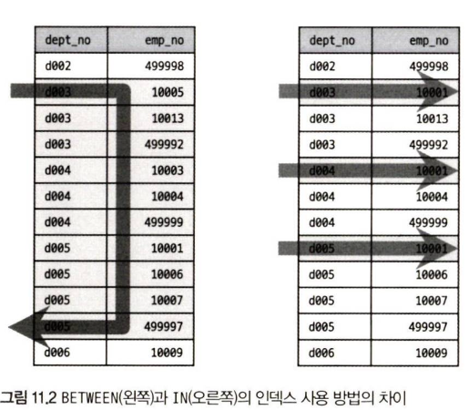

# 11.3 MySQL연산자와 내장 함수

## 11.3.1 리터럴 표기법 문자열

### 11.3.1.1 문자열

- 문자열 표준 표기

  - SQL 표준: **홑따옴표 (')** 사용
  - MySQL:에서는 **쌍따옴표 (")** 사용 가능

  ```SQL
  SELECT * FROM departments WHERE dept_no = 'doo1';
  SELECT * FROM departments WHERE dept_no = "doo1";
  ```

- 문자열 값에 홑따옴표가 포함되어 있는 경우

  - SQL 표준: 홑따옴표 두 번 연속해서 입력
  - MySQL: 쌍따옴표와 홑따옴표 혼합

  ```SQL
  SELECT * FROM departments WHERE dept_no = 'd''oo1';

  // MySQL에서만 지원
  SELECT * FROM departments WHERE dept_no = "d'oo1";
  SELECT * FROM departments WHERE dept_no = "d""oo1";
  ```

- 식별자가 키워드가 충돌할 때

  - 오라클 / PostgreSQL: 쌍따옴표나 대괄호로 감싸서 충돌 방지
  - MySQL: 역따옴표로 감싸서 충돌 방지

  ```SQL
  CREATE TABLE tab_test (`table` VARCHAR(20) NOT NULL, ...);
  SELECT `column` FROM tab_test;
  ```

  > MySQL 서버의 `sql_code` 시스템 변수값에 `ANSI_QUOTES` 설정 시 쌍따옴표는 문자열 리터럴 표기에 사용 불가, 테이블명이나 칼럼명의 충돌을 피하기 위해서는 역따옴표가 아닌 쌍따옴표 사용해야함

### 11.3.1.2 숫자

- 숫자값을 상수로 SQL에 사용하는 경우 따옴표 없이 숫자 값 입력
- 문자열 형태로 따옴표 사용하더라도 비교 대상이 숫자 값이거나 숫자 타입의 칼럼인 경우 MySQL서버가 **문자열 값을 숫자 값으로 자동 변환**

- 서로 다른 타입으로 WHERE 조건 비교가 수행되는 경우

  ```SQL
  SELECT * FROM tab_test WHERE number_column = '10001';
  SELECT * FROM tab_test WHERE string_column = 10001;
  ```

  - 첫번째 쿼리: 주어진 상수값을 숫자로 변환 -> 상수값 하나만 변환하기에 성능 관련 문제 발생 X
  - 두번째 쿼리: 주어진 상수값이 숫자값, 비교되는 칼럼은 문자값 -> MySQL은 문자열 칼럼을 숫자로 비교해서 비교

    `string_column` 칼럼의 모든 문자열 값을 숫자로 변환해서 비교 수행 -> `string_column`에 인덱스가 있어도 이를 이용하지 못함 & 알파벳과 같은 문자가 포함된 경우 숫자값으로 변환이 불가해 쿼리 자체가 실패할 수도 있음

  > 원칙적으로 문제 해결을 위해 숫가 값은 숫자 타입의 칼럼에만 저장해야함

### 11.3.1.3 날짜

- 날짜 타입 비교나 `INSERT`

  - 다른 DBMS: 문자열을 `DATE` 타입으로 변환하는 코드 필요
  - MySQL: 정해진 형태의 날짜 포맷으로 표기 시, 자동으로 DATE나 `DATETIME` 값으로 변환

  ```SQL
  SELECT * FROM dept_emp WHERE from_date = '2025-11-01';
  SELECT * FROM dept_emp WHERE from_date = STR_TO_DATE('2025-11-01', '%Y-%m-%d');
  ```

  - 첫번째 쿼리: 날짜 타입의 칼럼과 문자열 비교하는 경우 MySQL 서버가 문자열 값을 DATE 타입으로 변환해서 비교
  - 두번째 쿼리: SQL에서 문자열을 DATE타입으로 강제 변환 후 비교

### 11.3.1.4 불리언

- `BOOL`과 `BOOLEAN` 이라는 타입은 `TINYINT `타입에 대한 동의어 -> 테이블의 칼럼을 `BOOL`로 생성한 뒤 조회해보면 칼럼의 타입이 `TINYINT`

- MySQL에서 TRUE, FALSE 형태로 비교하거나 값 저장 가능

  ```SQL
  mysql > CREATE TABLE tb_boolean (bool_value BOOLEAN);

  mysql > INSERT INTO tb_boolean VALUES (FALSE);
  mysql > INSERT INTO tb_boolean WHERE bool_value = FALSE;
  mysql > INSERT INTO tb_boolean WHERE bool_value = TRUE;
  ```

  - TRUE, FALSE로 비교했지만 실제로 값 조회 시 0 또는 1이 조회 -> 불리언 값을 정수로 매핑하여 사용

  ```SQL
  mysql> CREATE TABLE tb_boolean (bool_value BOOLEAN);

  mysql> INSERT INTO tb_boolean VALUES (FALSE), (TRUE), (2), (3), (4), (5);

  mysql> SELECT * FROM tb_boolean WHERE bool_value IN (FALSE, TRUE);
  +------------+
  | bool_value |
  +------------+
  |          0 |
  |          1 |
  +------------+
  ```

  > C/C++ 언어와 달리 TRUE 값은 1만을 의미

  > 불리언 타입을 사용하고 싶다면 ENUM 타입으로 관리하는 것이 실수 방지에 좋음

## 11.3.2 MySQL 연산자

### 11.3.2.1 동등(Equal) 비교(=, <=>)

- 동등 비교

  - "=" 기호 사용
  - MySQL: 추가적으로 "<=>" 연산자 제공
    - `NULL`에 대한 비교까지 수행
    - NULL-Safe 비교 연산자라고 함

  ```SQL
  mysql> SELECT 1 = 1, NULL = NULL, 1 = NULL;
  +-------+-------------+----------+
  | 1 = 1 | NULL = NULL | 1 = NULL |
  +-------+-------------+----------+
  |     1 | NULL        | NULL     |
  +-------+-------------+----------+

  mysql> SELECT 1 <=> 1, NULL <=> NULL, 1 <=> NULL;
  +---------+---------------+------------+
  | 1 <=> 1 | NULL <=> NULL | 1 <=> NULL |
  +---------+---------------+------------+
  |       1 |             1 |          0 |
  +---------+---------------+------------+
  ```

  - NULL은 "IS NULL" 연산자 외에는 비교할 방법이 없음
  - 첫번째 쿼리: 한쪽이 NULL이면 비교 결과도 NULL로 반환
  - NULL-Safe 비교 연산자 이용 시 양쪽 비교 대상 모두 NULL 이면 `TRUE`, 한쪽만 NULL이면 `FALSE` 반환

### 11.3.2.2 부정(Not Equal) 비교 (<>, !=)

- "<>" 연산자와 "!=" 연산자 사용
- 가독성을 위해 통일해서 사용하는 방법을 권장

```SQL
mysql> SELECT ! 1;
+-----+
| ! 1 |
+-----+
|   0 |
+-----+

mysql> SELECT !FALSE;
+--------+
|      1 |
+--------+

mysql> SELECT NOT 1;
+-------+
|     0 |
+-------+

mysql> SELECT NOT 0;
+-------+
|     1 |
+-------+

mysql> SELECT NOT (1=1);
+-----------+
|         0 |
+-----------+

```

### 11.3.2.3 NOT(!) 연산자

- TRUE나 FALSE 연산의 결과를 반대로 만드는 연산자로 "NOT"과 "!" 사용

> 불리언 값 뿐만 아니라 숫자나 문자열 표현식에도 사용할 수 있지만 부정의 결과값을 정확히 예측할 수 없는 경우에는 사용 지양

### 11.3.2.4 AND(&&)와 OR(||) 연산자

- DBMS: 불리언 표현식의 결과 결합 위해 AND나 OR 사용
- MySQL: 추가로 "&&", "||" 사용도 허용
- 오라클에서는 "||" 를 불리언 표현식의 결합 연산자가 아닌 문자열을 결합하는 연산자로 사용
  - 오라클에서 운영되던 애플리케션을 MySQL로 이관하거나 문자열 결합 연산자에 "||" 사용하고 싶을 때 `sql_mode` 시스템 변수값에 `PIPE_AS_CONCAT` 설정
  - 해당 옵션 설정 불리언 표현식 결합 시, "&&"는 사용 가능하지만 "||"는 사용 불가

```SQL
mysql> SET sql_mode = 'PIPE_AS_CONCAT';
mysql> SELECT 'abc' || 'def' AS concated_string;
+----------------+
| concated_string|
+----------------+
|         abcdef |
+----------------+
```

### 11.3.2.5 나누기(/)와 나머지(%) 연산자

- 나누기 연산자: "/"
- 나눈 몫의 정수 부분만 가져오려면 DIV 연산자
- 나눈 결과의 나머지를 가져오는 연산자: "%
  , MOD 연산자

```SQL
mysql> SELECT 29 / 9;
+--------+
| 3.2222 |
+--------+

mysql> SELECT 29 DIV 9;
+----------+
|        3 |
+----------+

mysql> SELECT MOD(29, 9);
+------------+
|          2 |
+------------+

mysql> SELECT 29 MOD 9;
+----------+
|        2 |
+----------+

mysql> SELECT 29 % 9;
+--------+
|      2 |
+--------+
```

### 11.3.2.6 REGEXP 연산자

- 문자열 값이 어떤 패턴을 만족하는지 확인하는 연산자
- RLIKE는 RECEXP와 똑같은 비교 수행
  - MySQL의 RLIKE는 정규 표현식을 비교하는 연산자
- RECEXP 사용 시 좌측에 비교 대상 문자열 값 또는 문자열 칼럼, 우측에 검증하고자 하는 정규 표현식

```SQL
// 'abc' 문자열이 x,y,z 문자로 시작하는지 검증
mysql> SELECT 'abc' REGEXP '^[x-z]';
+--------+
|      0 |
+--------+
```

<details markdown="1">
  <summary> 대표 심벌 </summary>
  <div>
    <ul>
      <li>1. ^: 문자열의 시작 표시 </li>
      <li>2. $: 문자열의 끝을 표시</li>
      <li>3. []: 문자 그룹을 표시, 대괄호는 문자열이 아닌 문자 하나와 일치하는지 확인</li>
      <li>4. (): 문자열 그룹을 표시, (xyz)라고 표현하면 xyz 모두 있는지 확인</li>
      <li>5. |: |로 연결된 문자열 중 하나인지 확인 </li>
      <li>6. .: 어떠한 문자든지 1개의 문자 표시, "..." 로 표시되었다면 3개의 문자로 구성된 문자열 찾음</li>
      <li>7. *: 이 기호 앞에 표시된 정규 표현식이 0 또는 1번 이상 반복될 수 있다는 표시</li>
      <li>8. +: 이 기호 앞에 표시된 정규 표현식이 1번 이상 반복될 수 있다는 표시</li>
      <li>9. ?: 이 기호 앞에 표시된 정규 표현식이 0 또는 1번만 올 수 있다는 표시<li>
    </ul>
  </div>
</details>

### 11.3.2.7 LIKE 연산자

- DBMS에서 더 많이 사용
- REGEXP 연산자는 인덱스를 사용하지 못하지만 LIKE 연산자는 인덱스를 사용해 처리할 수 있음
- 정규 표현식 검사가 아닌 어떤 상수 문자열이 있는지 없는지 정도를 판단하는 연산자
- "%", "\_" 만 사용할 수 있음
  - %: 0 또는 1개 이상의 문자에 일치
  - \_: 정확히 1개의 문자에 일치

```SQL
mysql> SELECT 'abcdef' LIKE 'abc%';
+--------------------------+
|                        1 |
+--------------------------+

mysql> SELECT 'abcdef' LIKE '%abc';
+--------------------------+
|                        0 |
+--------------------------+

mysql> SELECT 'abcdef' LIKE '%ef';
+--------------------------+
|                        1 |
+--------------------------+
```

와일드카드 문자인 "%"나 "\_" 문자 자체를 비교하는 경우 ESCAPE 절을 LIKE 조건 뒤에 추가

```SQL
mysql> SELECT 'abc' LIKE 'a%';
+-------------------+
|                 1 |
+-------------------+

mysql> SELECT 'a%' LIKE 'a%';
+--------------------+
|                  1 |
+--------------------+

mysql> SELECT 'abc' LIKE 'a/\%' ESCAPE '/';
+-----------------------------------+
|                                 0 |
+-----------------------------------+

mysql> SELECT 'a%' LIKE 'a/\%' ESCAPE '/';
+------------------------------------+
|                                  1 |
+------------------------------------+
```

- 와일드카드 문자가 검색어의 뒤쪽에 있는 경우 인덱스 레인지 스캔으로 사용가능하지만, 와일드카드가 검색어의 앞쪽에 있다면 사용할 수 없다

  ```SQL
  mysql> EXPLAIN
  -> SELECT COUNT(*)
  -> FROM employees
  -> WHERE first_name LIKE 'Christ%';
  +----+-------+-------------+----------------+--------+---------+------+-------+--------------------------+
  | id | select_type | table | type  | possible_keys | key | key_len | ref | rows | Extra                |
  +----+-------------+-------+-------+---------------+-----+---------+------+--------+----------------------+
  |  1 | SIMPLE      | employees | range | ix_firstname  | ix_firstname | 53 | NULL  | 226 | Using where; Using index |
  +----+-------------+-------+-------+---------------+-----+---------+------+--------+----------------------+
  ```

  ```SQL
  mysql> EXPLAIN
  -> SELECT COUNT(*)
  -> FROM employees
  -> WHERE first_name LIKE '%rist';
  +----+-------+-------------+-------+---------------+----------------+---------+------+--------+---------------------------------+
  | id | select_type | table | type | possible_keys | key | key_len | ref | rows | Extra                         |
  +----+-------------+-------+-------+---------------+----------------+---------+------+--------+---------------------------------+
  |  1 | SIMPLE      | employees | index | NULL          | ix_firstname | 53 | NULL  | 300584 | Using where; Using index |
  +----+-------------+-------+-------+---------------+----------------+---------+------+--------+---------------------------------+
  ```

### 11.3.2.8 BETWEEN 연산자

- 다른 비교 조건과 결합해 하나의 인덱스를 사용할 때 조심해야할 점

dept_emp 테이블에 (dept_no, emp_no) 칼럼으로 구성된 프라이머리 키가 존재한다고 가정

```SQL
mysql> SELECT * FROM dept_emp WHERE dept_no = 'd003' AND emp_no = 10001;

mysql> SELECT * FROM dept_emp WHERE dept_no BETWEEN 'd003' AND 'd005' AND emp_no = 10001;
```

- 첫번째 쿼리: `dept_no`, `emp_no` 조건 모두 인덱스 이용해서 범위 줄여주는 방법으로 사용 가능
- 두번째 쿼리: `BETWEEN`이 사용되어 인덱스의 Left-most 특성상 `emp_no = 10001`은 비교 범위를 줄이는 역할 하지 못함
  -> dept_emp 테이블의 (dept_no, emp_no) 인덱스의 레코드 (전체 데이터의 1/3)를 읽지만 실제로 가져오는 데이터는 1건밖에 안됨



- BETWEEN 연산자는 크다와 작다 비교로 하나로 묶어둔 것, IN 연산자는 동등 비교 연산자와 비슷

- BETWEEN 쿼리 최적화

  1. IN 사용

  ```SQL
  mysql> SELECT * FROM dept_emp
  WHERE dept_no IN ('d003', 'd004', 'd005')   AND emp_no = 10001;
  ```

  -> 이 쿼리를 아래와 같이 바꾸면 `emp_no = 10001` 조건도 작업 범위를 줄이는 용도로 인덱스 이용 가능

  2. 세미 조인 최적화

  ```SQL
  SELECT *
  FROM dept_emp de USE INDEX(PRIMARY)
  WHERE dept_no IN (
  SELECT dept_no
  FROM departments
  WHERE dept_no BETWEEN 'd003' AND 'd005'
  )
  AND emp_no=10001;
  ```

  MySQL 옵티마이저는 이 쿼리를 JOIN 쿼리로 재작성하여 최정화된 방식으로 실행

### 11.3.2.9 IN 연산자

- 여러 개의 값에 대해 동등 비교 연산 수행
- 여러 개의 값이 비교되지만 범위 검색이 아닌 여러 번의 동등 비교로 실행되어 빠르게 처리됨

1. 상수가 사용된 경우

   - 동등 비교와 동일하게 작동 -> 매우 빠르게 쿼리 처리

   ```SQL
   mysql> SELECT * FROM dept_emp WHERE (dept_no, emp_no) IN (('d001', 10017), ('d002', 10144), ('d003', 10054))
   ```

   MySQL 8.0 버전부터는 IN 절에 튜플을 그대로 나열해도 인덱스 최적으로 사용 가능

   ```SQL
   mysql> SELECT * FROM dept_emp WHERE (dept_no, emp_no) IN (('d001', 10017), ('d002', 10144), ('d003', 10054))
   ```

   -> 위 쿼리의 실행 계획 확인 결과

   : `dept_emp` 테이블의 프라이머리 키를 이용한 결과, `dept_emp` 칼럼 (4글자 \* 4바이트 )과 `emp_no` 칼럼 (4바이트) 이용해서 인덱스 레인지 스캔 실행

2. 서브 쿼리가 사용된 경우
   - IN (subquery) 형태의 조건은 최적화가 매우 까다로움
   - 8.0버전부터는 많이 안정됨

- NOT IN의 실행 계획은 동등이 아닌 부정형 비교여서 인덱스 풀 스캔으로 표시됨

## 11.3.3 MySQL 내장 함수

> 여기서 언급하는 내장 함수나 사용자 정의 함수는 스토어드 프로그램으로 작성되는 프로시저나 스토어드 함수와는 다르니 혼동 주의

### 11.3.3.1 NULL 값 비교 및 대체 (IFNULL, ISNULL)

- `IFNULL()`

  - 칼럼이나 표현식의 값이 NULL 인지 비교
  - NULL 이면 다른 값으로 대체
  - 두 개의 인자 전달
    - 첫번째 인자는 NULL 인지 아닌지 비교하려는 칼럼 혹은 표현식
    - 두번째 인자는 첫 번째 인자의 값이 NULL일 경우 대체할 값이나 칼럼 설정
  - 반환 값
    - 첫 번째 인자가 NULL이 아닐 경우 첫 번째 인자 값
    - 첫 번째 인자가 NULL일 경우 두 번째 인자 값

- `ISNULL()`
  - 전달한 표현식이나 칼럼의 값이 NULL인지 아닌지 비교
  - 반환 값
    - 인자의 표현식이 NULL이면 `TRUE(1)`
    - NULL이 아니면 `FALSE(0)`

```SQL
mysql> SELECT IFNULL(NULL, 1);
+-----------------+
|               1 |
+-----------------+

mysql> SELECT IFNULL(0, 1);
+--------------+
|            0 |
+--------------+

mysql> SELECT ISNULL(0);
+--------------+
|            0 |
+--------------+

mysql> SELECT ISNULL(1/0);
+--------------+
|            1 |
+--------------+
```

### 11.3.3.2 현재 시각 조회 (NOW, SYSDATE)

- `NOW()`
  : 하나의 SQL 에서 모든 값을 가짐

- `SYSDATE()`
  : 하나의 SQL에서도 호출되는 시점에 따라 결과값이 달라짐

NOW 함수 사용 예제

```SQL
mysql> SELECT NOW(), SLEEP(2), NOW();
+---------------------+----------+---------------------+
| NOW()               | SLEEP(2) | NOW()               |
+---------------------+----------+---------------------+
| 2020-08-23 14:55:20 | 0        | 2020-08-23 14:55:20 |
+---------------------+----------+---------------------+

mysql> SELECT SYSDATE(), SLEEP(2), SYSDATE();
+---------------------+----------+---------------------+
| SYSDATE()           | SLEEP(2) | SYSDATE()           |
+---------------------+----------+---------------------+
| 2020-08-23 14:55:23 | 0        | 2020-08-23 14:55:25 |
+---------------------+----------+---------------------+
```

- `NOW()` 함수 사용한 첫 번째 함수: 두 번의 `NOW()`가 같은 결과 반환
- `SYSDATE()` 함수 사용한 두 번째 함수: `SLEEP()` 함수의 대기 시간인 2초 동안 차이 발생

-> `SYSDATE()` 함수의 잠재적인 문제점 1. `SYSDATE()` 함수가 사용된 SQL은 레플리카 서버에서 안정적으로 복제되지 못함 2. `SYSDATE()` 함수와 비교되는 칼럼은 인덱스를 효율적으로 사용하지 못함

- 최적화

```SQL
mysql> EXPLAIN
    -> SELECT emp_no, salary, from_date, to_date
    -> FROM salaries
    -> WHERE emp_no=10001 AND from_date>NOW();
```

- `NOW()` 함수는 상수 값처럼 취급되어 인덱스를 사용하여 emp_no와 from_date 조건으로 검색 범위를 좁힘

```SQL
mysql> EXPLAIN
    -> SELECT emp_no, salary, from_date, to_date
    -> FROM salaries
    -> WHERE emp_no=10001 AND from_date>SYSDATE();
```

- `SYSDATE()` 함수는 호출될 때마다 다른 값을 반환해서 상수가 아님 -> 인덱스 스캔때도 매번 비교되는 레코드마다 함수 실행해야함

> `SYSDATE()` 함수 사용을 지양하는 것이 좋지만 이미 사용했다면 MySQL 서버 설정 파일에 `sysdate-is-now` 시스템 변수 활성화 권장

### 11.3.3.3 날짜와 시간의 포맷

- `DATE_FORMAT()`
  : DATETIME 타입의 칼럼이나 값을 원하는 형태의 문자열로 변환해야할 때 사용. 즉 날짜를 문자열로 변환

  - 지정 문자

    - %Y: 4자리 연도
    - %m: 월 (01~12)
    - %d: 일 (01~31)
    - %H: 시 (00~23)
    - %i: 분 (00~59)
    - %s: 초 (00~59)

      -> 위의 지정자로 필요한 포맷 또는 필요한 부분만 문자열로 변환 가능

- 날짜 포맷 변경을 위한 지정자는 모두 대소문자 구분해서 사용해야함

```SQL
mysql> SELECT DATE_FORMAT(NOW(), '%Y-%m-%d') AS current_dt;
+------------+
| current_dt |
+------------+
| 2020-08-23 |
+------------+

mysql> SELECT DATE_FORMAT(NOW(), '%Y-%m-%d %H:%i:%s') AS current_dttm;
+---------------------+
| current_dttm        |
+---------------------+
| 2020-08-23 15:06:45 |
+---------------------+
```

- `STR_TO_DATE()`
  - SQL에서 표준 형태 (년-월-일 시:분:초)로 입력된 문자열은 필요한 경우 자동으로 DATETIME 타입으로 변환되어 처리. 즉, 문자열을 날짜로 변환
  - 자동으로 변환되지 않은 형태는 명시적으로 날짜 타입으로 변환해야함
    - `STR_TO_DATE()` 함수를 이용해 문자열을 DATETIME으로 변환 가능
    - 날짜의 각 부분을 명시하는 지정자는 `DATE_TIME()` 함수에서 사용했던 지정자와 동일하게 사용

```SQL
mysql> SELECT STR_TO_DATE('2020-08-23', '%Y-%m-%d') AS current_dt;
+------------+
| current_dt |
+------------+
| 2020-08-23 |
+------------+

mysql> SELECT STR_TO_DATE('2020-08-23 15:06:45', '%Y-%m-%d %H:%i:%s') AS current_dttm;
+---------------------+
| current_dttm        |
+---------------------+
| 2020-08-23 15:06:45 |
+---------------------+
```

### 11.3.3.4 날짜와 시간의 연산 (DATE_ADD, DATE_SUB)

특정 날짜에서 연도나 월일, 시간 등을 더하거나 뺄 때 사용

- `DATE_ADD()`

  - 더하거나 빼는 처리 둘 다 가능 (<- `DATE_SUB()` 가 크게 필요 없음)

- 두 함 수 모두 두 개의 인자 필요
  - 첫 번째 인자: 연산을 수행할 날짜
  - 두 번째 인자: 더하거나 빼고자 하는 월의 수나 일자의 수
    - `INTERVAL n [YEAR, MONTH, DAY, HOUR, MINUTE, SECOND, MICROSECOND, QUARTER, WEEK ...]` 의 형태로 입력
    - `n`은 더하거나 빼고자 하는 차이 값
    - 그 뒤에 명시되는 단위에 따라 하루를 더할지 한 달을 더할지 결정

```SQL
// 다음 날
mysql> SELECT DATE_ADD(NOW(), INTERVAL 1 DAY) AS tomorrow;
+---------------------+
| tomorrow            |
+---------------------+
| 2020-08-24 15:11:07 |
+---------------------+

// 하루 전
mysql> SELECT DATE_ADD(NOW(), INTERVAL -1 DAY) AS yesterday;
+---------------------+
| yesterday           |
+---------------------+
| 2020-08-22 15:11:07 |
+---------------------+
```

### 11.3.3.5 타임스탬프 연산 (UNIX_TIMESTAMP, FROM_UNIXTIME)

- `UNIX_TIMESTAMP()`

  - 2025-01-01 00:00:00 으로부터 경과된 초의 수 반환
  - 인자가 없으면 현재 날짜와 시간의 타임스탬프 값을 반환
  - 인자가 있으면 그 날짜와 시간의 타임스탬프 반환

- `FROM_UNIXTIME()`
  - 인자로 전달한 타임스탬프 값을 DATETIME 타입으로 변환

```SQL
mysql> SELECT UNIX_TIMESTAMP();
+------------------+
| UNIX_TIMESTAMP() |
+------------------+
|       1598163535 |
+------------------+

mysql> SELECT UNIX_TIMESTAMP('2020-08-23 15:06:45');
+---------------------------------------+
| UNIX_TIMESTAMP('2020-08-23 15:06:45') |
+---------------------------------------+
|                            1598162805 |
+---------------------------------------+

mysql> SELECT FROM_UNIXTIME(UNIX_TIMESTAMP('2020-08-23 15:06:45'));
+------------------------------------------------------+
| FROM_UNIXTIME(UNIX_TIMESTAMP('2020-08-23 15:06:45')) |
+------------------------------------------------------+
| 2020-08-23 15:06:45                                  |
+------------------------------------------------------+
```

> MySQL의 TIMESTAMP 타입은 4바이트 숫자 타입으로 저장되기 때문에 실제로 가질 수 있는 값의 범위는 '1970-01-01 00:00:01 ~ 2038-01-09 03:14:07'의 날짜까지 가능

### 11.3.3.6 문자열 처리 (PRAD, LPAD / RTRIM, LTRIM, TRIM)

- `RPAD()`, `LATP()`
  - 우측, 좌측에 문자를 덧 붙여서 지정된 길이의 문자열로 만드는 함수
  - 3개의 인자가 필요
    - 첫 번째 인자: 패딩 처리를 할 문자열
    - 두 번째 인자: 몇 파이트까지 패딩할 것인지 (패딩 적용 후 결과로 반환될 문자열의 최대 길이)
    - 세 번째 인자: 어떤 문자를 패딩할 것인지 의미

```SQL
mysql> SELECT RPAD('Cloee', 10, '_');
+--------------------------+
| RPAD('Cloee', 10, '_')   |
+--------------------------+
| Cloee_____               |
+--------------------------+

mysql> SELECT LPAD('123', 10, '0');
+----------------------+
| LPAD('123', 10, '0') |
+----------------------+
| 0000000123           |
+----------------------+
```

- `RTRIM()`, `LTRIM()`
  - 문자열의 우측 또는 좌측에 연속된 공백 문자 (Space, NewLine, Tab 문자)를 제거
  - `TRIM()` 함수는 `RTRIM()`, `LTRIM()` 둘 다 수행

```SQL
mysql> SELECT RTRIM('Cloee ') AS name;
+-------+
| name  |
+-------+
| Cloee |
+-------+

mysql> SELECT LTRIM(' Cloee') AS name;
+-------+
| name  |
+-------+
| Cloee |
+-------+

mysql> SELECT TRIM(' Cloee ') AS name;
+-------+
| name  |
+-------+
| Cloee |
+-------+
```

### 11.3.3.7 문자열 결합 (CONCAT)

- `CONCAT()`
  - 여러 개의 문자열을 연결해서 하나의 문자열로 반환
  - 인자의 개수 제한 X
  - 숫자 값을 인자로 전달 -> 문자열 타입으로 자동 변환 후 연결
  - 의도된 결과가 아닌 경우 명시적으로 `CAST()` 함수 이용해 문자열로 변환하는 것이 안전

```SQL
mysql> SELECT CONCAT('Georgi', 'Christian') AS name;
+---------------+
| name          |
+---------------+
| GeorgiChristian |
+---------------+

mysql> SELECT CONCAT('Georgi', 'Christian', 2) AS name;
+------------------+
| name             |
+------------------+
| GeorgiChristian2 |
+------------------+

mysql> SELECT CONCAT('Georgi', 'Christian', CAST(2 AS CHAR)) AS name;
+------------------+
| name             |
+------------------+
| GeorgiChristian2 |
+------------------+
```

- `CONCAT_WS()`
  - 문자열을 연결할 때 구분자를 넣어주는 특징
  - 첫 번째 인자: 구분자
  - 두 번째 인자부터: 연결할 문자

```SQL
mysql> SELECT CONCAT_WS(', ', 'Georgi', 'Christian') AS name;
+-------------------+
| name              |
+-------------------+
| Georgi, Christian |
+-------------------+
```

### 11.3.3.8 GROUP BY 문자열 결합 (GROUP_CONCAT)

- `GROUP_CONCAT()`

  - `COUNT()`, `MAX()`, `AVG()` 등과 같은 그룹함수 중 하나
  - 주로 GROUP BY와 함꼐 사용
    > 구분자 지정 안 하면 기본 구분자 (,)로 연결하여 반환
  - GROUP BY가 없는 SQL에서 사용하면 단 하나의 결과값만 만들어냄

  - **특징**

    - 값들을 먼저 정렬한 후 연결 가능
    - 각 값의 구분자 설정 가능
    - 여러 값 중 중복을 제거하고 연결하는 것도 가능

  - 지정한 칼럼의 값을 연결하기 위해 제한적인 메모리 버퍼 공간 사용
    - 시스템 변수에 지정된 크기를 초과한 결과가 나오면 쿼리에서 경고 매세지 발생
    - GUI 도구 사용 시 경고만 발생하고 쿼리의 결과 출력 vs JDBC로 실행 시 에러로 취급되어 실패
    - 메모리 버퍼 크기는 group_concat_max_len 변수로 조정 가능
      - 기본으로 설정된 버퍼의 크기는 1KB

  > MySQL 8.0 버전 부터 용도에 맞게 래터럴 조인이나 윈도우 함수 이용 가능
  >
  > ```SQL
  > -- // 윈도우 함수를 이용해 최대 5개 부서만 GROUP_CONCAT 실행
  > mysql> SELECT GROUP_CONCAT(dept_no ORDER BY dept_name DESC)
  > -> FROM (
  > ->   SELECT *, RANK() OVER (ORDER BY dept_no) AS rnk
  > ->   FROM departments
  > -> ) AS x
  > -> WHERE rnk <= 5;
  > +------------------------------------------+
  > | GROUP_CONCAT(dept_no ORDER BY dept_name DESC) |
  > +------------------------------------------+
  > | d004,d001,d003,d002,d005                 |
  > +------------------------------------------+
  > ```
  >
  > ```SQL
  > -- // 레터럴 조인을 이용해 부서별로 10명씩만 GROUP_CONCAT 실행
  > mysql> SELECT d.dept_no, GROUP_CONCAT(de2.emp_no) AS dept_emp_list
  > -> FROM departments d
  > -> LEFT JOIN LATERAL (
  > ->   SELECT de.dept_no, de.emp_no
  > ->   FROM dept_emp de
  > ->   WHERE de.dept_no=d.dept_no
  > ->   ORDER BY de.emp_no ASC LIMIT 10
  > -> ) AS de2 ON de2.dept_no=d.dept_no
  > -> GROUP BY d.dept_no;
  > ```

GROUP_CONCAT 예시

```SQL
// 기본 구분자
mysql> SELECT GROUP_CONCAT(dept_no) FROM departments;
+--------------------------------------+
| GROUP_CONCAT(dept_no)                |
+--------------------------------------+
| d009,d005,d002,d003,d001,d004,d006,d008,d007 |
+--------------------------------------+

// | 구분자 사용
mysql> SELECT GROUP_CONCAT(dept_no SEPARATOR '|') FROM departments;
+------------------------------------------------+
| GROUP_CONCAT(dept_no SEPARATOR '|')            |
+------------------------------------------------+
| d009|d005|d002|d003|d001|d004|d006|d008|d007 |
+------------------------------------------------+

// 오름차순 정렬
mysql> SELECT GROUP_CONCAT(dept_no ORDER BY emp_no DESC)
    -> FROM dept_emp
    -> WHERE emp_no BETWEEN 100001 AND 100003;
+-------------------------------------------+
| GROUP_CONCAT(dept_no ORDER BY emp_no DESC) |
+-------------------------------------------+
| d005,d008,d008,d005                       |
+-------------------------------------------+

// 중복 제거
mysql> SELECT GROUP_CONCAT(DISTINCT dept_no ORDER BY emp_no DESC)
    -> FROM dept_emp
    -> WHERE emp_no BETWEEN 100001 AND 100003;
+---------------------------------------------------+
| GROUP_CONCAT(DISTINCT dept_no ORDER BY emp_no DESC) |
+---------------------------------------------------+
| d008,d005                                         |
+---------------------------------------------------+
```

### 11.3.3.9 값의 비교와 대체 (CASE WHEN .. THEN ... END)

- CASE WHEN

  - 함수가 아닌 SQL 구문으로 SWITCH 구문과 같은 역할을 함
  - CASE로 시작하고 END로 끝나야함
  - WHEN .. THEN .. 은 필요한 만큼 반복해서 사용 가능

  1. 코드 값을 실제 값으로 변환하거나 특정 일자를 기준으로 이전인지 이후인지 비교해 설명을 붙이는 용도

  ```SQL
  mysql> SELECT emp_no, first_name, CASE gender WHEN 'M' THEN 'Man' WHEN 'F' THEN 'Woman' ELSE 'Unknown' END AS gender
  FROM employees
  LIMIT 10;
  ```

  2. 동등 연산자로 비교할 수 있을 때 비교하고자 하는 칼럼이나 표현식을 CASE, WHEN 키워드 사이에 두고, 비교 기준값을 WHEN 뒤에 입력해서 사용
     -> 일반적인 프로그래밍 언어의 SWITCH 문법과 같은 방식으로 사용

  ```SQL
  mysql> SELECT emp_no, first_name, CASE WHEN hire_date<'1995-01-01' THEN 'Old' ELSE 'New' END AS employee_type
  FROM employees
  LIMIT 10;
  ```

  - CASE WHEN 절이 일치하는 경우에만 THEN 이하의 표현식 실행

    ex) 성별이 여자인 경우에만 최종 급여 정보가 필요하고 남자인 경우에는 이름만 필요함

    ```SQL
    mysql> SELECT de.dept_no, e.first_name, e.gender, (SELECT s.salary FROM salaries s WHERE s.emp_no=e.emp_no
    ORDER BY from_date DESC LIMIT 1) AS last_salary
    FROM dept_emp de, employees e
    WHERE e.emp_no = de.emp_no AND de.dept_no='d001'
    ```

    : 남자의 경우는 salaries 테이블을 조회할 필요가 없기에 불필요한 작업이 수행됨

    -> 불필요한 작업 제거 위해 CASE WHEN으로 서브쿼리 감싸 실행

    ```SQL
    mysql> SELECT de.dept_no, e.first_name, e.gender CASE WHEN e.gender='F' THEN (SELECT s.salary FROM salaries s WHERE s.emp_no=e.emp_no
    ORDER BY from_date DESC LIMIT 1) ELSE 0 END AS last_salary
    FROM dept_emp de, employees e
    WHERE e.emp_no = de.emp_no AND de.dept_no='d001'
    ```

    : 여자인 경우에만 서브쿼리 실행되어 남자 사원의 수만큼 서브쿼리 실행 횟수를 줄일 수 있음

### 11.3.3.10 타입의 변환 (CAST, CONVERT)

Prepard Statement를 제외하면 SQL은 텍스트 기반으로 작동하기 때문에 SQL에 포함된 모든 입력값은 문자열처럼 취급됨. 명시적으로 타입의 변환이 필요한 경우 `CAST()`, `CONVERT()` 함수 사용하면 됨

- `CAST()`

  - 변환 가능한 데이터 타입은 DATE, TIME, DATETIME, BINARY, CHAR, DECIMAL, SIGNED, INTEGER, UNSIGNED INTEGER
  - 하나의 인자를 받아들임
    - 하나의 인자는 두 부분으로 나뉨
    - 첫 번째 부분: 타입을 변환할 값이나 표현식
    - 두 번째 부분: 변환하고자 하는 데이터 타입
    - 구분을 위해 `AS` 사용

  ```SQL
  mysql> SELECT CAST('1234' AS SIGNED INTEGER) AS converted_integer;
  mysql> SELECT CAST('2000-01-01' AS DATE) AS converted_date;
  ```

  - 문자열과 숫자, 날짜의 변환은 명시적으로 안 해도 자동 변환이 되지만 `SIGNED`, `UNSIGNED`는 명시적인 타입 변환이 필요

  ```SQL
  mysql> SELECT 1-2;
  +-----+
  | 1-2 |
  +-----+
  |  -1 |
  +-----+

  mysql> SELECT CAST(1-2 AS UNSIGNED);
  +-----------------------+
  | CAST(1-2 AS UNSIGNED) |
  +-----------------------+
  | 18446744073709551615  |
  +-----------------------+
  ```

- `CONVERT()`

  - 타입 변환 용도
    - 첫 번째 인자: 변환하려는 값이나 표현식
    - 두 번째 인자: 변환하고자 하는 타입
  - 문자열의 문자 집합 변환 용도
    - 하나의 인자 받아들이고 두 부분으로 나눠짐
    - 첫 번째 부분: 타입을 변환할 값이나 표현식
    - 두 번째 부분: 문자 집합의 이름
    - 구분자로 `USING` 키워드 명시

  ```SQL
  mysql> SELECT CONVERT(1-2, UNSIGNED);
  +------------------------+
  | CONVERT(1-2, UNSIGNED) |
  +------------------------+
  | 18446744073709551615   |
  +------------------------+

  mysql> SELECT CONVERT('ABC' USING 'utf8mb4');
  +---------------------------------+
  | CONVERT('ABC' USING 'utf8mb4')  |
  +---------------------------------+
  | ABC                             |
  +---------------------------------+
  ```

### 11.3.3.11 이진값과 16진수 문자열 변환

- `HEX()`
  - 이진값을 사람이 읽을 수 있는 형태의 16진수 문자열로 변환
- `UNHEX()`
  - 16진수 문자열을 읽어서 이진값으로 변환

> 여기서 이진값은 사람이 읽을 수 있는 형태의 문자열이나 숫자가 아닌 바이너리 값

### 11.3.3.12 암호화 및 해시 함수

MD5, SHA 모두 비대칭형 암호화 알고리즘으로 인자로 전달한 문자열을 각각 지정된 비트 수의 해시 값으로 만들어내는 함수

- SHA()
  - SHA-1 암호화 알고리즘 사용
  - 결과로 160비트 (20바이트) 해시 값 반환
  - 출력값이 16진수 문자열 형태이기에 저장공간이 20바이트의 두 배 필요 -> 암호화된 값 저장 위해 CHAR(40) 타입 필요
- SHA2()
  - SHA 암호화 알고리즘보다 더 강력한 224~512비트 암호화 알고리즘 사용해 해시 값 생성 및 반환
  - 사용된 인자 값에 따라 해시 값의 길이가 달라지기에 사용된 인자의 두 배가 필요
- MD5()
  - 메시지 다이제스트(Message Digest) 알고리즘을 사용해 128비트(16바이트) 값을 반환
  - 입력된 문자열의 길이를 줄이는 용도로 사용
  - 출력값이 16진수 문자열 형태이기에 저장공간이 16바이트의 두 배 필요 -> 암호화된 값 저장 위해 CHAR(32) 타입 필요

```SQL
mysql> SELECT MD5('abc');
+----------------------------------+
| MD5('abc')                       |
+----------------------------------+
| 900150983c0d24f8b0d6963f7d28e17f |
+----------------------------------+

mysql> SELECT SHA('abc');
+------------------------------------------+
| SHA('abc')                               |
+------------------------------------------+
| a9993e364786816aba3e25717850c26c9cd0d89d |
+------------------------------------------+

mysql> SELECT SHA2('abc', 256);
+------------------------------------------------------------------+
| SHA2('abc', 256)                                                 |
+------------------------------------------------------------------+
| ba7816f8f0f1cfea414140de5dae2223b00361a396177a9cb410ff61f20015ad |
+------------------------------------------------------------------+
```

- 저장 공간을 16바이트와 20바이트로 줄이고 싶다면 CHAR, VARCHAR 타입이 아닌 BINARY, VARBINARY 형태로 저장

  - 칼럼의 타입을 BINARY(16), BINARY(20)으로 정의하고 `MD5()` 함수나 `SHA()` 함수의 결과를 `UNHEX()` 함수를 통해 이진값으로 변환해서 저장
  - BINARY에 저장된 이진값을 다시 되돌릴 때는 `HEX()` 함수 사용

  ```SQL
  mysql> CREATE TABLE tb_binary (
  -> col_md5 BINARY(16),
  -> col_sha BINARY(20),
  -> col_sha2_256 BINARY(32)
  -> );

  mysql> INSERT INTO tb_binary VALUES
  -> (UNHEX(MD5('abc')), UNHEX(SHA('abc')), UNHEX(SHA2('abc', 256)));

  mysql> SELECT HEX(col_md5), HEX(col_sha), HEX(col_sha2_256) FROM tb_binary \G
  *************************** 1. row ***************************
  HEX(col_md5): 900150983C0D24F8B0D6963F7D28E17F
  HEX(col_sha): A9993E364786816ABA3E25717850C26C9CD0D89D
  HEX(col_sha2_256): BA7816F8F0F1CFEA414140DE5DAE2223B00361A396177A9CB410FF61F20015AD
  ```

- 긴 문자열 인덱스 최적화

  - 세 함수 모두 결과 중복 가능성이 매우 낮아 긴 데이터를 크기를 줄여 인덱싱하는 용도로 사용됨
  - ex) URL은 1KB를 넘을 때도 있을 정도로 길이가 긴 편. 이 값을 MD5() 함수로 단축하여 16바이트로 저장 가능

  - MD5() 함수를 이용해 해시 칼럼을 추가하고 사용하는 예제

    1. 해시 칼럼을 적용하기 전의 테이블

    ```SQL
    CREATE TABLE tb_accesslog (
    access_id BIGINT NOT NULL AUTO_INCREMENT,
    access_url VARCHAR(1000) NOT NULL,
    access_dttm DATETIME NOT NULL,
    PRIMARY KEY (access_id),
    INDEX ix_accessurl(access_url)) ENGINE=INNODB;
    ```

    : access_url 칼럼은 길이가 길지만 이 칼럼에 인덱스를 생성해야함 -> 함수 기반의 인덱스를 생성

    2. 함수 기반의 인덱스 가지는 테이블

    ```SQL
    CREATE TABLE tb_accesslog (
    access_id BIGINT NOT NULL AUTO_INCREMENT,
    access_url VARCHAR(1000) NOT NULL,
    access_dttm DATETIME NOT NULL,
    PRIMARY KEY (access_id),
    -- MD5 해시 값에 인덱스 생성 (키 길이를 16바이트로 단축)
    INDEX ix_accessurl ((UNHEX(MD5(access_url))))
    );
    ```

    3. 함수 기반의 인덱스를 가진 테이블 사용

    ```SQL
    -- // 예제 레코드 INSERT
    mysql> INSERT INTO tb_accesslog VALUES (1, 'http://matt.com', NOW());

    -- // 평문으로 데이터 조회 시 결과 없음
    mysql> SELECT * FROM tb_accesslog WHERE MD5(access_url)='http://matt.com';
    Empty set (0.00 sec)

    -- // MD5 해시 값으로 검색하면 결과 나옴
    mysql> SELECT * FROM tb_accesslog WHERE UNHEX(MD5(access_url))=UNHEX(MD5('http://matt.com'));
    +-----------+---------------------+---------------------+
    | access_id | access_url          | access_dttm         |
    +-----------+---------------------+---------------------+
    |         1 | http://matt.com     | 2020-08-23 16:49:01 |
    +-----------+---------------------+---------------------+
    ```

    - 실행 계획의 key_len 칼럼의 값이 131바이트로 표시 (32(MD5()함수의 32글자가 차지하는 바이트 수)\*4와 메타정보의 공간 포함)

    ```SQL
    mysql> EXPLAIN SELECT * FROM tb_accesslog WHERE MD5(access_url)=MD5('http://matt.com');
    +----+-------------+--------------+-------+---------------+--------------+---------+------+------+-------+
    | id | select_type | table        | type  | possible_keys | key          | key_len | ref  | rows | Extra |
    +----+-------------+--------------+-------+---------------+--------------+---------+------+------+-------+
    |  1 | SIMPLE      | tb_accesslog | ref   | ix_accessurl  | ix_accessurl | 131     | NULL | 1    | NULL  |
    +----+-------------+--------------+-------+---------------+--------------+---------+------+------+-------+
    ```

    4. 저장 공간을 더 줄이려면 MD5() 함수의 결과를 UNHEX() 함수를 사용해 이진값으로 만들기

    ```SQL
    mysql> EXPLAIN SELECT * FROM tb_accesslog
    -> WHERE UNHEX(MD5(access_url))=UNHEX(MD5('http://matt.com'));
    +----+-------------+--------------+-------+---------------+--------------+---------+-------+------+-------------+
        | id | select_type | table        | type  | possible_keys | key          | key_len | ref   | rows | Extra       |
    +----+-------------+--------------+-------+---------------+--------------+---------+-------+------+-------------+
    |  1 | SIMPLE      | tb_accesslog | ref   | ix_accessurl  | ix_accessurl | 67      | const | 1    | Using where |
    +----+-------------+--------------+-------+---------------+--------------+---------+-------+------+-------------+
    ```

### 11.3.3.13 처리 대기 (SLEEP)

- `SLEEP()`

  - SQL의 개발이나 디버깅 용도로 잠깐 대기하거나 쿼리의 실행을 오랜 시간 유지하고자할 때 유용

  - 대기할 시간을 초 단위로 인자를 받음

  ```SQL
  mysql> SLECET SLEEP(1.5) FROM employees WHERE emp_no BETWEEN 10001 AND 10010;
  ```

  -> `SLEEP()` 함수는 레코드의 건수만큼 함수를 호출하기 때문에 이 쿼리는 employees 테이블에서 조회되는 레코드 건별로 1.5초 동안 대기

### 11.3.3.14 벤치마크

- `BENMARK()`

  - 간단한 함수의 성능 테스트용으로 유용한 함수
  - 2개의 인자 필요
    - 첫 번째 인자: 반복해서 수행할 횟수
    - 두 번째 인자: 반복해서 실행할 표현식
      - 반드시 스칼라값을 반환하는 표현식이여야함
      - SELECT 쿼리를 사용하는 것이 가능하지만 하나의 칼럼을 가진 하나의 레코드(스칼라값)를 반환하는 쿼리만 사용 가능
  - 반환 값보다는 지정한 횟수만큼 반복 실행하는데 얼만큼의 시간이 소요되었는지가 중요
  - 주의사항
    - `SELECT BENCHMARK(10, expr)`와 `SELECT expr`을 직접 10번 실행하는 것과 차이가 있음
      -> `SELECT expr`을 직접 실행하는 것은 매번 쿼리의 파싱이나 최적화, 테이블 잠금의 비용 발생
      -> `SELECT BENCHMARK(10, expr)`는 벤치마크 횟수에 관계없이 단 1번의 네트워크, 쿼리 파싱 등의 비용이 소요됨 & 이미 할당받은 메모리 자원까지 공유

  ```SQL
  mysql> SELECT BENCHMARK(10000000, MD5('abcdefghijk'));
  +-----------------------------------------+
  | BENCHMARK(10000000, MD5('abcdefghijk')) |
  +-----------------------------------------+
  |                                       0 |
  +-----------------------------------------+
  1 row in set (1.26 sec)
  ```

  > `BENCHMARK()` 함수로 얻은 쿼리나 함수의 성능은 그 자체로는 큰 의미가 없고, 두 개의 동일 기능을 상대적으로 비교 분석하는 용도로 사용할 것을 권장

### 11.3.3.15 IP 주소 변환

IP 주소는 4바이트의 부호 없는 정수이지만 대부분의 DBMS에서 IP 정보를 `VARCHAR(15)` 타입에 '.'으로 구분해서 저장 -> 저장 공간을 많이 필요 & A,B,C 클래스로 구분하는 것도 불가능

- `INET_ATON()`
  - 문자열로 구성된 IPv4 주소를 정수형으로 변환
- `INET_NTOA()`
  - 정수형의 IPv4 주소를 사람이 읽을 수 있는 형태의 '.'로 구분된 문자열로 변환
- `INET6_ATON()`, `INET6_NTOA()`
  - IPv6 주소 변환 가능
  - `INET6_ATON()` : IPv4 포맷의 IP 주소도 BINARY 타입으로 변환 가능
  - `INET6_NTOA()` : BINARY 타입의 IPv4, IPv6 주소 모두 문자열로 변환 가능
  - `INET6_ATON()`, `INET6_NTOA()`를 이용해 IPv6나 IPv4의 주소를 저장하려면 바이너리 값을 저장할 수 있는 BINARY(4), BINARY(16) 타입 사용
  - IPv4, IPV6 둘 다 저장하고자 하면 VARBINARY(16) 타입 사용권장

```SQL
mysql> SELECT HEX(INET6_ATON('fdfe:5a55:caff:fefa:9089'));
+------------------------------------------------+
| HEX(INET6_ATON('fdfe:5a55:caff:fefa:9089'))    |
+------------------------------------------------+
| FDFE0000000000005A55CAFFFEFA9089               |
+------------------------------------------------+

mysql> SELECT HEX(INET6_ATON('10.0.5.9'));
+-----------------------------+
| HEX(INET6_ATON('10.0.5.9')) |
+-----------------------------+
| 0A000509                    |
+-----------------------------+

mysql> SELECT INET6_NTOA(UNHEX('FDFE0000000000005A55CAFFFEFA9089'));
+------------------------------------------------------+
| INET6_NTOA(UNHEX('FDFE0000000000005A55CAFFFEFA9089')) |
+------------------------------------------------------+
| fdfe:5a55:caff:fefa:9089                             |
+------------------------------------------------------+

mysql> SELECT INET6_NTOA(UNHEX('0A000509'));
+-----------------------------+
| INET6_NTOA(UNHEX('0A000509')) |
+-----------------------------+
| 10.0.5.9                    |
+-----------------------------+
```

### 11.3.3.16 JSON 포맷

- `JSON_PRETTY()`

  - JSON의 기본적인 표시 방법인 단순 텍스트 포맷의 가독성 문제를 해결하기 위해 `JSON_PRETTY()` 함수를 통해 읽기 쉬운 포맷으로 변환

  - JSON 원형 포맷

  ```SQL
  mysql> SELECT doc FROM employee_docs WHERE emp_no=10005;
  +-------------------------------------------------------------+
  | doc                                                         |
  +-------------------------------------------------------------+
  | {"emp_no": 10005, "gender": "M", "salaries":[{"salary...}]} |
  +-------------------------------------------------------------+
  ```

  - 포맷팅

  ```SQL
  mysql> SELECT JSON_PRETTY(doc) FROM employee_docs WHERE emp_no=10005 \G
    *************************** 1. row ***************************
    JSON_PRETTY(doc): {
    "emp_no": 10005,
    "gender": "M",
    "salaries": [
        {
        "salary": 91453,
        "to_date": "2001-09-09",
        "from_date": "2000-09-09"
        },
        {
        "salary": 94692,
        "to_date": "9999-01-01",
        "from_date": "2001-09-09"
        }
    ],
    "hire_date": "1989-09-12",
    "last_name": "Maliniak",
    "birth_date": "1955-01-21",
    "first_name": "Kyoichi"
    }
  ```

### 11.3.3.17 JSON 필드 크기

- `JSON_STORAGE_SIZE()`

  - 텍스트 기반의 JSON 데이터를 저장할 떄 디스크의 저장 공간을 절약하기 위해 BSON 포맷 사용
  - BSON으로 변환했을 떄 저장 공간의 크기 예측의 어려움 해결을 위해 해당 함수 사용
  - 함수 실행 결과로 반환되는 값의 단위는 바이트

  ```SQL
    mysql> SELECT emp_no, JSON_STORAGE_SIZE(doc) FROM employee_docs LIMIT 2;
    +--------+------------------------+
    | emp_no | JSON_STORAGE_SIZE(doc) |
    +--------+------------------------+
    | 10001  | 611                    |
    | 10002  | 383                    |
    +--------+------------------------+
  ```

### 11.3.3.18 JSON 필드 추출

- `JSON_EXTRACT()`

  - JSON 도큐먼트에서 특정 필드의 값을 가져오는 방법
  - 2개의 인자 필요
    - 첫 번째 인자: JSON 도큐먼트 혹은 데이터가 저장된 칼럼
    - 두 번째 인자: 가져오고자 하는 JSON 경로
  - 결과에는 따옴표가 붙어서 나옴
    - `JSON_UNQUOTE()` 함수 사용 시 따옴표 없이 값만 가져올 수 있음
  - '->' 연산자는 `JSON_EXTRACT()`와 동일한 기능
  - '->>' 연산자는 `JSON_UNQUOTE()`와 `JSON_EXTRACT()` 함수를 조합한 것과 동일한 기능

    ```SQL
    mysql> SELECT emp_no, JSON_EXTRACT(doc, "$.first_name") FROM employee_docs;
    +--------+---------------------------------+
    | emp_no | JSON_EXTRACT(doc, "$.first_name") |
    +--------+---------------------------------+
    | 10001  | "Georgi"                        |
    | 10002  | "Bezalel"                       |
    | 10003  | "Parto"                         |
    | 10004  | "Christian"                     |
    | 10005  | "Kyoichi"                       |
    +--------+---------------------------------+

    mysql> SELECT emp_no, JSON_UNQUOTE(JSON_EXTRACT(doc, "$.first_name")) FROM employee_docs;
    +--------+------------------------------------------------+
    | emp_no | JSON_UNQUOTE(JSON_EXTRACT(doc, "$.first_name")) |
    +--------+------------------------------------------------+
    | 10001  | Georgi                                         |
    | 10002  | Bezalel                                        |
    | 10003  | Parto                                          |
    | 10004  | Christian                                      |
    | 10005  | Kyoichi                                        |
    +--------+------------------------------------------------+

    -- // '->', '->>' 사용
    mysql> SELECT emp_no, doc->"$.first_name" FROM employee_docs LIMIT 2;
    +--------+---------------------+
     emp_no | doc->"$.first_name" |
    --------+---------------------+
    | 10001  | "Georgi"            |
    | 10002  | "Bezalel"           |
    +--------+---------------------+

    mysql> SELECT emp_no, doc->>'$.first_name' FROM employee_docs LIMIT 2;
    +--------+----------------------+
    | emp_no | doc->>'$.first_name' |
    +--------+----------------------+
    | 10001  | Georgi               |
    | 10002  | Bezalel              |
    +--------+----------------------+
    ```

### 11.3.3.19 JSON 오브젝트 포함 여부 확인

- `JSON_CONTAINS()`

  - JSON 도큐먼트 혹은 지정된 JSON 필드를 가지고 있는지 확인하는 함수
  - 첫 번째 인자: JSON 도큐먼트 혹은 데이터가 저장된 칼럼
  - 두 번째 인자: JSON 오브젝트
  - 세 번쨰 인자(선택): JSON 경로 명시하면 해당 경로에 JSON 오브젝트 존재 여부 체크
    -> 첫번째 인자로 주어진 JSON 도큐먼트에서 두 번째 인자의 JSON 오브젝트가 존재하는지 검사

    ```SQL

    mysql> SELECT emp_no FROM employee_docs
    -> WHERE JSON_CONTAINS(doc, '{"first_name":"Christian"}');
    +--------+
    | emp_no |
    +--------+
    |  10004 |
    +--------+

    mysql> SELECT emp_no FROM employee_docs
    -> WHERE JSON_CONTAINS(doc, '"Christian"', '$.first_name');
    +--------+
    | emp_no |
    +--------+
    |  10004 |
    +--------+
    ```

### 11.3.3.20 JSON 오브젝트 생성

- `JSON_OBJECT()`

  - RDBMS 칼럼의 값을 이용하여 JSON 오브젝트 생성 함수

  ```SQL
    mysql> SELECT
    -> JSON_OBJECT("empNo", emp_no,
    ->             "salary", salary,
    ->             "fromDate", from_date,
    ->             "toDate", to_date) AS as_json
    -> FROM salaries LIMIT 3;
    +-------------------------------------------------------------------------------------------------+
    |       as_json                                                                                         |
    +-------------------------------------------------------------------------------------------------+
    | {"empNo": 10001, "salary": 60117, "toDate": "1987-06-26", "fromDate": "1986-06-26"}             |
    | {"empNo": 10001, "salary": 62102, "toDate": "1988-06-25", "fromDate": "1987-06-26"}             |
    | {"empNo": 10001, "salary": 66074, "toDate": "1989-06-25", "fromDate": "1988-06-25"}             |
    +-------------------------------------------------------------------------------------------------+
  ```

### 11.3.3.21 JSON 칼럼으로 집계

- `JSON_OBJECTAGG()`, `JSON_ARRAYAGG()`

  - GROUP BY 절과 함께 사용되는 집계 함수로, RDBMS 칼럼의 값들을 모아 JSON 배열이나 도큐먼트를 생성
  - `JSON_OBJECTAGG()`: 2개의 인자 필요
    - 첫 번째 인자: key
    - 두 번째 인자: value
      -> 키-밸류 쌍의 JSON 도큐먼트를 만들어 반환
      -> 데이터를 이름이 있는 필드로 저장할 때 유용
  - `JSON_ARRAYAGG()`: 1개의 인자 필요
    -> 데이터를 단순 목록으로 저장할 때 유용

    - 주어진 RDBMS 칼럼의 값을 이용해 JSON 배열을 만들어 반환

    ```SQL
    mysql> SELECT dept_no, JSON_OBJECTAGG(emp_no, from_date) AS agg_manager
    -> FROM dept_manager
    -> WHERE dept_no IN ('d001','d002','d003')
    -> GROUP BY dept_no;
    +---------+------------------------------------------------+
    | dept_no | agg_manager                                    |
    +---------+------------------------------------------------+
    | d001    | {"110022": "1985-01-01", "110039": "1991-10-01"} |
    | d002    | {"110085": "1985-01-01", "110114": "1989-12-17"} |
    | d003    | {"110183": "1985-01-01", "110228": "1992-03-21"} |
    +---------+------------------------------------------------+


    mysql> SELECT dept_no, JSON_ARRAYAGG(emp_no) AS agg_manager
    -> FROM dept_manager
    -> WHERE dept_no IN ('d001','d002','d003')
    -> GROUP BY dept_no;
    +---------+------------------------+
    | dept_no | agg_manager            |
    +---------+------------------------+
    | d001    | [110022, 110039]       |
    | d002    | [110085, 110114]       |
    | d003    | [110183, 110228]       |
    +---------+------------------------+
    ```

### 11.3.3.22 JSON 테이블을 테이블로 변환

- `JSON_TABLE()`

  - JSON 데이터 값을 모아서 RDBMS 테이블 만들어 반환
  - 반환하는 테이블의 레코드 건수는 원본 테이블과 동일한 레코드 건수를 가짐
  - 내부 임시 테이블을 이용하기 때문에 임시 테이블에 레코드가 많이 저장되지 않게 주의해야함 -> 성능 저하 발생

    - employee_docs 테이블의 doc JSON 칼럼에서 emp_no, gender, first_name을 추출하여 임시 테이블 e2를 만들고 원본 테이블의 emp_no를 조인 조건으로 사용해 결과를 조회

    ```SQL
    mysql> SELECT e2.emp_no, e2.first_name, e2.gender
        -> FROM employee_docs e1,
        -> JSON_TABLE(doc, "$" COLUMNS (emp_no INT PATH "$.emp_no",
        -> gender CHAR(1) PATH "$.gender",
        -> first_name VARCHAR(20) PATH "$.first_name")
        -> ) AS e2
        -> WHERE e1.emp_no IN (10001, 10002);
    +--------+-------------+--------+
    | emp_no | first_name  | gender |
    +--------+-------------+--------+
    | 10001  | Georgi      | M      |
    | 10002  | Bezalel     | F      |
    +--------+-------------+--------+
    ```

    ```SQL
    mysql> EXPLAIN SELECT e2.emp_no, e2.first_name, e2.gender
    -> FROM employee_docs e1,
    -> JSON_TABLE(doc, "$" COLUMNS (emp_no INT PATH "$.emp_no",
    -> gender CHAR(1) PATH "$.gender",
    -> first_name VARCHAR(20) PATH "$.first_name")
    -> ) AS e2
    -> WHERE e1.emp_no IN (10001, 10002);
    +----+-------------+------+---------+---------------+---------+---------+------+------+----------------------------------+
    | id | select_type | table| type    | possible_keys | key     | key_len | ref  | rows | Extra                            |
    +----+-------------+------+---------+---------------+---------+---------+------+------+----------------------------------+
    | 1  | SIMPLE      | e1   | range   | PRIMARY       | PRIMARY | 4       | NULL | 2    | Using where                      |
    | 1  | SIMPLE      | e2   | ALL     | NULL          | NULL    | NULL    | NULL | 1    | Table function json_table; Using temporary|
    +----+-------------+------+---------+---------------+---------+---------+------+------+----------------------------------+
    ```
