# 11.4.8 GROUP BY

> GROUP BY 는 특정 칼럼의 값으로 레코드를 그룹핑하고, 그룹별로 집계된 결과를 하나의 레코드로 조회할 때 사용한다.

<br>

## 11.4.8.1 WITH ROLLUP

> ROLLUP : 그룹핑된 그룹별로 소계를 가져올 수 있는 기능 

```sql
SELECT dept_no, COUNT(*)
FROM dept_emp
GROUP BY dept_no WITH ROLLUP;
```

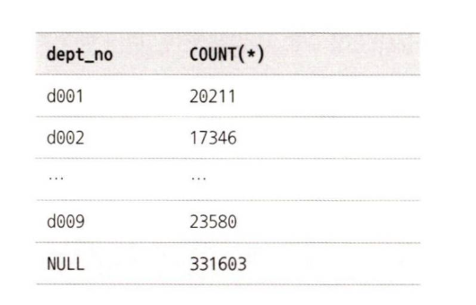

소계 레코드의 칼럼값은 항상 NULL 로 표시된다는 점에 주의하자.

<br>

## 11.4.8.2 레코드를 칼럼으로 변환해서 조회

GROUP BY나 집합 함수를 통해 레코드를 그룹핑할 수 있지만 하나의 레코드를 여러 개의 칼럼으로 나누거나 변환하는 SQL 문법은 없다.
하지만 SUM() 이나 COUNT() 같은 집합 함수와 CASE WHEN ... END 구문을 통해 레코드를 칼럼으로 변환하거나 하나의 칼럼을 조건으로 구분해서 2개 이상의 칼럼으로 변환하는 것은 가능하다.

<br>

# 11.4.9 ORDER BY

> ORDER BY 는 검색된 레코드를 어떤 순서로 정렬할지 결정한다.

어떤 DBMS 도 ORDER BY 절이 명시되지 않은 쿼리에 대해서는 어떠한 정렬도 보장하지 않는다.
인덱스를 사용한 SELECT 의 경우 인덱스에 정렬된 순서대로 레코드를 가져오긴 하지만, 그렇다고 해서 ORDER BY 를 사용하지 않아도 된다는 것은 잘못된 생각이다.

<br>

## 11.4.9.1 ORDER BY 사용법 및 주의사항

- ORDER BY 절은 1개 또는 그 이상 여러 개의 칼럼으로 정렬을 수행할 수 있다.
- 정렬 순서(오름차순, 내림차순) 은 칼럼별로 다르게 명시할 수 있다.
- 일반적으로 정렬할 대상은 칼럼명이나 표현식으로 명시되지만, SELECT 되는 칼럼의 순번을 명시할 수도 있다.
  - `ORDER BY 2` 라고 명시하면 SELECT 되는 칼럼 중에서 2번째 칼럼으로 정렬하라는 의미가 된다.

<br>

## 11.4.9.2 여러 방향으로 동시 정렬

- MySQL8.0 이전 버전까지는 여러 개의 칼럼을 조합해서 정렬할 때 각 칼럼의 정렬 순서가 오름차순과 내림차순이 혼용되면 인덱스를 이용할 수 없었다.
- 하지만 MySQL8.0 버전부터는 오름차순과 내림차순을 혼용해서 인덱스를 생성할 수 있게되었다.
```sql
ALTER TABLE salaries ADD INDEX ix_salary_fromdate(salary DESC, from_date ASC);
```

<br>

## 11.4.9.3 함수나 표현식을 이용한 정렬

- 하나 또는 여러 칼럼의 연산 결과를 이용하여 정렬하는 것도 가능하다.
```sql
SELECT *
FROM salaries
ORDER BY COS(salary);
```

<br>

# 11.4.10 서브쿼리

> 쿼리를 작성할 때 서브쿼리를 사용하면 단위 처리별로 쿼리를 독립적으로 작성할 수 있다. 조인처럼 여러 테이블을 섞어 두는 형태가 아니어서 쿼리의 가독성도 높아지며, 복잡한 쿼리도 손쉽게 작성할 수 있다.

<br>

## 11.4.10.1 SELECT 절에 사용된 서브쿼리

SELECT 절에 사용되는 서브쿼리의 경우, 내부적으로 임시 테이블을 만들거나 쿼리를 비효율적으로 실행하게 만들지는 않는다. 따라서 서브쿼리가 적절히 인덱스를 사용할 수 있다면 크게 주의할 사항은 없다.

=> 일반적으로 SELECT 절에 서브쿼리를 사용하면, 그 서브쿼리는 항상 칼럼과 레코드가 하나인 결과를 반환해야한다. (그 값이 NULL 이든 아니는 관계 없음)

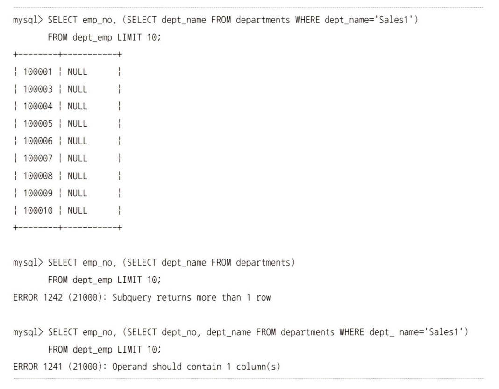

- 첫 번째 쿼리에서 사용된 서브쿼리는 항상 결과가 0건이다. 하지만 에러를 발생하지 않고, 서브쿼리의 결과는 NULL 로 채워져서 반환된다.
- 두 번째 쿼리에서 서브쿼리가 2건 이상의 레코드를 반환하는 경우에는 에러가 나면서 쿼리가 종료된다.
- 세 번째 쿼리와 같이 SELECT 절에 사용된 서브쿼리가 2개 이상의 칼럼을 가져오려고 할 때도 에러가 발생한다.

<br>

> [!IMPORTANT]
>
> - 즉 SELECT 절의 서브쿼리에는 로우 서브쿼리를 사용할 수 없고, 오로지 스칼라 서브쿼리만 사용할 수 있다.
> - 가끔 조인으로 처리해도 되는 쿼리를 SELECT 절의 서브쿼리를 사용해서 작성할 때도 있는데, 서브쿼리로 실행될 때보다 조인으로 처리할 때가 좀 더 빠르기 때문에 가능하다면 조인으로 쿼리를 작성하자.

<br>

## 11.4.10.2 FROM 절에 사용된 서브쿼리

> MySQL 5.7 버전 이전에는 FROM 절에 서브쿼리가 사용될 경우 서브쿼리의 결과를 임시 테이블로 저장하고, 필요할 때 다시 임시 테이블을 읽는 방식으로 처리했으나, 5.7버전 이후부터는 옵티마이저가 **외부 쿼리** 로 병합하는 최적화를 수행하도록 개선되었다.

<br>

## 11.4.10.3 WHERE 절에 사용된 서브쿼리

> WHERE 절의 서브쿼리는 SELECT 절이나 FROM 절보다는 다양한 형태(연산자)로 사용될 수 있다.

- 동등 또는 크다 작다 비교(= (subquery))
- IN 비교(IN (subquery))
- NOT IN 비교(NOT IN (subquery))

# 11.4.11 CTE(Common Table Expression)

> CTE(Common Table Expression)는 이름을 가지는 임시 테이블로서, SQL 문장 내에서 한 번 이상 사용될 수 있으며 SQL 문장이 종료되면 CTE 임시 테이블은 삭제된다.
> 재귀적 반복 실행 여부를 기준으로 Non-recursive 와 Recursive CTE 로 구분된다.

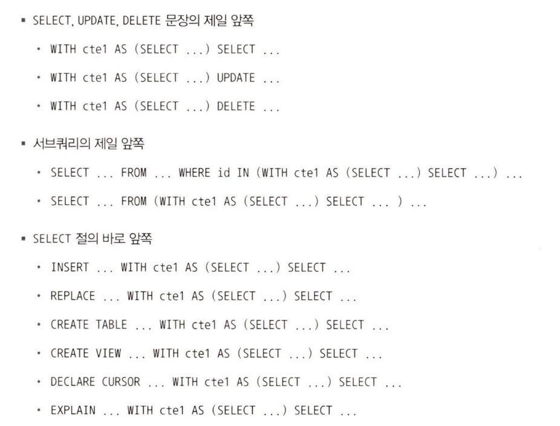


## 11.4.11.1 비 재귀적 CTE(Non-Recursive CTE)

MySQL 서버에서는 ANSI 표준을 그대로 이용해서 WITH 절을 이용해 CTE 를 정의한다.
```sql
WITH cte1 AS (SELECT * FROM departments)
SELECT * FROM cte1;
```

**CTE의 장점**
- CTE 임시 테이블은 재사용이 가능하므로 FROM 절의 서브쿼리보다 효율적이다.
- CTE로 선언된 임시 테이블을 다른 CTE 쿼리에서 참조할 수 있다.
- CTE는 임시 테이블의 생성 부분과 사용 부분의 코드를 분리할 수 있어 가독성이 높다.

<br>

## 11.4.11.2 재귀적 CTE(Recursive CTE)

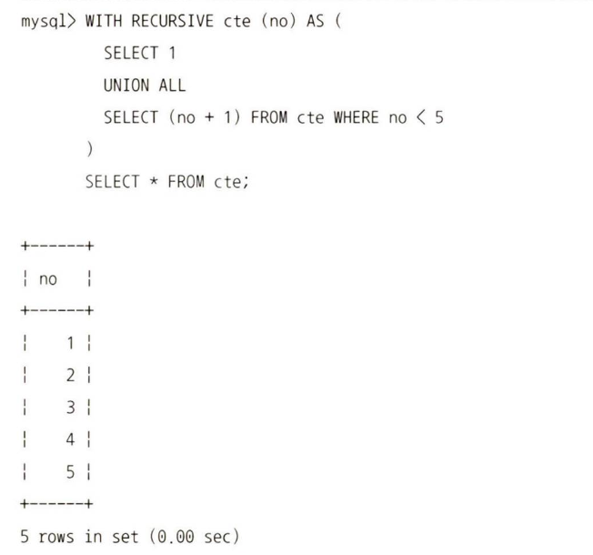

비 재귀적 CTE 는 단순히 쿼리를 한 번만 실행해 그 결과를 임시 테이블로 저장한다. 반면에 재귀적 CTE 쿼리는 비 재귀적 쿼리 파트와 재귀적 파트로 구분되며, 이 둘을 UNION 또는 UNION ALL 로 연결하는 형태로 반드시 쿼리를 작성해야한다.

위의 예제에서는 `SELECT 1` 이 비 재귀적 파트, `SELECT (no + 1) FROM cte WHERE no < 5`가 재귀적 파트가 된다.

=> 비 재귀적 파트는 처음 한 번만 실행되지만, 재귀적 파트는 **쿼리 결과가 없을 때까지 반복 실행** 된다.

위 예시 작동 방법

1. CTE 쿼리의 비 재귀적 파트의 쿼리를 실행
2. 1번의 결과를 이용해 cte 라는 이름의 임시 테이블 생성
3. 1번의 결과를 cte 라는 임시 테이블에 저장
4. 1번 결과를 입력으로 사용해 CTE 쿼리의 재귀적 파트의 쿼리를 실행
5. 4번의 결과를 cte라는 임시 테이블에 저장
6. 전 단계의 결과를 입력으로 사용해 CTE 쿼리의 재귀적 파트 쿼리를 실행
7. 6번 단계에서 쿼리 결과가 없으면 CTE 쿼리를 종료
8. 6번의 결과르 cte 라는 임시 테이블에 저장
9. 6번으로 돌아가서 반복 실행

<br>

# 11.4.12 윈도우 함수 (Window Function)

> 윈도우 함수는 조회하는 현재 레코드를 기준으로 연관된 레코드 집합의 연산을 수행한다. 
> 집계 함수는 주어진 그룹 별로 하나의 레코드로 묶어서 출력하지만, 윈도우 함수는 조건에 일치하는 레코드 건수는 변하지 않고 그대로 유지한다.

## 11.4.12.1 쿼리 각 절의 실행 순서

윈도우 함수를 사용하는 쿼리의 결과에 보여지는 레코드는 WHERE, FROM, GROUP BY, HAVING 절에 의해 결정되고, 그 이후 윈도우 함수가 실행된다. 그리고 마지막으로 SELECT, ORDER BY, LIMIT 절이 실행되어 최종 결과가 반환된다.

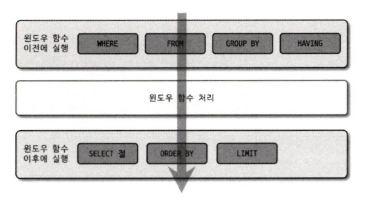

## 11.4.12.2 윈도우 함수 기본 사용법

```sql
AGGREGATE_FUNC() OVER(<partition> <order>) AS window_func_column
```

집계 함수와는 달리 함수 뒤에 OVER 절을 이용해 연산 대상을 파티션하기 위한 옵션을 명시할 수 있다. 이렇게 OVER 절에 의해 만들어진 그룹을 파티션 또는 윈도우라고 한다.

<br>

다만 윈도우 함수의 기능을 GROUP BY 나 다른 기존 기능으로 대체할 수 있는 경우, 가능하다면 윈도우 함수에 너무 의존하지 않는 것이 좋다. 대량의 레코드를 기준으로는 윈도우 함수가 다소 떨어지는 성능을 보인다.

# 11.4.13 잠금을 사용하는 SELECT

> InnoDB 테이블에 대해서는 레코드를 SELECT 할 때 레코드에 아무런 잠금도 걸지 않으며, 이를 잠금 없는 읽기라고 한다. 
> 하지만 SELECT 쿼리를 이용해 읽은 레코드의 칼럼값을 애플리케이션에서 가공해서 다시 업데이트하고자 할 때는 SELECT 가 실행된 후 다른 트랜잭션이 그 칼럼의 값을 변경하지 못하게 해야한다.
> 이런 경우 레코드를 읽으면서 잠금을 걸어둘 필요가 있는데, 이 때 사용하는 옵션이 FOR SHARE 와 FOR UPDATE 이다.

- FOR SHARE : SELECT 쿼리로 읽은 레코드에 대해서 **읽기 잠금**
- FOR UPDATE : SELECT 쿼리가 읽은 레코드에 대해서 **쓰기 잠금**

```sql
SELECT * FROM employees WHERE emp_no=10001 FOR SHARE;
SELECT * FROM employees WHERE emp_no=10001 FOR UPDATE;
```

=> 이 두 가지 잠금 옵션 모두 자동 커밋이 비활성화된 상태 또는 BEGIN 명령이나 START TRANSACTION 명령으로 트랜잭션이 시작된 상태에서만 잠금이 유지된다.

- FOR SHARE 절은 SELECT 된 레코드에 대해 읽기 잠금(공유 잠금, shared lock)을 설정하고 다른 세션에서 해당 레코드를 변경하지 못하게 한다. 다른 세션에서 잠금이 걸린 레코드를 읽는 것은 가능하다.
- FOR UPDATE 절은 쓰기 잠금(배타 잠금, exclusive lock)을 설정하고, 다른 트랜잭션에서는 그 레코드를 변경하는 것뿐만 아니라 읽기(FOR SHARE 절을 사용하는 SELECT 쿼리)도 수행할 수 없다.

> [!CAUTION]
>
> InnoDB 스토리지 엔진을 사용하는 테이블에서는 잠금 없는 읽기가 지원되기 때문에 특정 레코드가 **SELECT ... FOR UPDATE** 쿼리에 의해 잠겨진 상태라 하더라도 FOR SHARE 나 FOR UPDATE 절을 가지지 않은 단순 SELECT 쿼리는 아무런 대기 없이 실행된다.
>
> 잠금 대기하지 않는 경우
> 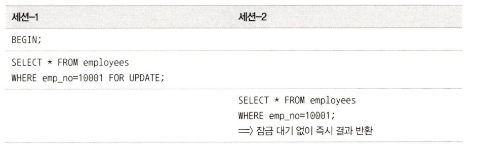
>
> 잠금 대기하는 경우
> 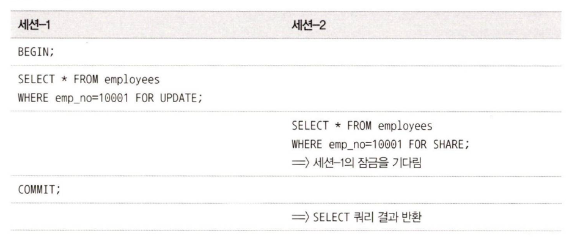
> => FOR SHARE 를 활용한 SELECT

## 11.4.13.1 잠금 테이블 선택

```sql
SELECT *
FROM employees e
  INNER JOIN dept_emp de ON de.emp_no=e.emp_no
  INNER JOIN departments d ON d.dept_no=de.dept_no
FOR UPDATE;
```


위 쿼리를 보면 employees 테이블과 dept_emp 테이블, departments 테이블을 조인해서 읽으면서 FOR UPDATE 절을 사용중이다.
이 때 InnoDB 스토리지 엔진은 3개 테이블에서 읽은 레코드에 대해 모두 쓰기 잠금을 걸게 된다.

만약 위 상황에서 dept_emp 테이블과 departments 테이블은 그냥 참고용으로만 읽고, 실제 쓰기 잠금은 employees 테이블에만 걸고싶다면, FOR UPDATE 뒤에 'OF 테이블' 절을 추가하면 된다.

```sql
SELECT *
FROM employees e
  INNER JOIN dept_emp de ON de.emp_no=e.emp_no
  INNER JOIN departments d ON d.dept_no=de.dept_no
WHERE e.emp_no=10001
FOR UPDATE OF e;
```

<br>

## 11.4.13.2 NOWAIT & SKIP LOCKED

> 지금까지의 MySQL 잠금은 누군가가 레코드를 잠그고 있다면 다른 트랜잭션은 그 잠금이 해제될 때까지 기다려야했다. 하지만 MySQL 8.0 버전부터는 특정 레코드가 잠겨진 상태라면 그냥 무시하고 다른 처리를 수행하거나 다른 트랜잭션을 시작하도록 구현해야할 때가 있는데 그럴 때는 NOWAIT 옵션을 사용하면 된다.

- NOWAIT
  - NOWAIT 옵션을 사용했을 때 특정 레코드가 다른 트랜잭션에 의해서 잠겨진 상태라면 에러를 반환하며 쿼리가 즉시 종료된다.
- SKIP LOCKED
  - SELECT 하려는 레코드가 다른 트랜잭션에 의해 이미 잠겨진 상태라면 잠긴 레코드는 무시하고 잠금이 걸리지 않은 레코드만 가져온다. (에러 반환 X)

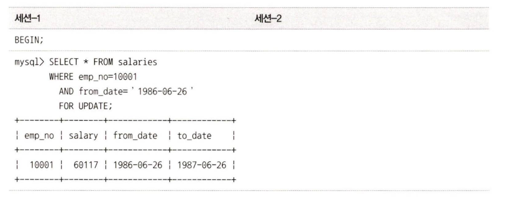

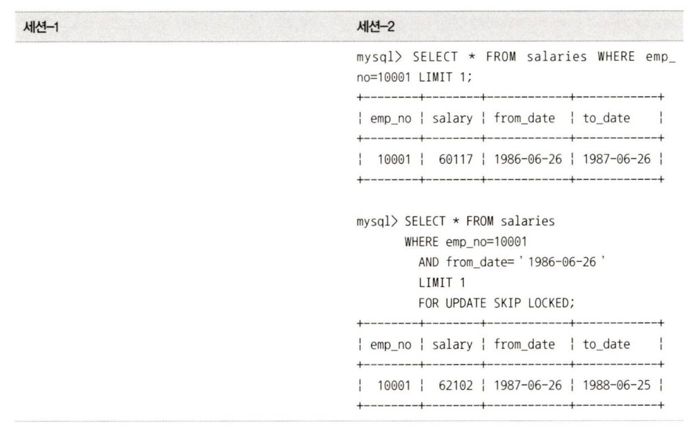

세션 1에서 특정 레코드를 잠근 상황

- 세션 2의 첫번째 쿼리 => FOR UPDATE 구문 없이 그냥 SELECT 만을 사용하다보니 잠금이 걸린 레코드더라도 그냥 읽어오는 모습을 확인할 수 있다.
- 세션 2의 두번째 쿼리 => FOR UPDATE 구문이 존재하고 SKIP LOCKED 를 통해 쿼리를 실행하다보니 잠그고 있는 레코드는 무시하고 그 다음 레코드를 반환하는 모습을 볼 수 있다.


### SKIP LOCKED 활용시 성능 차이


**SKIP LOCKED 사용 X**
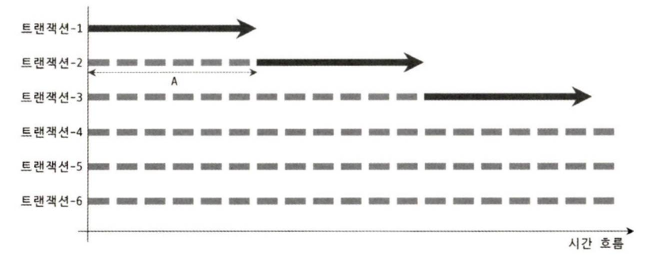

**SKIP LOCKED 사용 O**
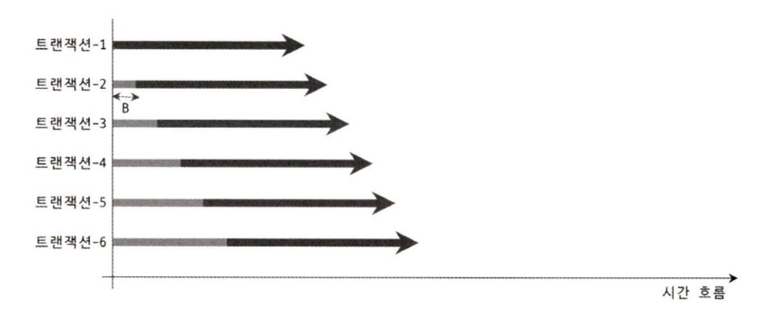