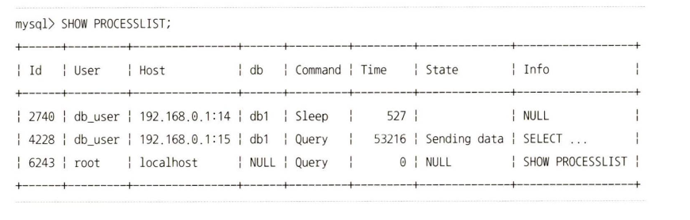
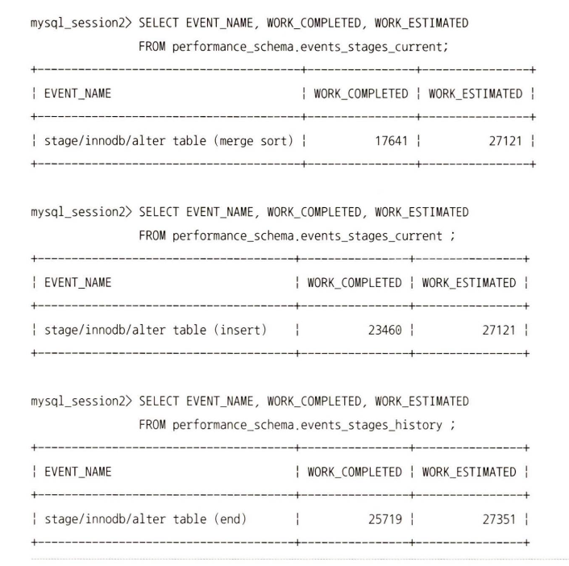

# 7절. 스키마 조작(DDL)

## 11.7 스키마 조작(DDL)

- 테이블/인덱스/뷰 등 **오브젝트 생성·변경·삭제**가 DDL.
- MySQL 8.0에선 대부분의 DDL이 **온라인 모드**로 처리되어, 스키마 변경 중에도 다른 세션에서 조회/쓰기 가능하게 개선됨.
- 하지만 어떤 DDL은 여전히 **긴 시간 + 큰 부하 + 강한 락**이 필요할 수 있으므로 **ALGORITHM / LOCK 옵션과 온라인 DDL 특성**을 이해해야 함.

---

## 11.7.1 온라인 DDL 개요

- 옛날(MySQL 5.5 이전): ALTER TABLE 동안 **다른 세션이 그 테이블에 DML 불가**

  → Percona의 `pt-online-schema-change` 같은 외부 도구 많이 사용.

- MySQL 5.6~8.0: 내부에 **온라인 DDL 엔진** 탑재 → 대부분 ALTER 작업을 “다른 세션의 SELECT/DML과 함께” 진행 가능.

---

## 11.7.1.1 온라인 DDL 알고리즘 (ALGORITHM)

MySQL은 ALTER TABLE 시 다음 **우선순위로 가능한 알고리즘**을 찾음:

1. `ALGORITHM=INSTANT` 가능하면 선택
2. `ALGORITHM=INPLACE` 가능한지 확인
3. `ALGORITHM=COPY` 사용

각 알고리즘 특징:

- **INSTANT**
    - 실제 데이터 파일은 건드리지 않고 **메타데이터만 수정**.
    - 예: NOT NULL 추가 불가, 일부 칼럼 추가/가상 칼럼/숨은 칼럼 등만 가능.
    - 작업 시간이 매우 짧고, 다른 쿼리 영향 거의 없음.
- **INPLACE**
    - “테이블을 통째로 복사하는 임시 테이블”은 안 만들지만,

      내부적으로는 **리빌드(재구성)** 이 필요한 경우가 많음.

    - 예: PK 변경, 인덱스 추가/삭제 등.
    - 온라인 동안 들어오는 DML은 **온라인 alter 로그**에 기록했다가

      마지막에 한 번에 반영.

- **COPY**
    - 전통 방식. **임시 테이블을 만들고 → 모든 레코드를 복사 → RENAME**.
    - 복사 중에는 해당 테이블에 DML(INSERT/UPDATE/DELETE) 불가, 부하 가장 큼.

---

## LOCK 옵션 (NONE / SHARED / EXCLUSIVE)

INSTANT는 메타데이터 잠금만 필요하므로 **LOCK 옵션을 명시할 수 없음**.

INPLACE·COPY에서만 LOCK을 선택할 수 있음:

- **LOCK=NONE**
    - 온라인 DDL 동안에도 **읽기·쓰기 모두 허용**.
    - 메타데이터 잠금은 시작/끝에 잠깐 필요하지만, 레코드 수준 잠금은 안 잡음.
- **LOCK=SHARED**
    - **읽기만 허용, 쓰기(DML)는 막음**.
    - 스키마 변경 중 SELECT는 가능하지만 INSERT/UPDATE/DELETE는 대기.
- **LOCK=EXCLUSIVE**
    - 읽기·쓰기 모두 막음. 예전 ALTER TABLE 과 동일한 강한 잠금.

- 보통 흐름
    1. INSTANT 시도
    2. 안 되면 INPLACE + LOCK=NONE
    3. 이것도 안 되면 INPLACE + LOCK=SHARED
    4. 그래도 안 되면 COPY + LOCK=SHARED → COPY + LOCK=EXCLUSIVE

---

## 11.7.1.4 온라인 DDL 실패 케이스

온라인 DDL이 실패하는 대표 상황:

- **변경 마지막에 데이터 제약 위반**
    - 예: 새로 만드는 인덱스가 UNIQUE인데, 이미 테이블에 중복 값 존재

      → 전체 ALTER는 실패하고 에러로 끝남.

- **LOCK 옵션이 실제 필요 수준보다 약한 경우**
    - 예: `LOCK=NONE` 으로 시도했는데, 실제론 강한 락이 필요한 작업

      → “LOCK=NONE is not supported. Try LOCK=SHARED” 같은 에러.

- **lock_wait_timeout 초과**
    - 시작/끝 순간에 필요한 메타데이터 잠금을

      다른 트랜잭션이 오래 쥐고 있으면, 대기하다 `ERROR 1205` 로 실패.

    - 이럴 땐 `lock_wait_timeout` 을 적당히 줄여서

      오래 기다리지만 말고 **빨리 실패하게** 하고,

      문제 트랜잭션을 정리한 뒤 다시 ALTER 시도하는 게 좋음.

- **온라인 로그/임시 디스크 공간 부족**
    - 인덱스 생성 시 사용하는 `tmpdir` 공간 부족,
    - `innodb_online_alter_log_max_size`보다 많은 변경이 발생하는 경우 등.

---

## 11.7.1.5 온라인 DDL 진행 상황 모니터링

- 온라인 DDL 포함 ALTER TABLE의 진행률은 **performance_schema** 로 모니터링 가능.
1. performance_schema 활성화 및 관련 instrument/consumer 켜기

    ```sql
    SET GLOBAL performance_schema = ON;
    UPDATE performance_schema.setup_instruments
      SET ENABLED='YES', TIMED='YES'
    WHERE NAME LIKE 'stage/innodb/alter%';
    
    UPDATE performance_schema.setup_consumers
      SET ENABLED='YES'
    WHERE NAME LIKE 'events_stages%';
    ```

2. 진행 상황 조회

    ```sql
    SELECT EVENT_NAME, WORK_COMPLETED, WORK_ESTIMATED
    FROM performance_schema.events_stages_current;
    
    ```




## 11.7.2 데이터베이스 변경

### 11.7.2.1 데이터베이스 생성

```sql
CREATE DATABASE [IF NOT EXISTS] employees
  CHARACTER SET utf8mb4
  COLLATE utf8mb4_general_ci;
```

- MySQL에선 스키마·데이터베이스가 거의 같은 개념, **논리적인 묶음** 정도 의미.
- 문자셋·콜레이션을 지정하지 않으면 `character_set_server` 기본값 사용.
- `IF NOT EXISTS`를 붙이면 **이미 있으면 무시**, 없을 때만 생성.

### 11.7.2.2 데이터베이스 목록

```sql
SHOW DATABASES;
SHOW DATABASES LIKE 'emp%';
```

- 현재 서버가 가진 DB 목록 조회.
- `LIKE 패턴`으로 특정 이름만 필터링 가능.
- 실행에는 `SHOW DATABASES` 권한 필요.

### 11.7.2.3 데이터베이스 선택

```sql
USE employees;
SELECT * FROM employees.departments;
```

- 기본 DB를 선택하는 명령.
- 이후 SQL에서 DB명을 안 쓰면 **현재 USE 된 DB**를 기준으로 테이블을 찾음.
- 다른 DB의 테이블을 쓸 땐 `db.table` 형식으로 **반드시 DB명 명시**.

### 11.7.2.4 데이터베이스 속성 변경

```sql
ALTER DATABASE employees
  CHARACTER SET = euckr
  COLLATE = euckr_korean_ci;
```

- 생성 시 지정한 **기본 문자셋·콜레이션**을 나중에 변경.
- 새로운 테이블/칼럼의 기본값에 영향을 줌.

### 11.7.2.5 데이터베이스 삭제

```sql
DROP DATABASE [IF EXISTS] employees;
```

- 해당 DB와 그 안의 모든 객체(테이블 등)를 **통째로 삭제**.
- `IF EXISTS`를 쓰면 DB가 없을 때 에러 없이 그냥 무시.

---

## 11.7.3 테이블 스페이스 변경

- MySQL 8.0부터 사용자 테이블도 **제너럴 테이블스페이스**에 저장 가능.
- 다만 제너럴 테이블스페이스는 몇 가지 제약이 있음:
    - 파티션 테이블은 사용할 수 없음.
    - 복제 소스·레플리카가 같은 호스트일 때 `ADD DATAFILE` 사용 제한.
    - 암호화/압축 단위가 “테이블스페이스 단위”로 묶임.
- 장점:
    - 여러 테이블을 한 **파일에 넣어 파일 핸들 수·메타데이터 관리 비용 감소.**
- 일반적인 환경에선 보통 **개별 테이블 스페이스(innodb_file_per_table=ON)** 를 쓰고,

  특별한 요구(테이블이 엄청 많이 필요한 응용 등) 있을 때만 제너럴 테이블스페이스 고려.


---

## 11.7.4 테이블 변경

### 11.7.4.1 테이블 생성

```sql
CREATE [TEMPORARY] TABLE [IF NOT EXISTS] tb_test (
  member_id BIGINT UNSIGNED AUTO_INCREMENT,
  nickname CHAR(20) CHARACTER SET 'utf8' COLLATE 'utf8_general_ci' NOT NULL,
  ...
  PRIMARY KEY (member_id),
  UNIQUE INDEX ux_nickname (nickname),
  INDEX ix_registeredttm (registered_dttm)
) ENGINE=InnoDB;
```

- `TEMPORARY` : 현재 세션에서만 보이는 **임시 테이블** 생성.
- `IF NOT EXISTS` : 같은 이름이 있으면 에러 대신 무시.
- `ENGINE` : 사용할 스토리지 엔진 지정 (8.0 기본은 InnoDB).

### 11.7.4.2 테이블 구조 조회

```sql
SHOW CREATE TABLE employees\G
DESC employees;
```

- `SHOW CREATE TABLE`
    - 테이블의 **CREATE TABLE 문 전체**를 보여줌 (칼럼·인덱스·외래키까지).
    - 튜닝/DDL 스크립트 작성 시 가장 많이 사용.
- `DESC`
    - 필드별 `Type / Null / Key / Default / Extra`를 표 형태로 보여줌.
    - 인덱스·외래키 구조까지 한 번에 보긴 어려움.

### 11.7.4.3 테이블 구조 변경

- 구조 변경은 `ALTER TABLE` 사용.

```sql
ALTER TABLE employees
  CONVERT TO CHARACTER SET UTF8MB4
  COLLATE UTF8MB4_GENERAL_CI
  ALGORITHM=INPLACE, LOCK=NONE;

ALTER TABLE employees ENGINE=InnoDB
  ALGORITHM=INPLACE, LOCK=NONE;
```

- 문자셋/콜레이션 변경:
    - 테이블 기본 문자셋뿐 아니라 **기존 데이터도 모두 변환**.
- ENGINE 변경:
    - 실제로는 **테이블 전체를 새 파일로 복사하는 작업(리빌드)** 이라 비용 큼.

### 11.7.4.4 테이블 명 변경 (RENAME TABLE)

```sql
RENAME TABLE t1 TO t2;
RENAME TABLE db1.t1 TO db2.t1;
```

- 같은 DB 안에서 이름만 바꾸면 메타데이터만 수정 → 매우 빠름.
- 다른 DB로 옮길 때는 **실제 데이터 파일 복사**가 필요해 더 오래 걸릴 수 있음.

### 교체용 RENAME 패턴

```sql
-- 새 테이블과 데이터 생성
CREATE TABLE batch_new (...);
INSERT INTO batch_new SELECT ...;

-- 기존 테이블과 교체
RENAME TABLE batch TO batch_old,
             batch_new TO batch;
```

- 두 개의 RENAME를 **한 문장으로 묶으면**
    - MySQL이 모든 대상 테이블에 한꺼번에 락을 잡고
    - 이름 변경을 원자적으로 수행 →
    - 응용 프로그램 입장에선 테이블이 “순간적으로” 바뀐 것처럼 보임.

### 11.7.4.5 테이블 상태 조회

```sql
SHOW TABLE STATUS LIKE 'employees'\G
```

- 테이블의 메타 정보를 한 번에 확인:
    - 사용 엔진, 행 수 추정치, 평균 row 길이, 데이터/인덱스 크기,

      생성 시각, 문자셋/콜레이션, 자동 증가 값, 기타 옵션 등.

- 큰 테이블의 **대략적인 레코드 수 / 용량 파악**에 유용.

## 11.7.4.6 테이블 구조 복사

- **데이터는 빼고 구조만 복사**할 때 쓰는 패턴.

```sql
-- 구조만 같은 새 테이블 생성
CREATE TABLE temp_employees LIKE employees;

-- 이후 데이터를 복사하고 싶으면
INSERT INTO temp_employees
SELECT * FROM employees;
```

인덱스까지 그대로 복사되는 건 `CREATE TABLE ... LIKE`.

---

## 11.7.4.7 테이블 삭제

```sql
DROP TABLE [IF EXISTS] table1;
```

- 테이블과 데이터 파일을 **통째로 삭제**.

---

## 11.7.5 칼럼 변경 (ADD / DROP / MODIFY)

### 11.7.5.1 칼럼 추가

```sql
-- 테일 끝에 새 칼럼 추가 → 대부분 INSTANT 가능
ALTER TABLE employees
  ADD COLUMN emp_telno VARCHAR(20),
  ALGORITHM=INSTANT;

-- 중간 위치에 새 칼럼 추가 → 리빌드(INPLACE) 필요
ALTER TABLE employees
  ADD COLUMN emp_telno VARCHAR(20) AFTER emp_no,
  ALGORITHM=INPLACE, LOCK=NONE;
```

- **테이블 끝에 칼럼 추가**는 보통 **INSTANT**로,

  메타데이터만 바꿔서 매우 빠름.

- **중간에 끼워 넣는 추가**는 실제 레코드 재배치가 필요 → **INPLACE 리빌드**.

### 11.7.5.2 칼럼 삭제

```sql
ALTER TABLE employees
  DROP COLUMN emp_telno,
  ALGORITHM=INPLACE, LOCK=NONE;
```

- 칼럼 삭제는 항상 **레코드 리빌드가 필요**해서 **INSTANT 불가**, **INPLACE 알고리즘**으로 처리.

### 11.7.5.3 칼럼 이름 및 타입 변경

```sql
-- 칼럼 이름만 변경
ALTER TABLE salaries
  CHANGE to_date end_date DATE NOT NULL,
  ALGORITHM=INPLACE, LOCK=NONE;

-- INT → VARCHAR 로 타입 변경
ALTER TABLE salaries
  MODIFY salary VARCHAR(20),
  ALGORITHM=COPY, LOCK=SHARED;

-- VARCHAR 길이 늘리기
ALTER TABLE employees
  MODIFY last_name VARCHAR(30) NOT NULL,
  ALGORITHM=INPLACE, LOCK=NONE;

-- VARCHAR 길이 줄이기
ALTER TABLE employees
  MODIFY last_name VARCHAR(10) NOT NULL,
  ALGORITHM=COPY, LOCK=SHARED;
```

- **이름만 바꾸는 경우** → 데이터 리빌드 없이 INPLACE.
- **타입 변경/길이 변경**은 경우에 따라 INPLACE 또는 COPY 필요:
    - 길이 늘리기: 보통 INPLACE 가능(상황에 따라 리빌드 여부 달라짐).
    - 길이 줄이기: 데이터 손실 가능성 때문에 **COPY + 더 강한 LOCK** 을 쓰기도 함.
- 특히 UTF8MB4처럼 **문자당 최대 4바이트** 쓰는 문자셋에서는 길이 변경이 실제 바이트 수를 바꿔서 리빌드가 필요할 수 있음.

---

## 11.7.6 인덱스 변경

### 11.7.6.1 인덱스 추가

```sql
-- PK 추가
ALTER TABLE employees
  ADD PRIMARY KEY (emp_no),
  ALGORITHM=INPLACE, LOCK=NONE;

-- UNIQUE 인덱스
ALTER TABLE employees
  ADD UNIQUE INDEX ux_empno (emp_no),
  ALGORITHM=INPLACE, LOCK=NONE;

-- 일반 보조 인덱스
ALTER TABLE employees
  ADD INDEX ix_lastname (last_name),
  ALGORITHM=INPLACE, LOCK=NONE;

-- FULLTEXT / SPATIAL 인덱스는 SHARED 잠금 필요
ALTER TABLE employees
  ADD FULLTEXT INDEX fx_firstname_lastname (first_name, last_name),
  ALGORITHM=INPLACE, LOCK=SHARED;

ALTER TABLE employees
  ADD SPATIAL INDEX fx_loc (last_location),
  ALGORITHM=INPLACE, LOCK=SHARED;
```

- MySQL 8.0에선 **대부분의 B-Tree 인덱스 추가가 온라인(INPLACE, LOCK=NONE)** 으로 가능.
- FULLTEXT, SPATIAL 인덱스는 **SHARED 락** 정도는 필요.

### 11.7.6.2 인덱스 조회

```sql
SHOW INDEX FROM employees;

SHOW CREATE TABLE employees;
```

- `SHOW INDEXES`
    - 인덱스별: 이름, 컬럼 순서(`Seq_in_index`), 유니크 여부, 카디널리티 등.
- `SHOW CREATE TABLE`
    - 테이블의 **CREATE 문 안에 인덱스 정의까지** 같이 보이므로

      “어떤 인덱스가 어떤 컬럼 조합으로 있는지” 한눈에 보기 좋음.


### 11.7.6.3 인덱스 이름 변경

```sql
-- 인덱스 이름 변경
ALTER TABLE salaries
  RENAME INDEX ix_salary TO ix_salary2,
  ALGORITHM=INPLACE, LOCK=NONE;
```

- 예전엔 인덱스 이름을 바꾸려면 **새 인덱스 생성 → 기존 인덱스 삭제** 패턴을 써야 했는데,

  이제는 **RENAME INDEX** 로 INPLACE 변경 가능.


### 11.7.6.4 인덱스 가시성 변경 (VISIBLE / INVISIBLE)

```sql
-- 인덱스를 잠시 안 쓰게 만들기
ALTER TABLE employees
  ALTER INDEX ix_firstname INVISIBLE;

-- 다시 사용하게 전환
ALTER TABLE employees
  ALTER INDEX ix_firstname VISIBLE;
```

- 인덱스를 지우지 않고 **옵티마이저가 사용하지 못하게** 만드는 기능.
    - 쿼리 계획에서 해당 인덱스가 사라지는지 확인 → 문제 없으면 나중에 DROP INDEX 로 영구 삭제.

---

## 11.7.8 프로세스 조회 및 강제 종료 (SHOW PROCESSLIST, KILL)

- **SHOW PROCESSLIST**

    ```sql
    SHOW PROCESSLIST;
    ```

    - 현재 MySQL 서버에 연결된 각 클라이언트 스레드 목록과 상태를 보여줌.

  

- **KILL 사용**

    ```sql
    KILL QUERY 4228;  -- 해당 스레드의 현재 쿼리만 취소
    KILL 4228;        -- 해당 커넥션 자체를 끊음 (트랜잭션도 함께 종료)
    ```

    - 애플리케이션이 쿼리 에러를 잘 처리 못 한다면 **KILL QUERY** 보다 **KILL (커넥션 전체 종료)** 가 더 안정적일 수 있음.

---

## 11.7.9 활성 트랜잭션 조회

- **information_schema.innodb_trx**

    ```sql
    SELECT trx_id,
           (SELECT CONCAT(user, '@', host)
              FROM information_schema.processlist
             WHERE id = trx_mysql_thread_id) AS source_info,
           trx_state,
           trx_started,
           (UNIX_TIMESTAMP(NOW()) - UNIX_TIMESTAMP(trx_started)) AS lasting_sec,
           trx_rows_modified,
           trx_rows_locked
      FROM information_schema.innodb_trx
     WHERE (UNIX_TIMESTAMP(NOW()) - UNIX_TIMESTAMP(trx_started)) > 5\G
    ```

    - 오래 살아 있는 트랜잭션을 찾을 수 있음.
    - 어떤 계정에서, 얼마나 오래, 몇 개의 레코드를 변경/락 잡고 있는지 확인.
- **어떤 레코드를 잠그고 있는지 확인 (performance_schema.data_locks 등)**

    ```sql
    SELECT * FROM data_locks\G
    ```

- **문제 트랜잭션 종료**

    ```sql
    KILL 14;
    ```

    - trx_mysql_thread_id 에 해당하는 스레드를 KILL 해서 오래된 트랜잭션/락을 정리.