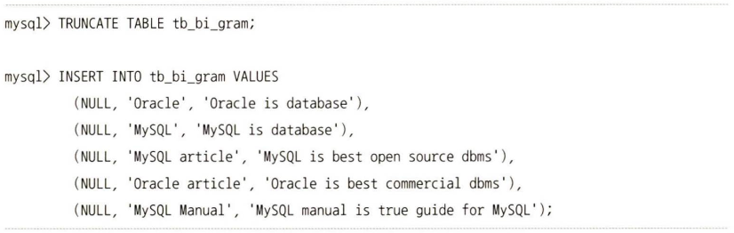
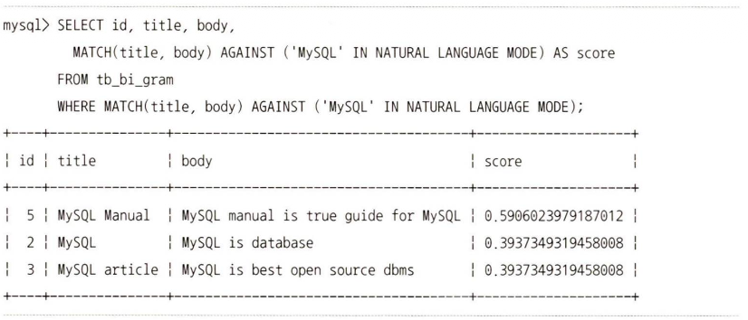
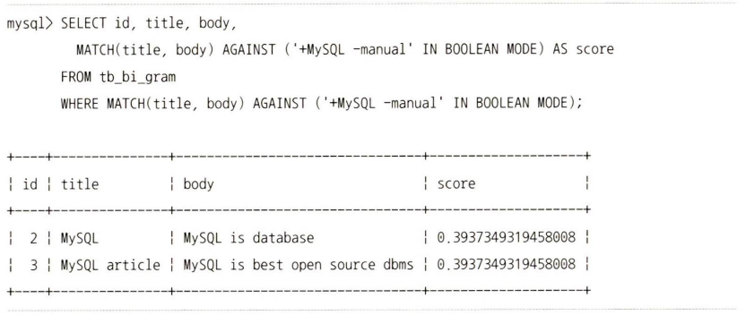
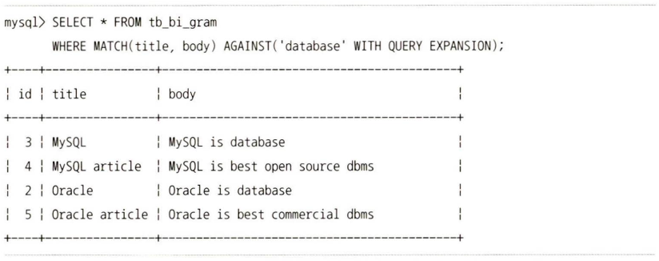

## 1. 전문 검색
- 전문 검색(Ful-text Search): 용량이 큰 문서를 단어 수준으로 잘게 쪼개어 문서 검색을 하도록 하는 것

서구권 언어의 경우 문서의 단어들을 분리해서 형태소를 찾고 그 형태소를 인덱싱하는 방법(어근 분석)을 사용하지만 이러한 방식은 한국어, 중국어, 일본어 등에는 적합하지 않다.
대신 단어의 형태소나 어원과 관계없이 특정 길이의 조각(Token)으로 인덱싱하는 n-gram 검색 기능을 이용한다.

### 1.1. 전문 검색 인덱스의 생성과 검색
MySQL 서버에서는 다음 2가지 알고리즘을 이용해 인덱싱할 토큰을 분리해낸다.

- 형태소 분석(서구권 언어의 경우 어근 분석)
    문장의 띄어쓰기 단위로 단어를 분리하고, 각 단어의 조사를 제거해 명사 또는 어근을 찾아 인덱싱하는 방식이다. MySQL 서버에서는 단순히 공백과 같은 띄어쓰기 기준으로 토큰을 분리해 인덱싱한다. 즉, 형태소 분석이나 어근 분석 기능은 따로 구현돼 있지 않다.
- n-gram 파서
    띄어쓰기 단위로 단어를 분리하고, 그 단어를 단순히 주어진 길이(n-gram의 n은 1~10 사이의 숫자 값)로 쪼개서 인덱싱하는 알고리즘이다. (8.5 '전문 검색 인덱스' 참조)

### 1.2. 전문 검색 쿼리 모드
- 자연어 검색(NATURAL LANGUAGE MODE)
    MySQL 서버의 자연어 검색은 검색어에 제시된 단어들을 많이 가지고 있는 순서대로 정렬해서 결과를 반환한다.
    
    

- 불리언 검색(BOOLEAN MODE)
    자연어 검색은 단순히 검색어에 포함된 단어들이 존재하는 결과만 가져오는 반면, 불리언 검색은 쿼리에 사용되는 검색어의 존재 여부에 대해 논리적 연산이 가능하다.
    
    위의 쿼리는 "MySQL"은 포함하지만 "manual"은 포함하지 않는 레코드를 검색하는 쿼리다.

- 검색어 확장(QUERY EXPANSION)
    사용자가 쿼리에 사용한 검색어로 검색된 결과에서 공통으로 발견되는 단어들을 모아서 다시 한번 더 검색을 수행하는 방식이다.
    
    "database"에 대한 전문 검색을 실행한 뒤 연관 있어 보이는 단어들인 "MySQL"이나 "Oracle"과 같은 것들을 뽑아 다시 전문 검색 쿼리를 실행한 뒤, 수집된 결과를 모두 합쳐서 반환한다.