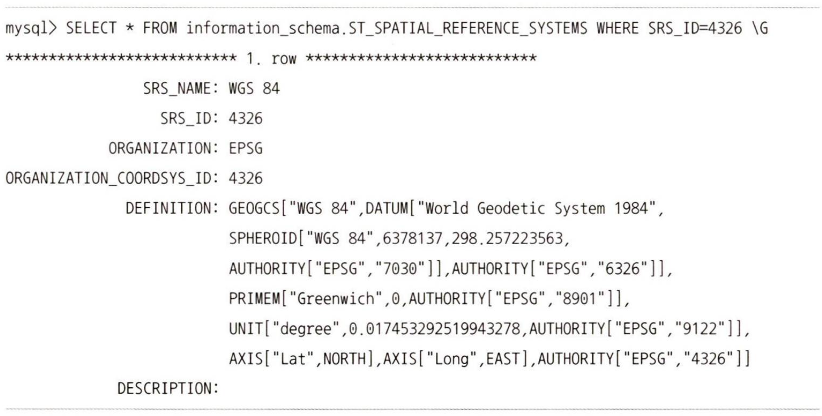
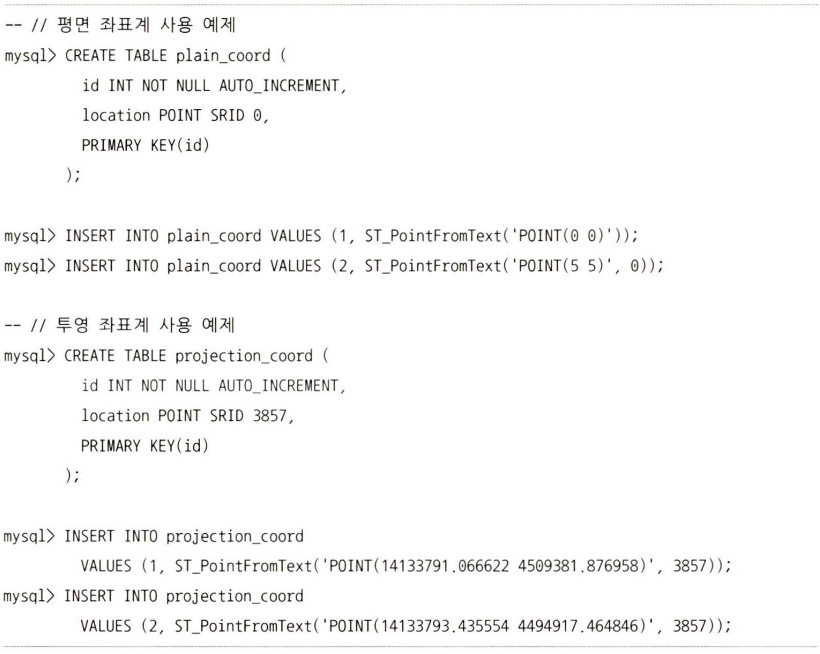
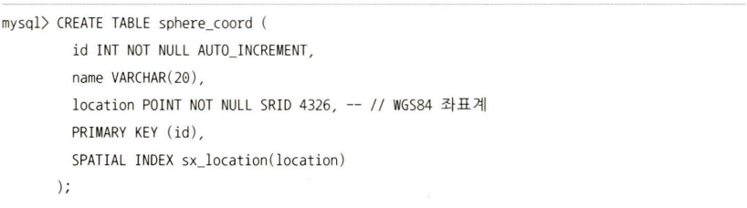
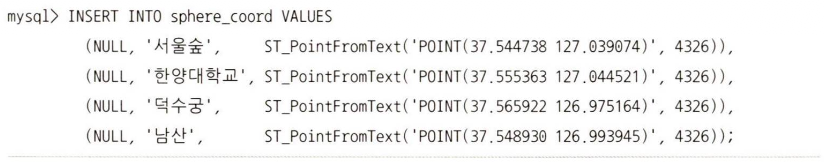

## 2. 공간 검색

### 2.1. 용어 설명
- OGC(Open Geospatial Consortium): 위치 기반 데이터에 대한 표준을 수립하는 단체
- OpenGIS: OGC에서 제정한 지리 정보 시스템(GIS, Geographic Information System) 표준으로, WKT나 WKB 같은 지리 정보 데이터를 표기하는 방법과 저장하는 방법, 그리고 SRID와 같은 표준을 포함한다.
- SRS와 GCS, PCS: SRS(Spatial Reference System)는 우리가 흔히 이야기하는 좌표계라고 생각하면 된다. SRS는 크게 GCS(Geographic Coordinate System)와 PCS(Projected Coordinate system)로 구분된다. GCS는 지구와 같은 구체 표면에서 특정 위치를 정의하고, PCS는 GCS 위치 데이터를 2차원 평면으로 투영시킨 좌표계이다.
- SRID와 SRS-ID: SRID는 특정 SRS를 지칭하는 고유 번호이고, SRS-ID와 동의어이다.
- WKT와 WKB: WKT(Well-Known Text format)는 텍스트 포맷으로 위치 좌표를 표현하는 방법이고, WKB(Well-Known Binary format)는 컴퓨터에 저장할 수 있는 형태의 이진 포맷의 저장 표준이다.
- MBR과 R-Tree: MBR(Minimum Bounding Rectangle)은 어떤 도형을 감싸는 최소의 사각 상자를 의미하고, R-Tree는 MBR을 통해 도형들의 포함 관계를 이용하여 만들어진 인덱스이다. (8.4 'R-Tree 인덱스' 참조)

### 2.2. SRS(Spatial Reference System)
SRS(좌표계)는 GCS(지리 좌표계)와 PCS(투영 좌표계)로 구분된다. MySQL 서버에서 지원하는 SRS는 5000여 개가 넘는데, 이에 대한 정보는 information_schema 데이터베이스의 ST_SPATIAL_REFERENCE_SYSTEMS 테이블을 통해 확인할 수 있다.

### 2.3. 투영 좌표계와 평면 좌표계
평면 좌표계는 투영 좌표계와 비슷한 특성을 가진다.
지구 구체 전체 또는 일부를 평면으로 투영(Projection)해서 표현한 좌표계를 투영 좌표계라고 한다. SRID=0인 좌표계도 평면에 표시되는 좌표계지만 투영 좌표계라고 하지 않고 평면 좌표계라고 한다. 평면 좌표계는 단위와 x축, y축 값의 제한을 갖지 않는다.

### 2.4. 지리 좌표계
GPS로부터 받는 위치 정보를 저장하기 위해 WGS 84 좌표계(SRID가 4326인 좌표계)를 이용한 예시(위/경도 이용)

