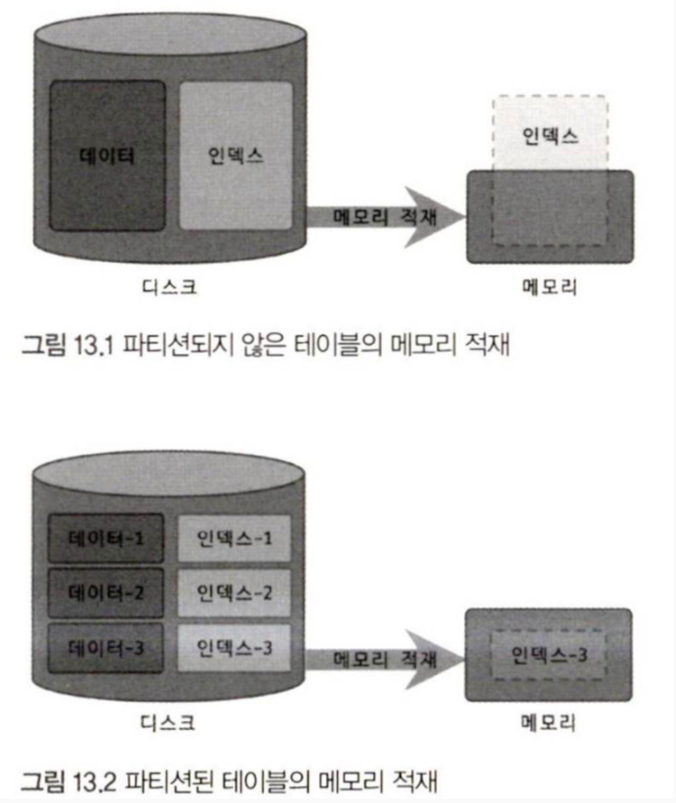
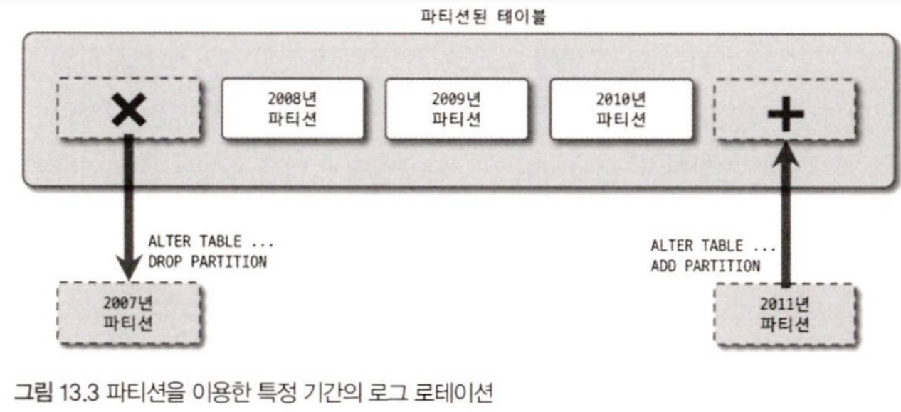
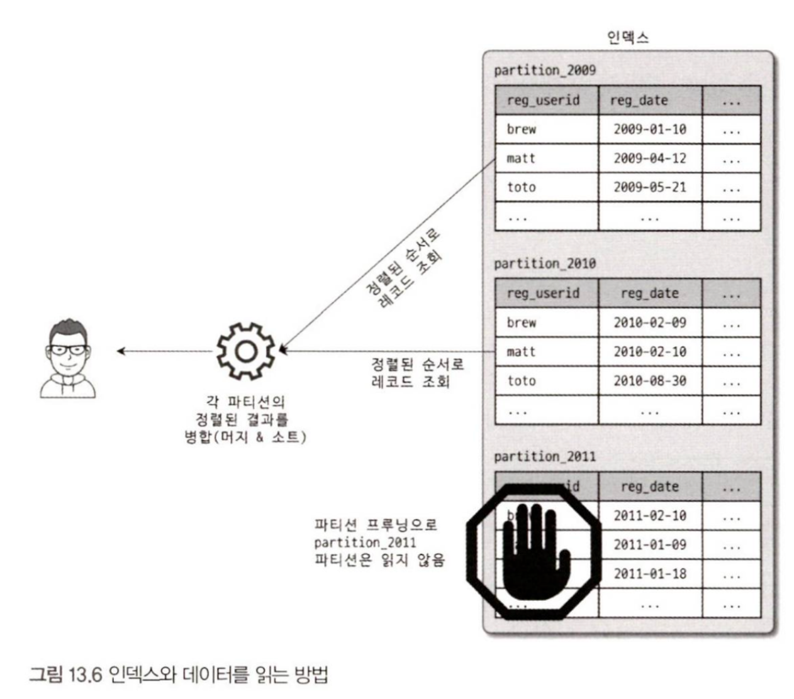

> 논리적으로는 하나의 테이블, 물리적으로는 여러 개의 테이블

주로 **대용량 테이블** 을 물리적으로 **여러 개의 소규모 테이블로 분산하는 목적** 으로 사용.

> [!caution]
> 무조건 성능이 빨라지는 만병 통치약이 아니다. 오히려 성능이 더 나빠질 수 있으니 유의할 것.


# 13.1 개요

파티션이 SQL 문장을 수행하는 데 어떤 영향을 미치고, 파티션으로 기대할 수 있는 장점은 무엇일까?

## 13.1.1 파티션을 사용하는 이유

테이블의 데이터가 단순히 많아진다고 해서 파티션을 적용한다 - X
하나의 테이블이 너무 커서, 인덱스의 크기가 물리적인 메모리보다 훨씬 크거나 주기적인 삭제 작업이 필요한 경우 등 - O


##### 1. 단일 INSERT와 범위 SELECT의 빠른 처리

인덱스가 커질수록 SELECT, INSERT 등등 모든 작업이 함께 느려지게 된다. 특히, 한 테이블의 인덱스가 물리적으로 MySQL이 사용 가능한 메모리 공간보다 크다면 그 영향은 더 심각할 것이다(Page Fault등.. 시간이 몇십 몇백배 차이나는 작업이 추가됨).



따라서 파티션은 데이터와 인덱스를 조각화해서, 물리적 메모리를 효율적으로 사용할 수 있게 해준다.

##### 2. 이력 데이터(Log)의 효율적인 관리

로그 데이터는 시간이 지나면 별도로 아카이빙하거나 백업 후 삭제해버리는 것이 일반적이다. 로그 테이블에서 불필요한 데이터를 백업하거나 삭제하는 작업은 **일반 테이블에서 상당히 고부하 작업** 에 해당한다. 그러나 **파티션으로 관리** 한다면, 간단하고 빠르게 해결할 수 있다.




## 13.1.2 파티션 내부 처리

#### 1단계: 테이블 생성

```sql
CREATE TABLE order_logs (
    id INT AUTO_INCREMENT,
    order_date DATE,
    customer_id INT,
    amount DECIMAL(10,2),
    PRIMARY KEY (id, order_date)  -- 파티션 키는 PK에 포함되어야 함
)
-- PARTITION BY RANGE: 범위 기반으로 파티션 분할
-- YEAR(order_date): order_date에서 연도를 추출하여 파티션 키로 사용
-- 예: '2023-05-15' → 2023
PARTITION BY RANGE (YEAR(order_date)) (
    
    -- p2022 파티션: YEAR(order_date) < 2023인 모든 데이터
    -- 즉, 2022년 이하 데이터 (2022, 2021, 2020... 모두 포함)
    -- 실제로는 다음 파티션이 없으면 2022년 이하 모든 데이터가 여기 저장됨
    PARTITION p2022 VALUES LESS THAN (2023),
    
    -- p2023 파티션: 2023 ≤ YEAR(order_date) < 2024
    -- p2022가 2023 미만을 처리했으므로, 실제로는 2023년 데이터만 저장됨
    PARTITION p2023 VALUES LESS THAN (2024),
    
    -- p2024 파티션: 2024 ≤ YEAR(order_date) < 2025
    -- 2024년 데이터만 저장됨
    PARTITION p2024 VALUES LESS THAN (2025),
    
    -- p_future 파티션: 2025 ≤ YEAR(order_date) < MAXVALUE
    -- MAXVALUE: MySQL의 특수 값으로 가능한 최대값을 의미
    -- 2025년 이후의 모든 미래 데이터 (2025, 2026, 2027...)가 저장됨
    -- MAXVALUE 파티션은 반드시 가장 마지막에 위치해야 함
    PARTITION p_future VALUES LESS THAN MAXVALUE
);

```

#### 2단계: 데이터 INSERT 과정

```sql
INSERT INTO order_logs VALUES
(1, '2022-05-15', 101, 50000),
(2, '2023-03-20', 102, 75000),
(3, '2023-11-10', 103, 30000),
(4, '2024-01-05', 104, 90000),
(5, '2025-06-01', 105, 40000);
```

**MySQL 내부 처리:**

1. `'2022-05-15'` → YEAR() = 2022 → 2022 < 2023 → **p2022 파티션**에 저장
2. `'2023-03-20'` → YEAR() = 2023 → 2023 < 2024 → **p2023 파티션**에 저장
3. `'2023-11-10'` → YEAR() = 2023 → 2023 < 2024 → **p2023 파티션**에 저장
4. `'2024-01-05'` → YEAR() = 2024 → 2024 < 2025 → **p2024 파티션**에 저장
5. `'2025-06-01'` → YEAR() = 2025 → 2025 < MAXVALUE → **p_future 파티션**에 저장

#### 3단계: SELECT 쿼리 처리 (파티션 프루닝)

##### 예시 1: 특정 연도 조회

```sql
SELECT * FROM order_logs 
WHERE order_date >= '2023-01-01' AND order_date < '2024-01-01';
```

**처리 과정:**

1. MySQL이 WHERE 조건 분석: `2023년 데이터만 필요`
2. **파티션 프루닝 발생**: p2023 파티션만 스캔
3. p2022, p2024, p_future 파티션은 완전히 무시
4. 결과: 2개 행 반환 (id 2, 3)

```sql
-- 실제 어떤 파티션을 스캔했는지 확인
EXPLAIN PARTITIONS 
SELECT * FROM order_logs 
WHERE order_date >= '2023-01-01' AND order_date < '2024-01-01';
```

**결과:**

```
+----+-------------+------------+------------+------+
| id | select_type | table      | partitions | rows |
+----+-------------+------------+------------+------+
| 1  | SIMPLE      | order_logs | p2023      | 2    |
+----+-------------+------------+------------+------+
```

→ **p2023만 스캔됨!**

##### 예시 2: 범위 조회

```sql
SELECT * FROM order_logs 
WHERE order_date BETWEEN '2023-06-01' AND '2024-03-31';
```

**처리 과정:**

1. 조건 분석: 2023년 중반 ~ 2024년 초반
2. **2개 파티션 스캔**: p2023, p2024
3. 나머지 파티션 무시
4. 결과: 3개 행 반환 (id 3, 4, 그리고 해당 기간의 데이터)

##### 예시 3: 파티션 키 없는 조회 (전체 스캔)

```sql
SELECT * FROM order_logs 
WHERE customer_id = 103;
```

**처리 과정:**

1. order_date 조건 없음
2. **모든 파티션 스캔**: p2022, p2023, p2024, p_future
3. 파티션 프루닝 불가능
4. 성능상 불리함

#### 4단계: DELETE/UPDATE 처리

```sql
-- 2023년 데이터만 삭제
DELETE FROM order_logs 
WHERE order_date BETWEEN '2023-01-01' AND '2023-12-31';
```

**처리 과정:**

1. p2023 파티션만 접근
2. 해당 파티션에서 조건에 맞는 행 삭제
3. 다른 파티션은 건드리지 않음

```sql
-- 특정 파티션 전체 삭제 (훨씬 빠름)
ALTER TABLE order_logs DROP PARTITION p2022;
```

→ 파일 시스템에서 p2022 파티션 파일을 통째로 삭제 (DELETE보다 수백배 빠름)

#### 5단계: 파티션 상태 확인

```sql
SELECT 
    PARTITION_NAME,
    PARTITION_EXPRESSION,
    PARTITION_DESCRIPTION,
    TABLE_ROWS,
    AVG_ROW_LENGTH,
    DATA_LENGTH
FROM information_schema.PARTITIONS
WHERE TABLE_SCHEMA = 'your_database'
  AND TABLE_NAME = 'order_logs';
```

**결과 예시:**

```
+---------------+-----------------------+--------+------------+
| PARTITION_NAME| PARTITION_DESCRIPTION | ROWS   | DATA_LENGTH|
+---------------+-----------------------+--------+------------+
| p2022         | 2023                  | 1      | 16384      |
| p2023         | 2024                  | 2      | 16384      |
| p2024         | 2025                  | 1      | 16384      |
| p_future      | MAXVALUE              | 1      | 16384      |
+---------------+-----------------------+--------+------------+
```

RANGE 파티셔닝은 파티션 키(여기서는 order_date)의 값을 확인해서 어느 범위에 속하는지 판단하고, 해당 파티션에만 접근. 이를 통해 대용량 테이블에서도 필요한 부분만 스캔하여 성능을 크게 향상.


### 13.1.2.3 파티션 테이블의 검색

SQL이 수행되기 위해 파티션 테이블을 검색할 때, 성능에 크게 영향을 미치는 조건은 다음과 같다.
- WHERE 절의 조건으로 검색해야 할 파티션을 선택할 수 있는가?
- WHERE 절의 조건이 인덱스를 효율적으로 사용(인덱스 레인지 스캔)할 수 있는가?

인덱스 레인지 스캔 : B+트리에서, 다음 순서로 작동하는 인덱스 범위 탐색
- **범위의 시작점 찾기** - 인덱스를 통해 조건을 만족하는 첫 번째 레코드를 찾습니다
- **범위 탐색** - 시작점부터 끝점까지 인덱스의 리프 노드를 순차적으로 따라갑니다
- **실제 데이터 접근** - 인덱스가 가리키는 행의 위치(ROWID)를 통해 실제 테이블에 접근합니다


### 13.1.2.4 파티션 테이블의 인덱스 스캔과 정렬

MySQL의 파티션 테이블에서 인덱스는 전부 로컬 인덱스에 해당한다. 즉, 파티션들간에 통합되는 하나의 거대한 인덱스는 지원하지 않는다는 것을 의미한다.

또한, 여러 파티션들이 가진 인덱스들은 정렬되어있지 않은 상태이다. 레인지 스캔 등으로 여러 파티션의 인덱스를 가져올 때, 해당하는 레코드들을 우선순위 큐에 임시로 저장한다. 그리고 우선순위 큐에서 다시 필요한 순서(정렬 순서)대로 데이터를 가져가는 것이다. 따라서 결과는 정렬된 결과를 받을 수 있다.



또한, 그림처럼 접근이 필요하지 않은 파티션은 전혀 읽지 않는 기술을 **파티션 프루닝** 이라고 한다.
최적화 단계에서 필요한 파티션만 골라내고 불필요한 것들은 실행 계획에서 배제하는 것을 의미한다.

# 13.2 주의사항

## 13.2.2 파티션 사용 시 주의사항

### 13.2.2.1 파티션과 유니크 키

> [!Note]
**파티션된 테이블에서 유니크 키(또는 PRIMARY KEY)는 반드시 파티션 키를 포함해야 함.**
파티션 키가 유니크 키의 일부여야 한다는 뜻.

##### 불가능한 경우

```sql
-- user_id로 파티션
-- email을 유니크 키로 설정 (파티션 키 미포함)
CREATE TABLE users (
    user_id INT,
    email VARCHAR(100) UNIQUE,  -- 문제!
    name VARCHAR(50),
    PRIMARY KEY (user_id)
) PARTITION BY RANGE (user_id) (
    PARTITION p1 VALUES LESS THAN (1000),
    PARTITION p2 VALUES LESS THAN (2000),
    PARTITION p3 VALUES LESS THAN MAXVALUE
);
-- ERROR: 파티션 키(user_id)가 유니크 키에 포함되지 않음
```

**왜 문제인가?**

- email의 유니크를 보장하려면 **모든 파티션**을 검사해야 함
- 특정 파티션만 확인해서는 중복 여부를 알 수 없음
- 성능 저하와 논리적 모순 발생

##### 가능한 경우 1: 복합 UNIQUE 키

```sql
CREATE TABLE users (
    user_id INT,
    email VARCHAR(100),
    name VARCHAR(50),
    PRIMARY KEY (user_id, email),  -- user_id 포함!
    UNIQUE KEY (user_id, email)    -- user_id 포함!
) PARTITION BY RANGE (user_id) (
    PARTITION p1 VALUES LESS THAN (1000),
    PARTITION p2 VALUES LESS THAN (2000),
    PARTITION p3 VALUES LESS THAN MAXVALUE
);
-- 가능! 파티션 키(user_id)가 유니크 키에 포함됨
```

##### 가능한 경우 2: 파티션 키 자체를 UNIQUE 키로

```sql
CREATE TABLE orders (
    order_id INT PRIMARY KEY,  -- 파티션 키이자 유니크 키
    customer_id INT,
    amount DECIMAL(10, 2)
) PARTITION BY RANGE (order_id) (
    PARTITION p1 VALUES LESS THAN (10000),
    PARTITION p2 VALUES LESS THAN (20000),
    PARTITION p3 VALUES LESS THAN MAXVALUE
);
-- 가능! order_id가 파티션 키이면서 동시에 유니크
```

## 왜 이런 제약이 있을까?

**유니크 제약 검증의 스코프 문제**

```
시나리오: email을 유니크로, user_id로 파티션
           
새 데이터 삽입: (user_id=1500, email='john@example.com')
                         ↓
            partition p2에만 저장됨
                         ↓
'john@example.com'의 유니크 확인?
- p1 검사: 없음 ✓
- p2 검사: 없음 ✓
- p3 검사: 없음 ✓
→ 유일성 보장됨

그런데...
- 같은 이메일이 p1에도 있다면?
- 파티션 키가 다르면 다른 파티션에 저장되는데
  유니크를 어떻게 보장할 것인가?
```

MySQL은 이를 해결하기 위해 **파티션 키를 반드시 유니크 키에 포함하도록 강제**한 것.


**1. PRIMARY KEY 설계**

```sql
-- 파티션을 고려한 설계
CREATE TABLE logs (
    log_id BIGINT,
    user_id INT,
    created_at DATETIME,
    message TEXT,
    PRIMARY KEY (user_id, log_id)  -- 파티션 키 포함!
) PARTITION BY RANGE (user_id) (...);
```

**2. 유니크한 필드가 파티션 키가 아닌 경우**

```sql
-- 해결책: 복합 키로 만들기
-- email을 유니크하게 하면서 user_id로 파티션하려면
PRIMARY KEY (user_id, email)
UNIQUE KEY (user_id, email)  -- 둘 다 동일
-- 또는
PRIMARY KEY (user_id)
UNIQUE KEY (user_id, email)
```


# 13.3 MySQL 파티션 종류

## 13.3.1 레인지 파티션 (Range Partition)

개념:

가장 일반적으로 사용되는 방식입니다. 연속적인 범위(Range)를 기준으로 파티션을 나눕니다. 주로 **날짜(년, 월, 일)**를 기준으로 데이터를 분리할 때 사용합니다.

**특징:**

- `VALUES LESS THAN` 문법을 사용합니다.
    
- 이력 데이터(로그, 히스토리) 관리에 최적입니다.
    

**예시 (SQL):** 사원의 입사 연도별로 파티션을 나누는 경우


```SQL
CREATE TABLE employees (
    id INT NOT NULL,
    fname VARCHAR(30),
    hired DATE NOT NULL DEFAULT '1970-01-01'
)
PARTITION BY RANGE (YEAR(hired)) (
    PARTITION p0 VALUES LESS THAN (2000), -- 2000년 미만 입사자
    PARTITION p1 VALUES LESS THAN (2010), -- 2000~2009년 입사자
    PARTITION p2 VALUES LESS THAN (2020), -- 2010~2019년 입사자
    PARTITION p3 VALUES LESS THAN MAXVALUE -- 그 외 나머지 (2020년 이후)
);
```

## 13.3.2 리스트 파티션 (List Partition)

개념:

데이터가 연속적이지 않고, 특정 카테고리나 집합으로 구분될 때 사용합니다.

**특징:**

- `VALUES IN` 문법을 사용합니다.
    
- 지역 코드, 부서 ID, 카테고리 ID 등 정해진 값에 따라 나눌 때 유용합니다.
    

**예시 (SQL):** 지역(Region) 코드에 따라 파티션을 나누는 경우


```SQL
CREATE TABLE locations (
    id INT NOT NULL,
    region_code INT NOT NULL
)
PARTITION BY LIST (region_code) (
    PARTITION p_east VALUES IN (1, 2, 3),   -- 동부 지역 코드
    PARTITION p_west VALUES IN (4, 5, 6),   -- 서부 지역 코드
    PARTITION p_others VALUES IN (7, 8, 9)  -- 기타 지역
);
```

## 13.3.3 해시 파티션 (Hash Partition)

개념:

해시 함수(나머지 연산 등)를 사용하여 데이터를 여러 파티션에 균등하게 분산시킬 때 사용합니다.

**특징:**

- 데이터가 특정 범위나 카테고리로 묶이지 않을 때 유용합니다.
    
- 파티션의 개수(`PARTITIONS N`)만 지정하면 알아서 분배됩니다.
    
- 단, 파티션을 추가하거나 삭제할 때 전체 데이터를 재배치해야 하므로 부하가 큽니다.
    

**예시 (SQL):** ID 값을 기준으로 4개의 파티션에 나누어 저장


```SQL
CREATE TABLE clients (
    id INT NOT NULL,
    name VARCHAR(30)
)
PARTITION BY HASH (id)
PARTITIONS 4;
```

## 13.3.4 키 파티션 (Key Partition)

개념:

해시 파티션과 비슷하지만, 사용자가 해시 표현식을 지정하는 대신 **MySQL의 내부 해시 함수(MD5 등)**를 사용합니다.

**특징:**

- 해시 파티션은 정수형(Integer) 컬럼만 가능하지만, 키 파티션은 **문자열 등 대부분의 데이터 타입**을 키로 사용할 수 있습니다.
    
- 보통 Primary Key(PK)나 Unique Key를 파티션 키로 사용합니다.
    

**예시 (SQL):** 문자열인 `s_key`를 기준으로 파티셔닝


```SQL
CREATE TABLE server_logs (
    s_key VARCHAR(32) PRIMARY KEY,
    log_message TEXT
)
PARTITION BY KEY (s_key)
PARTITIONS 4;
```

## 13.3.5 리니어 해시 / 리니어 키 파티션 (Linear Hash/Key Partition)

개념:

일반 해시/키 파티션의 단점(파티션 추가/삭제 시 전체 재분배)을 보완하기 위해 나온 방식입니다. Power-of-two (2의 제곱) 알고리즘을 사용합니다.
#### 리니어 해시의 작동 방식

**1단계: 초기 상태 (파티션 수: 2^n)**

```
파티션 수: 4개 (2^2)
- p0, p1, p2, p3

데이터 배치:
hash(key) % 4 로 어느 파티션에 저장할지 결정
```

**2단계: 파티션 확장 필요 시**

```
부하가 높으면 순차적으로 하나씩만 분할

Round 1: p0를 분할 → p0과 p4 (2개로 나뉨)
- 기존 p0의 데이터 중 일부만 p4로 이동
- 나머지는 그대로 p0 유지

Round 2: p1을 분할 → p1과 p5
Round 3: p2를 분할 → p2와 p6
Round 4: p3을 분할 → p3과 p7

최종: 파티션 수 8개 (2^3) 완성
```
**특징:**

- **장점:** 파티션을 추가하거나 줄일 때, 전체 데이터가 아닌 인접한 파티션의 데이터만 이동하므로 **재분배 속도가 빠릅니다.**
    
- **단점:** 일반 해시 파티션에 비해 데이터가 각 파티션에 **덜 균등하게 분포될 수 있습니다.**

#### 구체적인 예시
```
초기 상태 (파티션 4개):
─────────────────
파티션 0: key=0, 4, 8
파티션 1: key=1, 5, 9
파티션 2: key=2, 6, 10
파티션 3: key=3, 7, 11

해시 함수: hash(key) % 4

파티션 0 분할 (Round 1):
─────────────────
파티션 0: key=8           (유지)
파티션 4: key=0, 4        (새로 생성)
파티션 1: key=1, 5, 9     (변화 없음)
파티션 2: key=2, 6, 10    (변화 없음)
파티션 3: key=3, 7, 11    (변화 없음)

→ 이 시점에서 해시 함수는:
  - 이미 분할된 파티션은: hash(key) % 8
  - 아직 분할 안 된 파티션은: hash(key) % 4
```

**예시 (SQL):** `LINEAR` 키워드만 추가하면 됩니다.

```SQL
CREATE TABLE big_data_logs (
    id INT NOT NULL
)
PARTITION BY LINEAR HASH (id)
PARTITIONS 4;
```

---

### 요약 비교표

|**파티션 종류**|**기준**|**주요 용도**|**장점**|
|---|---|---|---|
|**Range**|연속된 범위|날짜별 로그, 이력 데이터|관리 용이, 범위 검색 빠름|
|**List**|특정 값 목록|지역, 카테고리 분류|데이터 성격에 따른 명확한 구분|
|**Hash**|사용자 표현식 (MOD)|특정 키 기준 균등 분산|데이터 쏠림 방지|
|**Key**|내부 해시 함수|PK 기준 분산 (문자열 가능)|정수형이 아닌 키로 분산 가능|
|**Linear**|2의 제곱 알고리즘|초대용량 데이터|파티션 재구성(추가/삭제) 속도 빠름|

> 참고 (13.3.6 파티션 테이블의 쿼리 성능):
> 
> 파티셔닝을 하는 가장 큰 이유는 '파티션 프루닝(Partition Pruning)' 때문입니다. 쿼리 조건에 파티션 키가 포함되면, MySQL은 불필요한 파티션은 아예 읽지 않고 **해당 데이터가 있는 파티션만 탐색**하므로 속도가 비약적으로 빨라집니다.