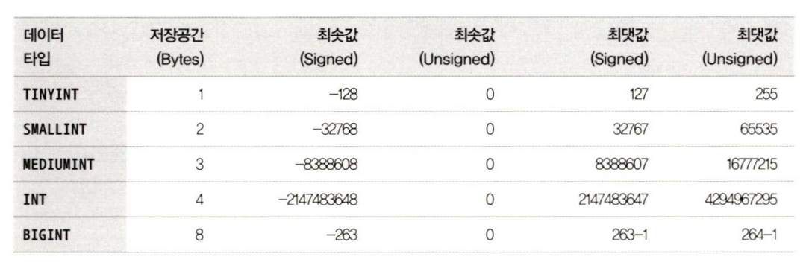
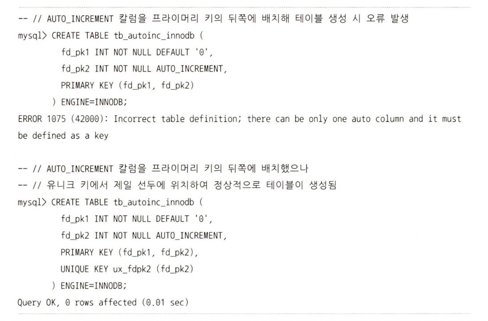
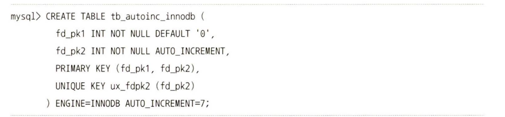

# 15.2 숫자

숫자를 저장하는 타입은 두 가지로 나뉨

- 참값
  : 소수점 이하 값의 유무와 관계없이 정확히 그 값을 그대로 유지
  - 참값을 관리하는 데이터 타입
    - `INTEGER`를 포함해 `INT`로 끝나는 타입, `DECIMAL`
- 근삿값 (=부동 소수점)
  : 부동 소수점이라 불리는 값 의미함. 처음 칼럼에 저장한 값과 조회된 값이 최대한 비슷한 값으로 관리
  - 근삿값 관리 타입
    - `FLOAT`, `DOUBLE`

값이 저장되는 포맷에 따라 두 가지로 나뉨

- 이진 표기법
  : 프로그래밍 언어에서 사용하는 정수나 실수 타입
  - 한 바이트로 256까지의 숫자 표현 가능 -> 적은 메모리나 디스크에 저장 가능
  - MySQL의 `INTEGER`, `BIGINT` 등 이진 표기법 사용
- 십진 표기법 (`DECIMAL`)
  : 숫자 값의 각 자릿값을 표현하기 위해 4비트(1바이트)를 사용해서 표기
  - MySQL에서 표기법을 사용하는 타입은 `DECIMAL` 뿐
    - 금액처럼 정확하게 소수점까지 관리되어야하는 값 저장할 때 사용
    - 65자리 숫자까지 표현할 수 있어서 `BIGINT`으로 저장할 수 없는 값 저장 시에 사용

> 일반적으로 DBMS에서는 `INTGER`, `BIGINT` 타입 자주 사용

# 15.2.1 정수

입력이 가능한 수의 범위 내에서 최대한 저장 공간을 적게 사용하는 타입을 선택하면 됨


- `UNSIGNED` 칼럼 옵션 사용 가능
  - 명시 안 할 경우: 기본적으로 음수와 양수를 동시에 저장할 수 있는 숫자 타입 (`SIGNED`)
  - 해당 옵션 설정 시, 0보다 큰 양의 정수만 저장 가능 -> 저장 가능한 최댓값이 `SIGNED` 타입보다 2배 큼
  - `AUTO_INCREMENT` 칼럼과 같이 음수가 저장될 수 없는 칼럼에 `UNSIGNED` 옵션 지정 시 작은 데이터 공간으로 더 많은 값 저장 가능

> [!CAUTION]
> UNSINGED 정수 칼럼과 SIGNED 칼럼을 조인할 때 서로 저장되는 값의 범위가 다르므로 외래 키로 사용되거나 조인의 조건이 되는 칼럼은 옵션을 일치시키는 것이 좋음

# 15.2.2 부동 소수점

- `FLOAT`
  - 정밀도 명시하지 않는 경우, 4바이트를 사용해 유효 자릿수 8개까지 유지
  - 정밀도 명시된 경우, 최대 8바이트까지 저장 공간 사용 가능
- `DOUBLE`

  - 8바이트의 저장 공간 필요
  - 최대 유효 16개의 유효 자릿수

  ```
  mysql > CREATE TABLE tb_float (fd1 FLOAT);
  mysql > INSERT INTO tb_float VALUES (0,1);

  mysql > SELECT * FROM tb_float WHERE fd1=0.1;
  ```

- 복제에 참여하는 MySQL 서버에서 부동 소수점 사용시 주의 사항
  - MySQL 서버의 바이너리 로그 포맷이 STATEMENT 타입인 경우 소스 서버와 레플리카 서버 간 데이터가 달라질 수 있음
    -> 부동 소수점 값을 저장해야한다면 유효 소수점의 자릿수만큼 10을 곱해서 정수로 만드렁 정수 타입의 칼럼에 저장하는 방법
    ex) 소수점 4자리까지 유효한 GPS 정보 저장 시, 소수점으로 된 좌표값에 10,000 을 곱해서 저장 & 조회 시 10,000으로 나눈 결과 사용

# 15.2.3 DECIMAL

: 소수점 이하의 값까지 정확하게 관리하기 위한 타입

- 숫자 하나 저장에 1/2 바이트 필요 -> 한 자리나 두 자릿수 저장 시 1바이트 필요
- `DECIMAL`로 저장하는 숫자의 자릿수 / 2 결과값을 올림 처리한 만큼의 바이트 수 필요

> [!CAUTION]
> DECIMAL 보다는 BIGINT 타입이 연산에서 더 빠름 -> 정수값을 관리하기 위해 DECIMAL 타입 사용은 지양

# 15.2.4 정수 타입의 칼럼을 생성할 때의 주의사항

부동 소수점이나 DECIMAL 타입으로 칼럼 정의 시, 타입 이름 뒤에 괄호로 정밀도 표시

- `DECIMAL(20,5)` -> 정수부 15, 소수부 5
- `DECIMAL(20)` -> 소수부 없이 정수부만 20자리 저장 타입 칼럼 생성
  > `FLOAT`이나 `DOUBLE` 타입은 저장 공간의 크기가 고정이기에 정밀도를 조절해서 저장 공간의 크기가 바뀌지 않지만 `DECIMAL`은 저장 공간 크기가 가변적이라 정밀도에 따라 변함

# 15.2.5 자동 증가 옵션 사용

`AUTO_INCREMENT` 옵션을 사용한 칼럼은 해당 테이블에서 프라이머리 키나 유니크 키의 일부로 정의해야함. 이때, 프라이머리 키나 유니크 키가 여러 개의 칼럼으로 구성되면 `AUTO_INCREMENT` 속성의 칼럼값이 증가하는 패턴이 달라짐

- MyISAM

  - 자동 증가 옵션이 사용된 칼럼이 프라이머리 키나 유니크 키의 아무 위치에서나 사용 가능

- InnoDB

  - `AUTO_INCREMENT` 칼럼으로 시작되는 인덱스를 생성해야함
  - `AUTO_INCREMENT` 칼럼을 프라이머리 키의 뒤쪽에 배치하면 오류가 발생함
    

- `AUTO_INCREMENT` 칼럼은 테이블 당 하나만 사용 가능
  - `AUTO_INCREMENT` 칼럼이 없는 테이블에 새로운 `AUTO_INCREMENT` 칼럼을 추가하면 새로 추가된 칼럼은 1부터 자동으로 증가된 값 칼당
  - 다음 증가 값이 얼마인지는 `SHOW CREATE TABLE` 명령으로 조회 가능
  - 개발용 MySQL 서버에서 서비스용 MySQL 서버로 스키마에 복사할 때 `AUTO_INCREMENT`의 초기값에 주의
    
    -> 이 경우에는 7부터 시작하게 됨
