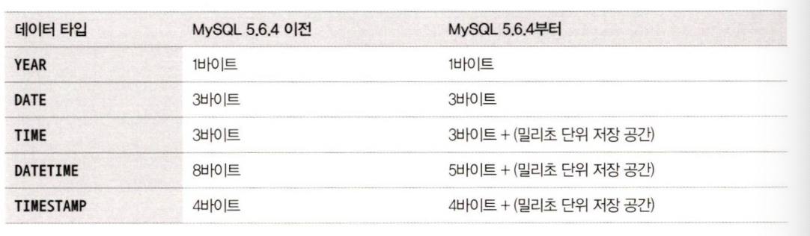
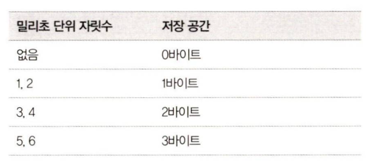
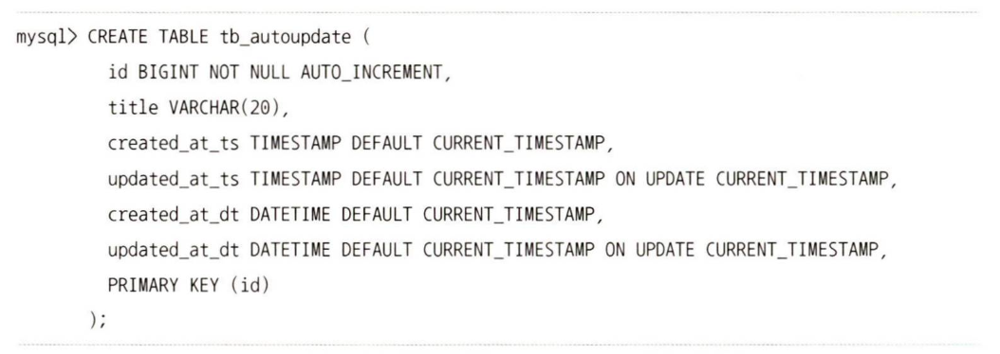

# 15.3 날짜와 시간

MySQL에서 지원하는 날짜와 시간에 관련된 데이터 타입

- `TIME`, `DATETIME`, `TIMESTAMP` 타입 밀리초 단위의 데이터 저장 가능
  

  - 밀리초 단위는 2자리당 1바이트 씩 공간이 더 필요함
  - 마이크로초까지 저장 가능한 `DATETIME(6)`은 (5바이트 + 3바이트) 사용
  - 밀리초 단위로 데이터 저장하기 위해서는 타입 뒤에 괄호와 함께 숫자 표기

- 날짜 타입(`DATEIME`, `DATE`) 은 칼럼 자체에 타임존 정보가 저장되지 않음 -> 클라이언트로부터 입력된 값 그대로 조회 및 출력
- `TIMESTAMP`는 항상 UTC 타임존으로 저장 -> 타임존이 달라져도 값이 자동 보정

# 15.3.1 자동 업데이트

- MySQL 5.6 이전 버전까지 TIMESTAMP 타입의 칼럼은 레코드의 다른 칼럼 데이터가 변경될 떄마다 시간이 자동 업데이트되고 DATETIME은 그러지 않았음
- 이후 버전부터 두 명령어 다 INSERT와 UPDATE 문장이 실행될 때마다 해당 시점으로 자동 업데이트되게 하려면 테이블 생성 시 **칼럼 정의 뒤에 다옴 옵션 정의 해야함**
  
