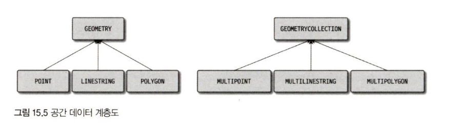

# 6절. 공간 데이터 타입

MySQL 서버는 **OpenGIS**에서 제시하는 표준을 준수하며, **WKT(Well Known Text)** 또는 **WKB(Well Known Binary)** 포맷을 이용해 공간 데이터를 관리한다.

---

### 15.6.1 공간 데이터 타입 계층 및 저장

### 1. 공간 데이터 타입 종류



MySQL은 점(Point), 선(LineString), 다각형(Polygon)을 포함하여 다음과 같은 공간 데이터 타입을 지원한다.

- **단일 객체 타입 (Single-Part):** 하나의 점, 선, 다각형 정보만 저장
    - **POINT:** 하나의 좌표점 (X, Y).
    - **LINESTRING:** 여러 개의 점을 연결한 선.
    - **POLYGON:** 닫힌 선(Exterior Ring)과 내부 구멍(Interior Ring)으로 구성된 다각형.
- **복수 객체 타입 (Multi-Part):** 동일 타입의 여러 객체를 저장
    - **MULTIPOINT, MULTILINESTRING, MULTIPOLYGON**
- **슈퍼 타입 (Super Type):**
    - **GEOMETRY:** POINT, LINESTRING, POLYGON 중 하나의 객체를 저장할 수 있는 최상위 슈퍼 타입.
    - **GEOMETRYCOLLECTION:** MULTI- 객체 포함, 모든 공간 데이터 타입 중 여러 객체를 저장할 수 있는 최상위 타입.

### 2. 내부 저장 방식

- MySQL 서버의 공간 데이터 타입은 메모리에서는 **BLOB 객체**로 관리되며, 클라이언트에도 BLOB 형태로 전송된다.
- 공간 데이터 컬럼의 데이터 타입은 대부분 **POINT**와 **POLYGON**으로 충분하며, 여러 타입의 데이터를 저장해야 한다면 **GEOMETRY** 타입을 사용한다.

---

### 15.6.2 공간 데이터 생성

공간 데이터 객체는 주로 **ST\_ 접두사**를 가지는 함수를 사용하여 WKT 포맷의 텍스트를 입력받아 생성한다.

### 1. 객체 생성 함수

모든 공간 데이터 생성 함수는 첫 번째 파라미터로 **WKT 문자열**을 사용하며, 선택적으로 두 번째 파라미터로 **SRID**를 설정할 수 있다. SRID를 명시하지 않으면 기본값 **0**으로 설정된다.

| **타입**       | **WKT 포맷**                    | **객체 생성 함수 (예시)**                  |
| -------------- | ------------------------------- | ------------------------------------------ |
| **POINT**      | `POINT(x y)`                    | `ST_PointFromText('POINT(10 20)', 4326)`   |
| **LINESTRING** | `LINESTRING(x0 y0, x1 y1, ...)` | `ST_LineStringFromText('LINESTRING(...)')` |
| **POLYGON**    | `POLYGON((x0 y0, x1 y1, ...))`  | `ST_PolygonFromText('POLYGON(...)')`       |
| **MULTIPOINT** | `MULTIPOINT(POINT(x0 y0), ...)` | `ST_MultiPointFromText('MULTIPOINT(...)')` |

---

### 15.6.3 공간 데이터 조회

MySQL 서버가 관리하는 공간 데이터 객체를 조회하는 방법은 다양하다.

1. **내부 포맷 그대로 조회:** (BLOB/WKB 포맷)
2. **텍스트 포맷 (WKT)으로 변환하여 조회:** `ST_AsText()`
3. **이진 포맷 (WKB)으로 변환하여 조회:** `ST_AsBinary()`
4. **공간 데이터의 속성 함수를 이용한 조회**

```sql
- WKT 및 WKB 포맷으로 변환하여 조회
SELECT location AS internal_format, ST_AsText(location) AS wkt_format, ST_AsBinary(location) AS wkb_format
FROM plain_coord;
```

---
