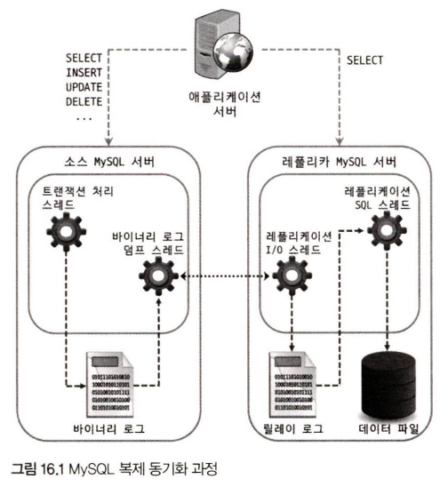

## 2. 복제 아키텍처
- 바이너리 로그(Binary Log)
    DB 서버에서 발생하는 모든 변경 사항이 기록되는 로그 파일로, 데이터의 변경 내역뿐만 아니라 데이터베이스나 테이블의 구조 변경과 계정이나 권한의 변경 정보까지 모두 저장된다.

소스 서버에서 생성된 바이너리 로그가 레플리카 서버로 전송되고 레플리카 서버에서는 해당 내용을 로컬 디스크에 저장한 뒤 자신이 가진 데이터에 반영함으로써 두 서버 간의 동기화가 이루어진다.

- 릴레이 로그(Relay Log)
    레플리카 서버에서 소스 서버의 바이너리 로그를 읽어 들여 따로 로컬 디스크에 저장해둔 파일

MySQL 복제 동기화 과정
