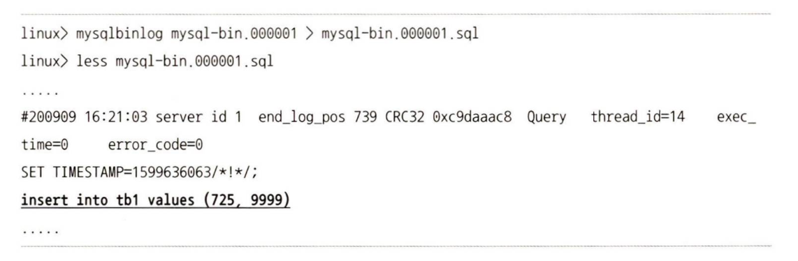

# 16.4 복제 데이터 포맷

## 16.4.1 Statement 기반 바이너리 로그 포맷

변경 이벤트에 대해 이벤트를 발생시킨 SQL 문을 바이너리 로그에 기록하는 방식 

실행된 SQL 문이 그대로 바이너리 로그에 저장되어 있는 것을 확인할 수 있음. 이 때 하나의 SQL 문은 여러 개의 데이터를 수정할 수 있는데, 이 경우 Statement 포맷에서는 바이너리 로그에 SQL 문 하나만 기록된다.

- 장점
  - 저장 공간에 대한 부담을 덜 수 있다.
  - 변경 내역이 전부 저장되는 파일이기 때문에 손쉽게 SQL 문을 확인할 수 있어서 감사에 용이하다.

- 단점
  - 비확정적으로 처리될 수 있는 쿼리가 실행된 경우 복제 시 소스 서버와 레플리카 서버 간에 데이터가 달라질 수 있다.
  - 데이터에 락을 Row 포맷에 비해 더 많이 건다.
  - 트랜잭션 격리 수준이 반드시 REPEATABLE-READ 이상이어야 한다.

## 16.4.2 Row 기반 바이너리 로그 포맷

MySQL 서버에서 데이터 변경이 발생했을 때 변경된 값 자체가 바이너리 로그에 기록되는 방식

- Row 포맷에서는 Statement 포맷보다 락이 최소화되어 처리된다.
- Row 포맷은 모든 트랜잭션 격리 수준에서 사용 가능하며, MySQL 서버의 바이너리 로그 포맷이 Row 포맷으로 설정돼 있다 하더라도 DDL 문은 전부 Statement 포맷 형태로 바이너리 로그에 기록된다.

## 16.4.3 Mixed 포맷

MySQL 서버가 두 가지 바이너리 로그 포맷을 혼합해서 사용하도록 설정하는 포맷

기본적으로는 Statement 포맷을 사용하며, 실행된 쿼리와 스토리지 엔진의 종류에 따라 필요 시 자동으로 Row 포맷으로 전환해서 로그에 기록한다.

다만 MySQL 서버가 내부적으로 설정된 기준과 기술적인 측면을 고려해 자동으로 두 포맷을 번갈아 사용하는 것이므로 실제 사용자가 예상했던 것과 다르게 처리될 수도 있다.
따라서 MIXED 포맷만이 가장 좋은 방법이라고 할 수 없으며, 사용자는 자신이 사용하는 쿼리 형태에 제일 적합한 방식이 어떤 방식인지를 고려해서 설정하는 것이 좋다.