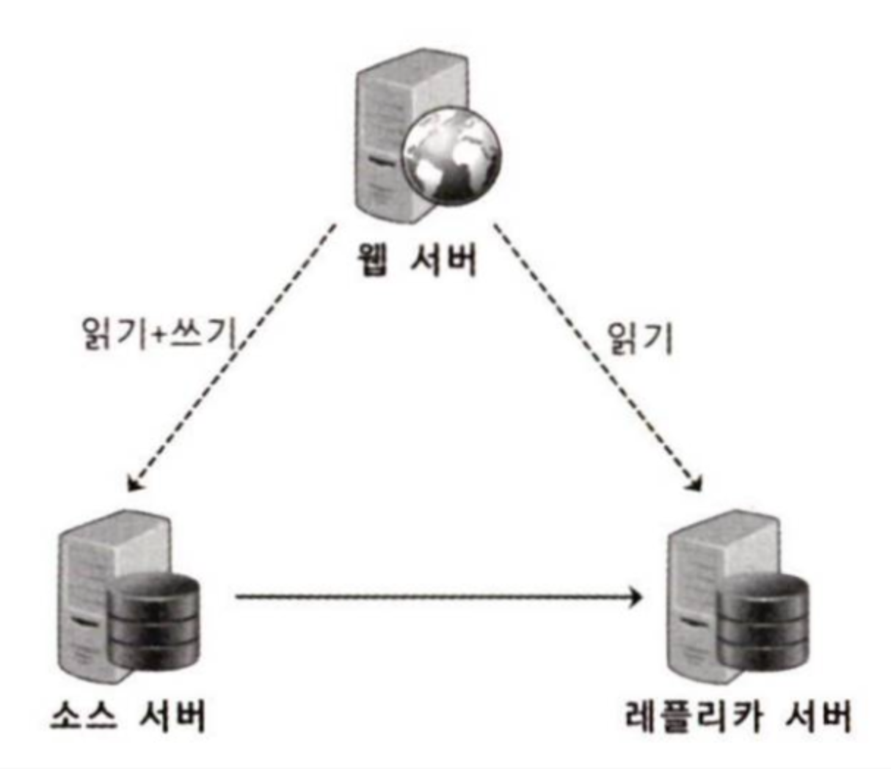
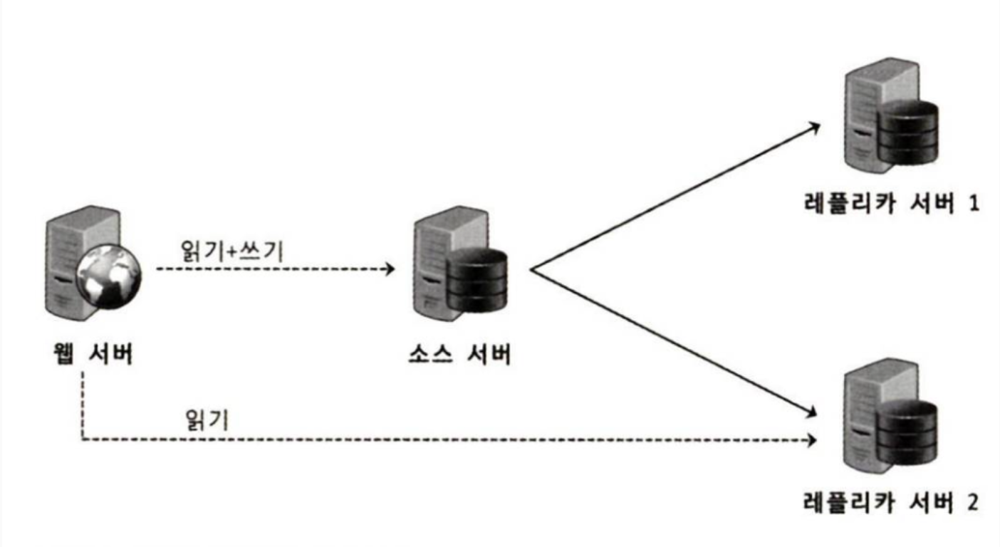
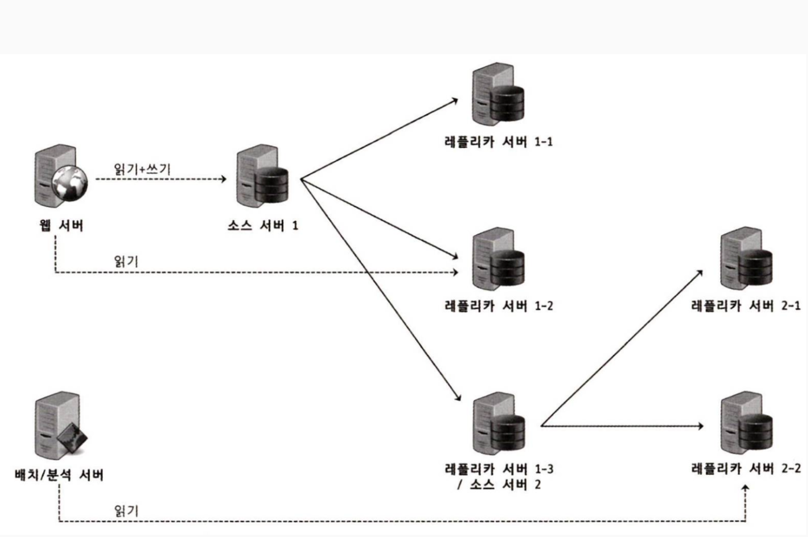
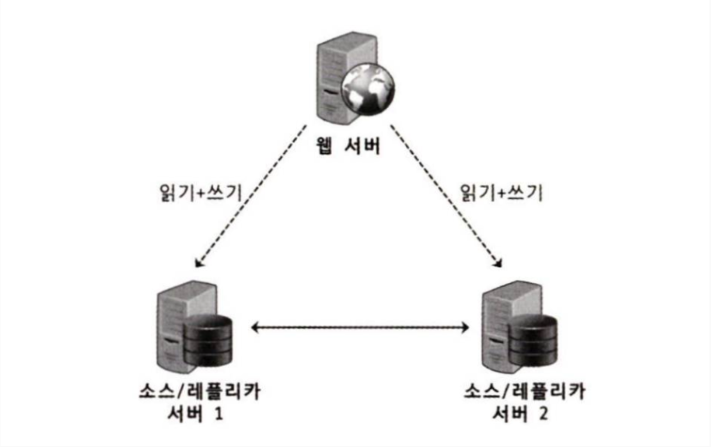

# 16.5 복제 동기화 방식

MySQL에서는 소스 서버와 레플리카 서버 간 복제 동기화에 대해 두 가지 방식을 제공
- 비동기 복제
- 반동기 복제(MySQL버전 5.5.부터 도입)

## 16.5.1 비동기 복제
> [!NOTE]
> 아래의 **'서버'는 모드 MySQL DB서버를 의미** 합니다.
> 아래의 '메인 서버' 는 책의 '소스 서버'를 의미합니다.
> 아래의 '백업 서버' 는 책의 '레플리카 서버'를 의미합니다.

> 기본적으로 동작하는 방식. 매인 서버(소스 서버)가 **백업 서버(레플리카 서버)에도 변경 이벤트가 정상 적용되었는지 확인하지 않는** 방식.

메인 서버가 백업 서버의 상태를 전혀 확인하지 않음
-> 동기화 여부를 보장하지 않음

장점 : 더 빠른 트랜잭션 처리, 백업 서버의 문제가 메인 서버에 전혀 영향을 미치지 않음, 백업 서버의 수에 메인 서버가 영향을 거의 받지 않음, 백업 서버에서 무거운 쿼리가 실행되어도 메인 서버와는 무관
단점 : 서버 장애 발생시, 트랜잭션이 누락될 수도 있음(수동으로 복구해줘야 함)

## 16.5.2 반동기 복제

비동기 복제보다는 **좀 더 향상된 데이터 무결성을 제공** 하는 복제 동기화 방식.

> **백업 서버**가 메인 서버로부터 **전달받은 변경 이벤트를 릴레이 로그에 기록후 응답(ACK)** 보내면, 그때서야 메인서버가 트랜잭션을 완전히 커밋함.

따라서, 반동기 복제에서는 메인 서버가 커밋된 경우 **적어도 하나의 백업 서버에 해당 트랜잭션들이 전송됐음을 보장** 한다.
-> 다만, **전송됐음** 을 보장하는것이지, **적용됨** 을 보장하는 것은 아니다(말장난.,..??)

아래는 두 가지 방식에 대한 설명.

1. AFTER_SYNC

- 메인 서버가 **커밋하기 전** 단게에서 레플리카 서버의 응답을 기다림.
- 백업 서버로부터 **정상적으로 응답이 내려오면 메인 서버는 그때 커밋**해서 트랜잭션 처리를 끝냄.
- 결과를 클라이언트에 반환


2. AFTER_COMMIT
- 커밋을 진행하고, 최종적으로 클라이언트에 결과를 반환하기 전 백업서버의 응답을 기다림.
- 백업서버에서 응답이 내려오면, 그때 클라이언트는 처리 결과를 얻음.


현재 MySQL에서 기본적으로 설정된 방식은 AFTER_SYNC 방식.
AFTER_SYNC 방식의 장점 : 
1. 팬텀 리드가 발생하지 않음
2. 장애 발생한 메인 서버에 대해 좀 더 수월한 복구 가능
3. AFTER_COMMIT보다 **데이터 무결성이 강화** 된 방식

*팬텀 리드* 란? 자신이 이전에 조회했던 데이터가, **다음 조회에서는 안보이는** 현상. 

> 반동기 복제는 비동기 복제보다 트랜잭션 처리 속도가 느릴 수 있다.
> 또한, 트랜잭션을 수행할때마다 확인을 받기 위해 네트워크 통신을하는데, 이 지연수치도 쌓이면 느려짐의 원인이 된다. 따라서, 메인 서버와 백업 서버는 물리적 거리가 가까울수록 좋다.


### 16.5.2.1 반동기 복제 설정 방법

#### 1. 기본 통신

- 프로토콜: 일반 MySQL TCP 통신 (기본 3306 포트)
- 흐름:
    1. 레플리카가 CHANGE MASTER TO ... (또는 CHANGE REPLICATION SOURCE TO ...) 로
        **소스 서버의 IP/포트, 계정, 로그 위치**를 설정
    2. START SLAVE; / START REPLICA; 하면 레플리카가 소스로 접속
    3. 소스에서 binlog(바이너리 로그)를 스트리밍 → 레플리카에서 relay log에 적고 적용
        
    

  

#### 2. 기본 복제 설정(반드시 필요)

**소스 서버(my.cnf 예시)**

``` SQL
server-id = 1
log-bin = mysql-bin
```

MySQL에서:

``` SQL
CREATE USER 'repl'@'%' IDENTIFIED BY 'pwd';
GRANT REPLICATION SLAVE ON *.* TO 'repl'@'%';
```

**레플리카 서버(my.cnf 예시)**

``` SQL
server-id = 2   -- 소스와 다른 값
relay-log = relay-bin
```

레플리카에서:

``` SQL
CHANGE MASTER TO
  MASTER_HOST='소스_IP',
  MASTER_USER='repl',
  MASTER_PASSWORD='pwd',
  MASTER_LOG_FILE='mysql-bin.000001',
  MASTER_LOG_POS=1234;
START SLAVE;   -- 또는 START REPLICA;
```

#### 3. 세미 싱크 씌우기

 플러그인 설치 + 설정을 추가

소스:

``` SQL
INSTALL PLUGIN rpl_semi_sync_master SONAME 'semisync_master.so';
SET GLOBAL rpl_semi_sync_master_enabled = ON;
```

레플리카:

``` SQL
INSTALL PLUGIN rpl_semi_sync_slave SONAME 'semisync_slave.so';
SET GLOBAL rpl_semi_sync_slave_enabled = ON;
```

 **기본 비동기 복제 세팅 + 세미 싱크 옵션** 둘 다 필요


# 16.6 복제 토폴로지

> [!Note]
> 이전에는 하나의 백업 서버가 둘 이상의 메인 서버를 가질 수 없다는 제약이 있었으나, 현재는 없다.


## 16.6.1 싱글 레플리카 복제 구성


이 복제 형태는 가장 기본적인 형태로, 제일 많이 사용되는 형태라고 할 수 있다.
이 형태에서, 애플리케이션 서버는 **소스 서버**에만 직접적으로 접근해 사용.

레플리카 서버는 소스 서버에서 장애가 발생했을 때 사용될 수 있는 예비 서버정도로 사용. 따라서 레플리카 서버에서 추가적은 쿼리나 배치 작업 등을 진행하기도 한다.

## 16.6.2 멀티 레플리카 복제 구성


서비스 트래픽이 크게 증가하면 소스 서버 한 대에서만 쿼리 요청을 처리하기에 벅찰 수 있다. 이를 레플리카 형태로 복제 구성을 전환해 쿼리 요청을 분산시킬 수 있다.


## 16.6.3 체인 복제 구성
> 멀티 레플리카 복제 구성에서, 레플리카 서버가 너무 많아 소스 서버의 성능에 악영향이 예상된다면 1:M:M구조의 체인 복제 구성을 고려해 볼 수 있다.




**1단계 (소스 → 중간 레플리카)**
- 웹 서버(쓰기/읽기)와 배치/분석 서버(읽기)가 소스 서버 1에 접근
- 소스 서버 1이 직접 관리하는 레플리카 서버들: 1-1, 1-2, 1-3/소스 서버 2

**2단계 (중간 소스 → 최종 레플리카)**
- 레플리카 서버 1-3이 **소스 서버 2** 역할로 전환
- 소스 서버 2가 추가 레플리카들(2-1, 2-2)을 관리

#### 장점
- **소스 서버 부하 감소**: 원본 소스 서버가 직접 관리할 레플리카 수를 줄임
- **확장성**: 계층적 구조로 더 많은 레플리카 추가 가능
- **성능 유지**: 소스 서버의 I/O와 네트워크 부하를 
#### 예시 - 복제 그룹별 용도 구분

**1차 복제 그룹** ("레플리카 서버 1-1", "1-2", "1-3/소스 서버 2")
- 소스 서버 1과 직접 연결
- 변경사항이 빠르게 적용됨
- **용도**: **OLTP 서비스** (Online Transaction Processing - 온라인 트랜잭션)
    - 실시간 사용자 요청 처리
    - 읽기 작업 부하 분산
**2차 복제 그룹** ("레플리카 서버 2-1", "2-2")
- 소스 서버 2(1차 레플리카)를 통해 간접 연결
- 약간의 지연 발생 가능
- 용도: 통계, 배치, 백업
    - 시간이 약간 지난 데이터 사용 가능
    - 무거운 분석 작업에 적합

> [!Note]
> 이 구조는 MySQL 버전 업그레이드나 하드웨어 교체에 매우 유용
**업그레이드 시나리오:**
> - 기존 장비(소스 1, 레플리카 1-1, 1-2): 기존 MySQL 버전 유지
> - 새 장비(레플리카 1-3/소스 2, 2-1, 2-2): 새로운 MySQL 버전으로 설치
> - 결과: **서비스 중단 없이** 점진적으로 새 버전으로 마이그레이션 가능
> 
> 이 방식의 가장 큰 장점은 **무중단 업그레이드(Zero-downtime upgrade)** 를 실현할 수 있다는 것입니다.

## 16.6.4 듀얼 소스 복제  구성



두 MySQL 서버 모드 쓰기가 가능하다는 것이 제일 큰 특징이다. 각 서버에서 변경한 데이터는 복제를 통해 다시 각 서버에 적용되므로 양쪽에 쓰기가 각자 발생하지만 **동일한 데이터** 를 갖게  된다.

듀얼 소스 복제 구성을 사용할 때, 다음 부분에서 문제가 발생할 수 있으므로 주의해야 한다.
- 동일한 데이터를 각 서버에서 변경
- 테이블에서 Auto-Increment 키 사용

