# 16.7.1 지연된 복제 (Delayed Replication)

- 복제는 최대한 **빠르게 동기화**해서 소스 서버와 레플리카 서버 간 데이터를 동일하 상태로 만드는 것이 본래 목적
- 의도적으로 소스 서버와 레플리카 서버 간 복제를 지연시켜야 하는 경우 **지연된 복제**

  - 개발자나 DBA가 소스 서버에서 실수로 중요한 테이블이나 데이터를 삭제한 경우
    -> 지연된 복제 사용 시 지연된 복제본을 통해 별도의 서비스 다운 타임 없이 바로 데이터 복구 가능
  - 이전 시점의 데이터 값에 대한 확인이 필요한 경우 백업 데이터가 아닌 지연된 복제본으로 확인 가능
  - `CHANGE RELICATION SOURCE TO(CHANGE MASTER TO)` 구문에 `SOURCE_DELAY(MASTER_DELAY)` 옵션으로 레플리카 서버를 소스 서버로부터 얼마나 지연시킬 것인지 지정

    ```MySQL
    -- // MySQL 8.0.23 미만 버전
    mysql_Replica > CHANGE MASTER TO MASTER_DELAY = 86400;

    -- // MySQL 8.0.23 이상 버전
    mysql_Replica > CHANGE RELICATION SOURCE TO S = 86400;
    ```

    -> 레플리카 서버가 소스 서버보다 트랙잭션 하루 지연돼서 반영

- `original_commit_timestamp (OCT)`
  - 트랙잭션이 원본 소스 서버에서 커밋된 시각
  - 밀리초 단위의 유닉스 타임스탬프 값으로 저장
  - 트랜잭션이 복제되는 모든 레플리카 서버들이 동일한 값을 가짐
  - 원본 서버에서는 OCT 값과 ICT 값이 동일
- `immediate_commit_timestamp (ICT)`
  - 트랜잭션이 직계 소스 서버에서 커밋된 시각
  - 밀리초 단위의 유닉스 타임스탬프 값으로 저장
  - 레플리카 서버가 바이너리 로그 사용 & `log_slave__updates` 옵션 활성화 시, 레플리카 서버에서 복제된 트랜잭션이 커밋된 시점으로 값이 저장

> - **직계 소스 서버**
>   - 가장 하위에 있는 레플리카 서버 기준으로 바로 위의 소스 서버 가 직계 서버
> - **원본 소스 서버**
>   - 트랜잭션이 제일 처음 실행됐던 소스 서버가 원본 소스 서버 (가장 위에 존재하는 서버)

- 지연된 복제 활성화 시 `SHOW REPLICA STATUS` 결과로 레플리카 서버의 지연된 시간 및 다음 트랜잭션 실행까지의 남은 시간 확인 가능
  ` MySQL
	mysql_Replica> SHOW SLAVE STATUS \G
	mysql_Replica> SHOW REPLICA STATUS \G
	`
  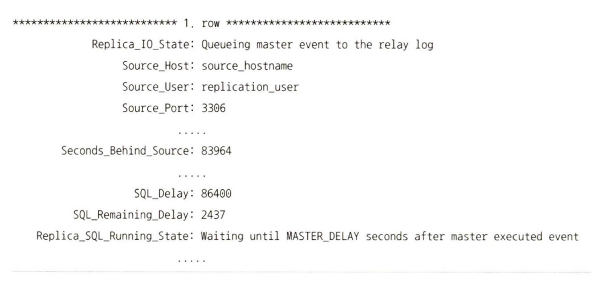
  -> 지연된 복제를 사용하더라도 소스 서버의 바이너리 로그는 레플리카 서버의 릴레이 로그 파일로 복사됨. 즉 레플리케이션 SQL 스레드가 복제된 이벤트들에 대한 실행을 지연시키는 것

# 16.7.2 멀티 스레드 복제 (Multi-threaded Replication)

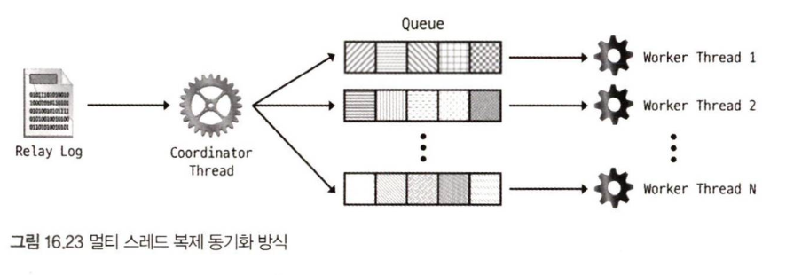

- 레플리카 서버에서 소스 서버로 복제된 트랜잭션을 여러 스레드로 처리할 수 있는 기능
- 멀티 스레드 복제에서 SQL 스레드는 코디네이터 스레드로 불림

  - 실제로 이벤트를 실행하는 워커 스레드와 협업해서 동기화 진행
  - 릴레이 로그 파일에서 이벤트들을 읽어서 스케줄링 방식에 따라 워커 스레드에 각 이벤트 할당
  - 각 이벤트는 워커 스레드들의 큐에 적재되고 워커 스레드가 이벤트들을 큐에서 순차적으로 꺼내 레플리카 서버에 적용함

- `slave_parallel_type`
  - 어떤 처리 방식으로 멀티 스레드 동기화 진행할건지 설정
  - 기본: 데이터 베이스 기반 방식 설정
- `slave_parallel_workers`
  - 워커 스레드의 개수 지정 가능 (0~1024)
    - 0으로 설정할 시 단일 스레드 모드로 복제 수행
    - 1인 경우, 멀티 스레드를 위한 코드 블록(코디네이션 작업, 워커 스레드 간 동기화 등)이 모두 실행되면서 실제 복제는 단일 스레드의 형태로 진행
- `slave_pending_jobs_size_max`

  - 워커 스레드의 큐에 할당할 수 있는 최대 메모리 크기 설정 (기본값 128MB)
  - 만약 해당 값을 초과하는 경우 모든 워커 스레드의 큐가 비워질 때까지 복제 지연 발생 -> 시스템 변수를 큰 값으로 변경하는 것이 필요

- `SHOW PROCESSLIST`
  - 코디네이터 스레드와 워커 스레드 확인 가능

## 16.7.2.1 데이터베이스 기반 멀티 스레드 복제

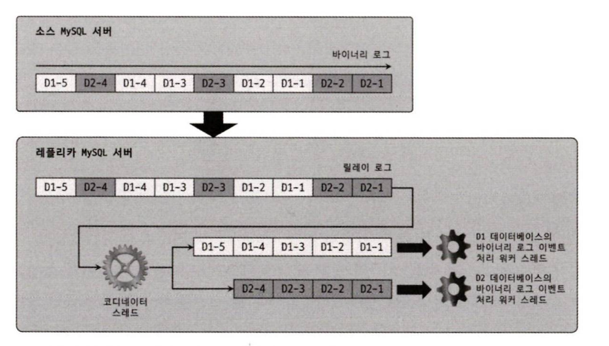

- 스키마 기반 처리 방식이라고도 함
- MySQL 내의 데이터베이스 단위로 병렬 처리 수행
- 코디네이터 스레드가 릴레이 로그 파일에서 이벤트를 읽어 데이터베이스 단위로 분리하고 각 워커 스레드로 할당
- 테이블이나 레코드 수준까지의 충돌 여부는 고려하지 않고 데이터베이스의 동일 여부만 확인해서 병렬 처리 수행
- MySQL 서버에 여러 개의 데이터베이스가 존재하고 각 데이터베이스에 유입되는 DML이 독립적이면서 양적으로 균등하게 실행되는 환경에서 유용한 방식
- MySQL 서버에 하나의 데이텁이스만 존재하는 경우 멀티 스레드로 처리될 수 없음

## 16.7.2.2 LOGICAL CLOCK 기반 멀티 스레드 복제

- 같은 데이터베이스 내에서도 멀티 스레드 동기화 처리 가능
- 소스 서버에서 트랜잭션들이 바이너리 로그로 기록될 때 각 트랜잭션별로 논리적인 순번 값을 부여해 레플리카 서버에서 트랜잭션의 순번 값을 바탕으로 병렬로 실행
- Commit-parent -> Lock -> WriteSet 기반 방식 순으로 도입

### 16.7.2.2.1 바이너리 로그 그룹 커밋

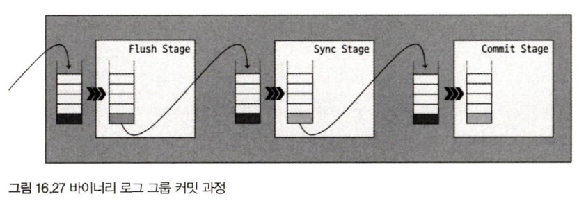

1. Flush
   : 대기 큐에 등록된 각 트랜잭션들을 순서대로 바이너리 로그에 기록
2. Sync
   : 앞서 기록된 바이너리 로그 내용들을 디스크와 동기화하는 `fsync()` 시스템 콜 수행

   - `sync_binlog` 옵션에 따라 디스크 동기화 진행
     - 1: Flush 단계에서 넘어온 전체 트랜잭션들에 대해 매번 디스크 동기화 작업 수행
       -> 매번 동기화 수행이 아닌 트랜잭션 그룹에 대한 동기화 수행
       - `binlog_group_commit_sync_delay`
         - 바이너리 로그를 디스크에 동기화하는 작업을 얼마정도 지연시킬지 제어 변수
       - `binlog_group_commit_sync_no_delay_count`
         - 바이너리 로그의 동기화 작업이 진행되기 전에 지연되어 대기할 수 있는 최대 트랜잭션 수 설정 변수

3. Commit
   : 대기 큐에 등록된 트랜잭션들에 대해 스토리지 엔진 커밋 진행
   - `binlog_order_commits`
     - `1`(기본값): 트랜잭션들이 바이너리 로그 파일에 기록된 순서대로 스토리지 엔진에 커밋
     - `0`: 스토리지 엔진 커밋이 바이너리 로그에 기록된 순서와 상관없이 병렬로 처리

- 각 단계에는 대기 큐가 존재, 트랜잭션들은 순서대로 대기 큐에 등록됨
  - 리더: 비어있는 대기 큐에 첫 번째로 등록된 트랜잭션
  - 팔로워: 이후 등록된 다른 트랜잭션들

### 16.7.2.2.2 Commit-parent 기반 LOGICAL CLOCK 방식

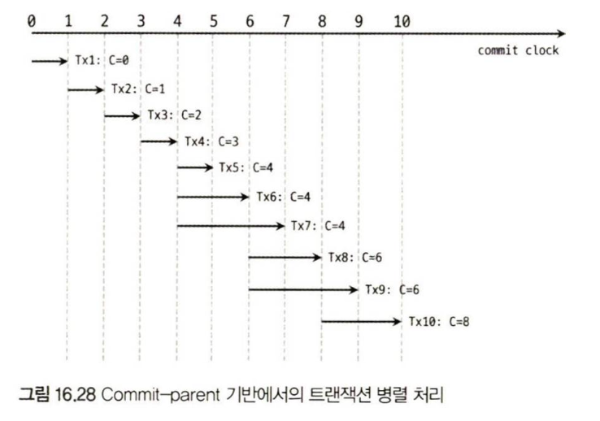

- **동일 시점에 커밋된 트랜잭션**들을 레플리카 서버에서 병렬로 실행될 수 있도록함
  - 커밋 시점이 같은 트랜잭션은 충돌할 수 없는 트랜잭션들이기 때문
  - commit_seq_no 값으로 같은 시점에 커밋 처리된 트랜잭션 식별
    - 해당 트랜잭션이 커밋될 당시 가장 최근에 커밋된 트랜잭션 순번 값 저장
    - 내부적으로 글로벌하게 관리되는 commit clock이라는 64비트 정수값 기반
    - 각 트랜잭션이 Prepare 단계에 진입했을 때 설정
    - 트랜잭션이 최종적으로 스토리지 엔진에 커밋되기 전에 값이 증가 -> 같은 시점에 커밋 처리가 된 트랜잭션은 동일한 값을 가짐
- 소스 서버에서 같은 그룹으로 커밋된 트랜잭션 수가 많을수록 레플리카 서버에서의 트랜잭션 병렬 처리율 향상

### 16.7.2.2.3 잠금 기반 LOGICAL CLOCK 방식

- 선행 트랜잭션의 순번 값이 동일하지 않더라도 커밋 처리 시점이 겹친다면 병렬로 처리됨
- `sequence_number`, `last_committed` 값 함께 기록
  - `sequence_number`(S)
    - 커밋된 트랜잭션에 대한 논리적인 순번 값
    - 매 트랜잭션이 커밋될 때마다 증가
  - `last_committed`(C)
    - 현 트랜잭션 이전에 커밋된 가장 최신 트랜잭션의 `sequence_number` 값이 저장

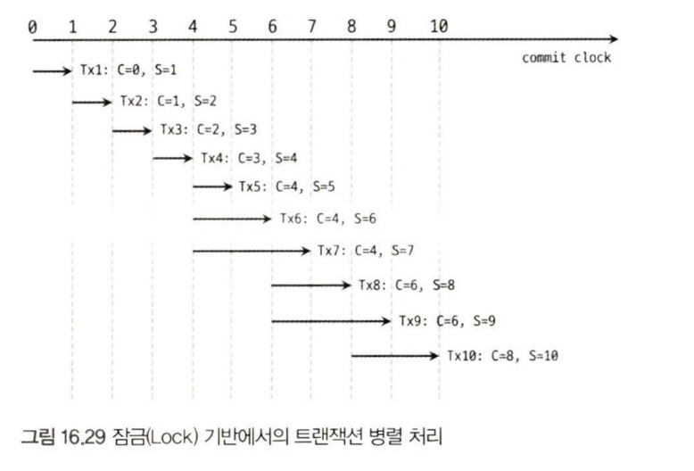
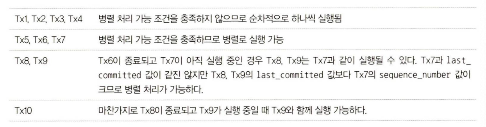

### 16.7.2.2.4 Write 기반 LOGICAL CLOCK 방식

- 기존방식

  - 커밋 처리 시점이 전혀 겹치지 않는 트랜잭션을 병렬로 실행될 수 없었음

- 동일한 데이터를 변경하지 않는 트랜잭션들은 레플리카 서버에서 모두 병렬로 실행될 수 있음
- `binlog_transcation_dependency_tracking` 변수로 원하는 타입 설정 가능

  - `COMMIT_ORDER`
    : 기본값으로 커밋 처리 시점이 겹치는 트랜잭션들 모두 병렬 처리 가능
  - `WRITESET`
    : 서로 다른 데이터를 변경한 트랜잭션 모두 병렬 처리 가능
  - `WRITESET_SESSION`
    : 동일한 세션에서 실행된 트랜잭션들을 병렬로 처리될 수 없다는 것 외에 `WRITESET`과 동일

- 내부적으로 트랜잭션에 의해 변경된 데이터들의 목록을 WriteSet으로 관리
  - `WriteSet = hash(index_name, db_name, de_name_length, table_name, table_name_length, value, value_length)`

## 16.7.2.3 멀티 스레드 복제와 복제 포지션 정보

- 각 워커 스레드들이 실행한 바이너리 로그 이벤트 포지션 정보
  - `slave_worker_info` 테이블 / `"worker-relay-log.info"` 접두사 가지는 파일들에 각 스레드별로 저장
  - 워커 스레드들은 이벤트를 실행 완료할 때마다 해당 데이터 갱신
- 어플라이어 메타데이터
  : 현재 복제 이벤트의 처리 현황을 보여줌

  - 코디네이터 스레드(SQL 스레드)가 수행하는 체크포인트 작업에 의해 주기적으로 갱신
  - 워커 스레드들이 아래와 같은 이벤트 처리 가정
    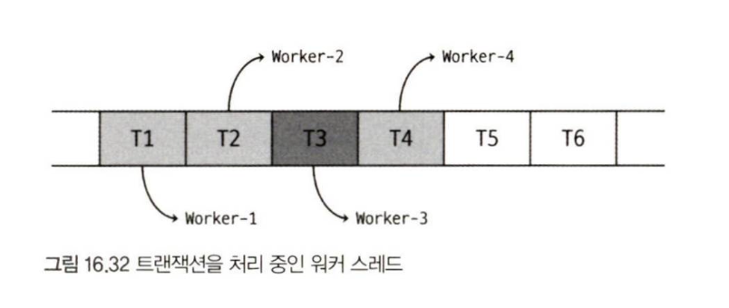

    - 각 이벤트들이 각 워커 스레드에 할당
    - T3이 처리가 오래 걸리는 이벤트라 나머지 이벤트들이 먼저 실행 완료됨
    - 이 시점에 코디네이터 스레드에서 체크포인트를 수행하면 T4가 완료되어도 T3이 완료되지 않아서 T2가 로우 워터마트 이벤트가 되고 어플라이어 메타데이터에서 T2에 해당하는 값으로 업데이트됨
      -> T2와 T4 사이에 생겨난 포지션 간격을 '갭(Gap)' - 갱비 존재하는 경우 체크 포인트 지점은 항상 갭 이전에 실행 완료된 이벤트에서만 나타남 - 멀티 스레드 복제에서 `slave_preserve_commit_order` 시스템 변수가 비활성화된 경우 발생 - 레플리카 서버에서 복제로 넘어온 이벤트들을 소스 서버에서 커밋된 순서와 동일한 순서로 커밋할 건지 제어하는 시스템 변수 - 1: 워커 스레드들에서 여러 이벤트가 동시에 처리되어도 릴레이 로그에 기록된 순서로 커밋되어 갭 발생 x

- 코디네이터 스레드는 워커 스레드에서 실행될 이벤트를 아래 시스템 변수에 설정된 값을 바탕으로 체크포인트 수행
  - `slave_checkpoint_period`
    : 코디네이터 스레드의 어플라이어 메타데이터 갱신 작업의 실행 주기 결정
  - `slave_checkpoint_group`
    : `slave_checkpoint_period` 변수와 동일한 역할로 사용되는데, 시간 대신 트랜잭션의 개수 지정
    - `slave_checkpoint_group`을 10으로 설정 -> 코디네이터 스레드는 10개의 트랜잭션을 실행한 후 어플라이어 메타데이터를 갱신하도록 체크포인터 발생

# 16.7.3 크래시 세이프 복제 (Crash-safe Replication)

서버 장애 이후 MySQL에서 복제가 진행되는 기능

## 16.7.3.1 서버 장애와 복제 실패

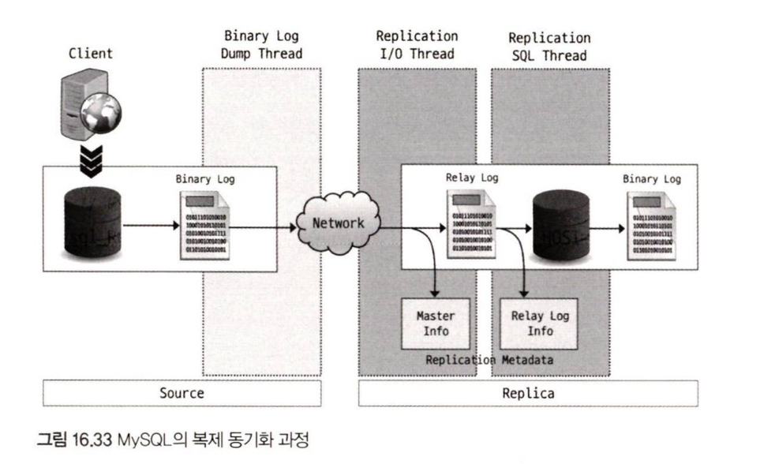

- 레플리케이션 I/O 스레드와 SQL 스레드가 함께 소스 서버와의 데이터 동기화 수행
- I/O 스레드가 소스 서버로 바이너리 로그 이벤트를 가져와 레플리카 서버의 로컬 디시크에 파일로 저장
- SQL 스레드는 I/O 스레드가 가져온 바이너리 로그 이벤트를 실제 MySQL 서버에서 재실행
- I/O 스레드와 SQL 스레드의 실행 포지션 정보는 TABLE 또는 FILE 형태로 관리

  - FILE
    - MySQL의 데이터 디렉터리에서 `master.info`, `relay-log.info` 파일에 저장
  - TABLE
    - `slave_master_info`, `slave_realy_log_info` 테이블에 각각의 데이터 저장

  -> MySQL 5.5 버전까지 FILE 형태로만 관리 & FILE 형태의 경우 각 스레드가 동작할 때 자신이 처리 중인 내용과 포지션 정보를 원자적으로 동기화된 상태로 관리할 수 없었음

- TABLE 형태로 관리

  - InnoDB 엔진을 사용해 SQL 스레드가 트랜잭션 적용과 정보 업데이트를 한 트랜잭션으로 묶어 원자적으로 처리 가능
    -> MySQL의 비정상적 종료 시, 포지션 불일치로 SQL 스레드가 동일한 쿼리 재실행 문제 방지 가능
  - I/O 스레드 포지션 불일치 문제
    - `relay_log_recovery` 옵션 활성화: MySQL 서버 재구동 시 MySQL 서버가 I/O 스레드의 포지션을 SQL 스레드가 마지막으로 실행했던 포지션으로 초기화, 새로운 릴레이 로그 파일 생성으로 SQL 스레드가 읽어야 할 릴레이 로그 포지션 위치 초기화

- 크래시 세이프 복제를 위한 최소환의 옵션
  ```
  relay_log_recovery = ON
  relay_log_info_repository = TABLE
  ```

## 16.7.3.2 복제 사용 형태별 세이프 복제 설정

사용자가 설정한 내용에 따라 복제 타입 및 동기화 방식 상이

### 16.7.3.2.1 바이너리 로그 파일 위치 기반 복제 + 싱글 스레드 동기화

바이너리 로그 파일 위치 기반이면서 싱글 스레드로 복제 동기화가 처리되는 복제 형태
`
	relay_log_recovery = ON
	relay_log_info_repository = TABLE
	`

MySQL 서버만 비정상으로 종료된 경우 복제가 정상적으로 재개됨

### 16.7.3.2.2 바이너리 로그 파일 위치 기반 복제 + 멀티 스레드 동기화

레플리카 서버에서 복제된 트랜잭션들의 커밋 순서가 소스 서버에서 동일하도록 설정됐는지 여부에 따라 옵션 셋이 달라짐

- 레플리카 서버에서 트랜잭션의 커밋 순서가 소스 서버와 일치하도록 설정된 경우
  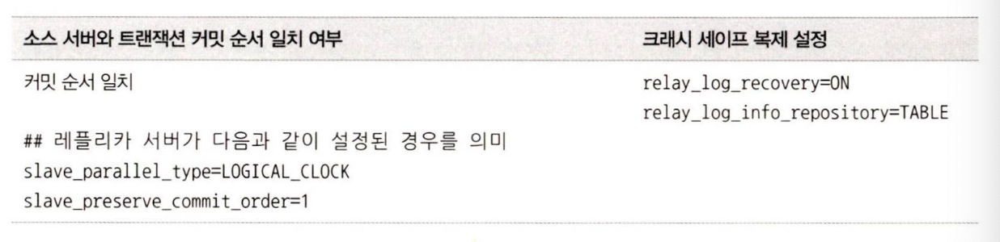 - 최소 옵션셋으로 크래시 세이프 복제 가능

- 커밋 순서가 일치하지 않는 경우
  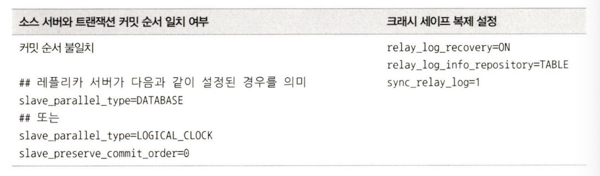 - `sync_relay_log = 1` 추가 설정해야 크래시 세이프 - MySQL의 릴레이 로그를 디스크와 얼마나 자주 동기화할 것인지 제어하는 옵션 - 0: MySQL에서 동기화지 않고 운영체제 설정에 따라 동기화 수행 - 0보다 큰 값: 릴레이 로그에 지정된 수만큼 이벤트가 기록된 경우 디스크와 동기화 - 기본값: 10,000 - 1이 아닌 0이나 1이상의 값을 사용하면 디스크에 동기화되지 못한 릴레이 로그 내용이 유실될 수 있음
  -> 멀티 스레드로 동기화될 때 발생할 수 있는 트랜잭션 갭 때문 - 트랜잭션 갭 - 멀티 스레드 복제에서 병렬 처리로 인해 트랜잭션이 순서대로 처리되지 않아 일시적으로 발생하는 트랜잭션 간의 간격 의미 - `syn_relay_log` 옵션이 1이면 이벤트가 릴레이 로그에 기록될 때마다 디스크에 동기화 처리 -> 이벤트 손실 최소화 가능 - 하지만 디스크에 부하

      -> 멀티 스레드 복제 사용시 LOGICAL_CLOCK 방식 사용 & `slave_preserve_commit_order` 옵션 1로 설정해서 트랜잭션 갭 발생 X


### 16.7.3.2.3 GTID 기반 복제 + 싱글 스레드 동기화

`mysql.gtid_executed` 테이블 데이터가 복제된 트랜잭션이 적용될 때마다 갱신 여부에 따라 크래시 세이프 복제를 위한 옵션 셋이 달라짐

- `SOURCE_AUTO_POSITION = 1`

  - 복구 시 `mysql.slave_relay_log_info` 테이블이 아닌 `mysql.gtid_executed` 테이블 참조
  - SQL 스레드가 마지막으로 적용한 트랜잭션의 GTID 를 얻기 위함

- `gitd_executed` 테이블이 매 트랜잭션이 적용될 때마다 항상 함께 갱신되어야 정상적으로 복구될 수 있음
  - 크래시 세이프한 복제를 위해서는 레플리카 서버에 `sync_binlog =1` 옵션과 `innodb_flush_log_at_trx_commit =1` 옵션이 설정되어 있어야함

### 16.7.3.2.3 GTID 기반 복제 + 멀티 스레드 동기화

싱글 스레드로 동기화되는 경우와 동일

- 멀티 스레드 복제인 경우 MySQL 서버가 비정상적으로 종료된 후 `relay_log_recovery=ON` 설정으로 재구동 시 트랜잭션 갭을 메우는 작업이 수행됨

# 16.7.4 필터링된 복제 (Filtered Replication)

소스 서버의 특정 이벤트들만 레플리카 서버에 적용될 수 있도록 필터링 기능 제공

- 필터링의 주체

  - 소스 서버와 레플리카 서버 둘 다 가능
  - **소스 서버**
    - 필터링은 데이터 베이스 단위로 가능
      - `binlog-do-db` : 바이너리 로그에 기록할 데이터베이스명 지정
      - `binlog-ignore-db`: 바이너리 로그에 기록하지 않을 데이터베이스명 지정
    - 두 옵션은 MySQL 서버 시작 시 커맨드 라인이나 설정 파일에 지정해서 사용 가능
    - `SHOW MASTER STATUS` 명령으로 적용된 내용 확인 가능
      - 서버 실행 중에는 동적으로 값을 변경 불가능
      - 재시작을 통해서만 변경 가능
  - **레플리카 서버**

    - 소스 서버에서보다 더 유연한 형태로 필터링 설정 가능
    - 서버를 재시작하지 않고 동적으로 필터링 설정 변경 가능
    - 필터링은 릴레이 로그에 저장된 이벤트들을 실행하는 시점에 적용
      - 일단 모든 이벤트들을 소스 서버로부터 가져온 다음에 다음 이벤트를 실행할 때 필터링을 적용
    - `CHANGE REPLICATION FILTER` 구문으로 복제 필터링 설정 가능

      - `FOR CHANNEL`
        - 지정한 복제 필터링 옵션을 멀티 소스 복제 구성에서 각 복제 채널별로 적용 가능
        - 명시하지 않는 경우, 설정된 필터링 옵션들이 전체 복제 채널에 적용
      - 사용 가능한 필터링 옵션
        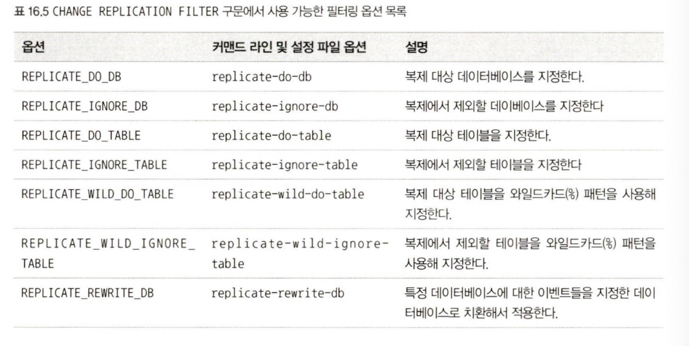

      - 복제가 이미 시작된 상태라면 `STOP REPLICA SQL_THREAD` 명령을 실행해 레플리케이션 SQL 스레드를 멈춘 후 `CHANGE REPLICATION FILTER` 구문 실행한 다음 `START REPLICA SQL_THREAD` 로 다시 SQL 스레드 재시작
      - 여러 필터 옵션들을 쉼표로 구분해서 함께 설정 가능
        - `CHANGE REPLICATION FILTER REPLICATE_DO_DB = (db1, db2), REPLICATE_IGNORE_DB=(db3, db4);`
      - 동일한 필터링 옵션이 한 구분에서 여러 번 명시된 경우 마지막에 명시된 설정이 적용됨
      - 와일드카드 특수문자를 사용해서 지정된 패턴에 매칭되는 데이터베이스 혹은 테이블에 대해 복제를 수행하거나 무시하도록 설정 가능
        - `CHANGE REPLICATION FILTER REPLICATE_WILD_DO_TABLE = ('db1.product%', 'db2.order%');`
        - `CHANGE REPLICATION FILTER REPLICATE_IGNORE_TABLE = ('db1.log%', 'db2.log%');`
      - 복제된 이벤트가 다른 데이터베이스에 적용되도록 설정 가능
        - 치환해서 적용할 데이터베이스를 나열하면됨
        - `CHANGE REPLICATION FILTER REPLICATE_REWRITE_DB = ((db1, db2));`
      - 이미 설정된 복제 필터링 옵션을 해제하려면 해제하고자 하는 필터링 옵션을 명시적으로 빈 값으로 설정해서 실행
        - `CHANGE REPLICATION FILTER REPLICATE_DO_DB = (), REPLICATE_IGNORE_DB=();`

- 바이너리 로그 포맷에 따라 데이터베이스 식별 방식이 달라짐
  ->
  - ROW 포맷
    - DDL문에 대해 USE 문을 사용해 디폴트 데이터베이스가 설정되게함
    - 쿼리에서 데이터베이스명을 지정하지 않음
  - STATEMENT 또는 MIXED 포맷
    - DML, DDL 모두 USE 문 사용해 디폴트 데이터베이스가 설정되게함
    - 쿼리에서 데이터베이스명을 지정하지 않음
    - 복제 대상 테이블과 복제 제외 대상 테이블을 모두 변경하는 DML 사용하지 않음
