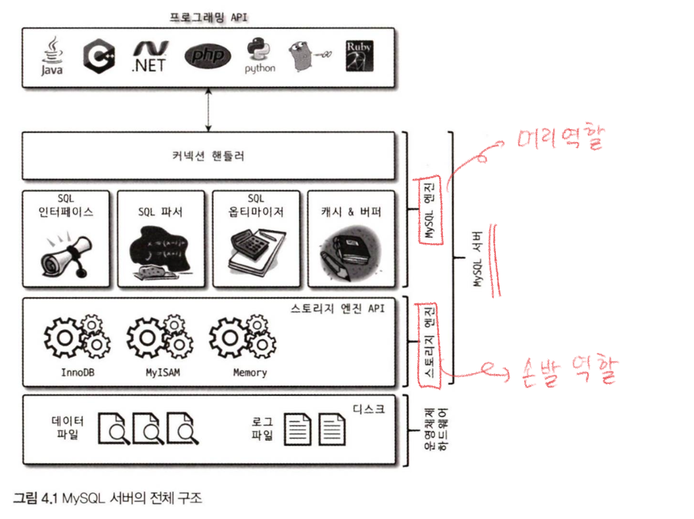
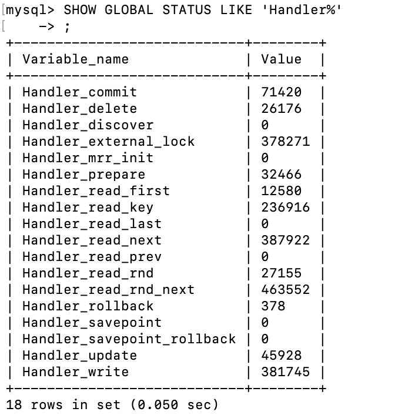
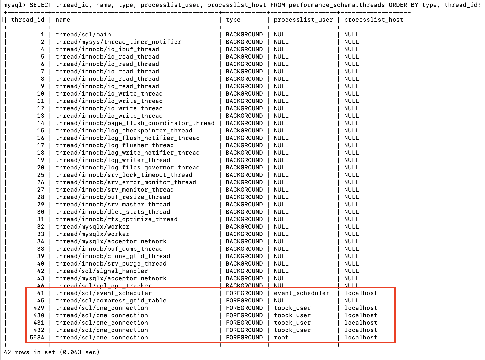
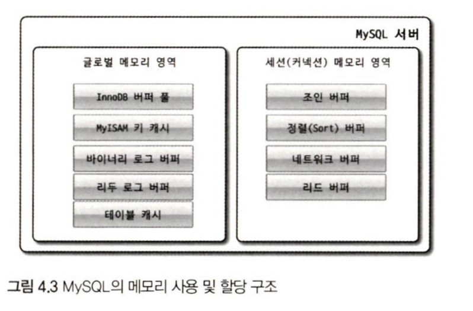
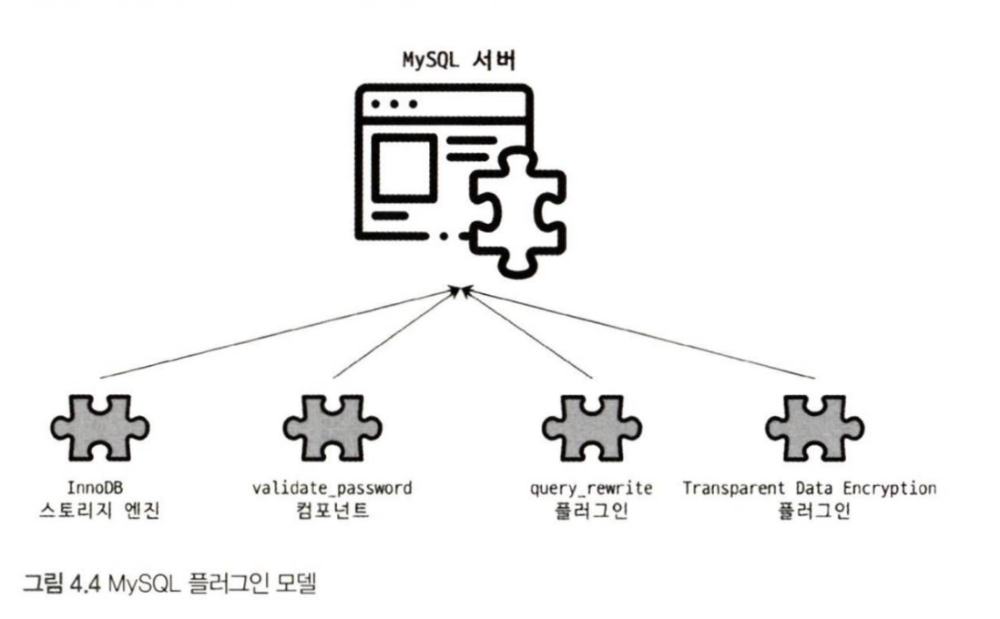
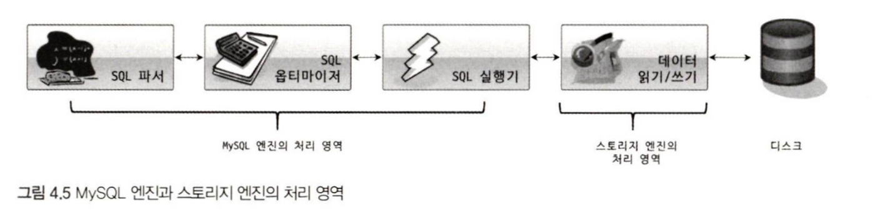
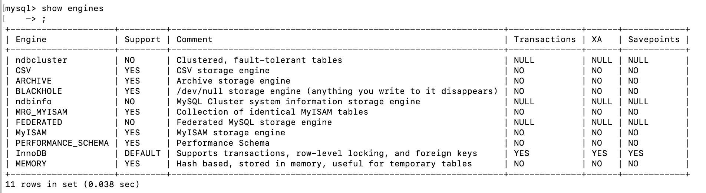
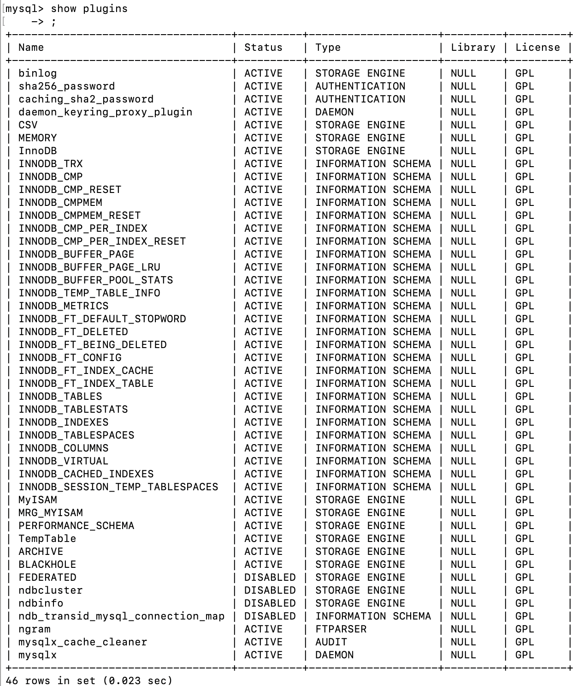
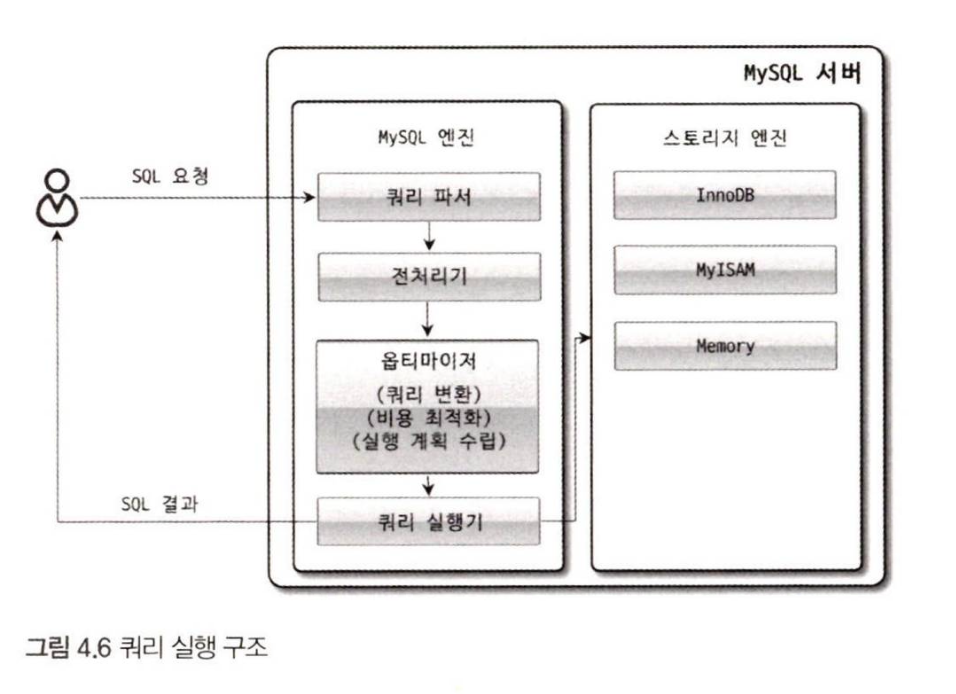

# 4장

## 4.1.1 MySQL의 전체 구조



**⇒ MySQL 서버**는 크게 `MySQL엔진`과 `스토리지 엔진`으로 구분

### 4.1.1.3 핸들러 API

```sql
SHOW GLOBAL STATUS LIKE 'Handler%';
```



> 핸들러 API를 통해 얼마나 많은 데이터(레코드) 작업이 있었는지 확인
>

## 4.1.2 MySQL 스레딩 구조

- MySQL서버는 프로세스 기반이 아니라 스레드 기반으로 작동
    - 크게 `Foreground 스레드`와 `Background 스레드`로 구분

```sql
SELECT thread_id, name, type, processlist_user, processlist_host FROM performance_schema.threads ORDER BY type, thread_id;
```

[실행 중인 스레드의 목록]



- ***/one-connectioin → 이 부분이 실제 사용자의 요청을 처리하는 포그라운드 스레드
- `toock_user` 계정은 한 번 생성된 하나의 계정이고
- 그 계정이 현재 4개의 연결(Connection) 을 동시에 가지고 있는 상태
    - 여러 스레드가 동일 작업을 병렬로 처리하는 경우
- 기본적으로 spring은 10개를 max_pool로 설정
- **현재 요청 부하가 낮아서** 풀의 최대치(10개)까지 안 쓴 상태

spring에서 yml파일 설정방법

```yaml
spring:
  datasource:
    hikari:
      maximum-pool-size: 4   
```

### 4.1.2.1 포그라운드 스레드(클라이언트 스레드)

- 최소한 MyWQL 서버에 접속된 클라이언트의 수만큼 존재
- 각 클라이언트 사용자가 요청하는 쿼리 문장을 처리
- 클라이언트 사용자가 작업을 마치고 커넥션을 종료하면 해당 커넥션을 담당하던 스레드는 다시 스레드 캐시로 되돌아감
    - 스레드 캐시에 유지할 수 잇는 최대 스레드 개수는 `thread_cache_size` 시스템 변수로 설정
- 포그라운드 스레드는 데이터를 MySQL의 데이터 버퍼나 캐시로 부터 가져옴
    - 없으면, 직접 디스크의 데이터나 인덱스 파일로부터 데이터를 읽어옴

- MyISAM테이블은 디스크 쓰기 작업까지 포그라운드 스레드가 처리
- InnoDB테이블은 데이터 버퍼나 캐시까지만 포그라운드 스레드가 처리
    - 나머지 버퍼로부터 디스크까지 기록하는 작업은 백그라운드 스레드가 처리

### 4.1.2.2 백그라운드 스레드

MyISAM테이블은 별로 해당 x, InnoDB는 여러 작업이 백그라운드 처리를 함

- insert Buffer를 병합하는 스레드
- **로그를 디스크로 기록하는 스레드**
- **InnoDB 버퍼 풀의 데이터를 디스크에 기록하는 스레드**
- 데이터를 버퍼로 읽어 오는 스레드
- 잠금이나 데드락을 모니터링하는 스레드

- MySQL 5.5부터 데이터 쓰기 스레드와 데이터 읽기 스레디의 개수를 2개 이상 지정할 수 있게 됨
    - `innodb_write_io_threads`, `innodb_read_io_threads` 시스템 변수로 스레드의 개수 설정

- 사용자의 요청을 처리하는 동중 쓰기 작업은 버퍼링되어 처리될 수 있지만, 읽기 작업은 절대 지연 x
    - 상용 RDMS, InnoDB : 쓰기 작업을 버퍼링해서 일괄 처리
        - insert,update,delte 쿼리로 데이터가 변경되는 경우 데이터가 완전히 저장될 때까지 기다리지 않아도 됨
    - MyISAM : 사용자 스레드가 쓰기 작업까지 함께 처리
        - 일반적인 쿼리는 쓰기 버퍼링 기능 사용 x

## 4.1.3 메모리 할당 및 사용 구조




- MySQL의 시스템 변수로 설정해 둔만큼 운영체제로부터 메모리를 할당받음

### 4.1.3.1 글로벌 메모리 영역

- 클라이언트 스레드의 수와 무고나하게 하나의 메모리 공간만 할당(필요에 따라 2개도 가능)
    - N개라고 하더라도 모든 스레드에 의해 공유

<aside>
대표적인 글로벌 메모리

- 테이블 캐시
- InnoDB 버퍼 풀
- InnoDB 어댑티브 해시 인덱스
- InnoDB 리두 로그 버퍼
</aside>

### 4.1.3.2 로컬 메모리 영역

= 세션 메모리 영역, 클라이언트 메모리 영역

- 클라이언트 스레드가 쿼리를 처리하는 데 사용하는 메모리 영역
- 각 클라이언트 스레드별로 독립적으로 할당되며 절대 공유되어 사용되지 않음
- 각 쿼리의 용도별로 필요할 때만 공간이 할당되고 필요하지 않는 경우에는 MySQL이 메모리 공간을 할당 조차 하지 않을 수 있음

<aside>
대표적인 로컬 메모리

- 정렬 버퍼
- 조인 버퍼
- 바이너리 로그 캐시
- 네트워크 버퍼
</aside>

## 4.1.4 플러그인 스토리지 엔진 모델



- 스토리지 엔진만 플러그인해서 사용하는 것만은 아님
- 많은 스토리지 엔진을 가지고 있지만, 부가적인 기능을 제공하는 스토리지 엔진을 필요로 할 수 있음
    - 다른 전문 개발 회사, 사용자가 직접 스토리지 엔진을 개발하는 것도 가능



- 대부분 작업 - MySQL엔진
- 데이터 읽기/쓰기 - 스토리지 엔진

<aside>
💡 하나의 쿼리 작업은 여러 하위 작업으로 나뉘는데, 각 하위 작업이 MySQL 엔진 영역에서 처리되는지 아니면 스토리지 엔진 영역에서 처리되는지 구분할 줄 알아야 함

</aside>

MySQL서버에서 지원되는 스토리지 엔진



- Support

    <aside>

    - Yes : MySQL서버에 해당 스토리지 엔진이 포함돼 있고, 사용 가능으로 활성화 된 상태
    - DEFAULT : ‘YES’ 와 동일한 상태(그렇지만 필수 스토리지 엔진임을 의미)
    - NO : 현재 MySQL서버에 해당 스토리지 엔진이 포함 X
    - DISABLED : 현재 MySQL서버에 해당 스토리지 엔진이 포함 O, 파라미터에 의해 비활성화
    </aside>

    - NO를 사용하려면 컴파일 해야됨(서버가 준비만 됐다면, **플러그인 형태**로 빌드된 스토리지 엔진 라이브러리를 다운해서 끼워 넣기만 하면 사용 가능)
    - **플러그인 형태**의 스토리지엔진은 손쉽게 업그레이드 가능
    - show plugins


        


## 4.1.5 컴포넌트

플러그인 아키텍처를 대체하기 위해 컴포넌트 아키텍처가 지원

- 플러그인 단점
    - 오직 MySQL 서버와 인터페이스할 수 있음, 플러그인끼리는 통신 못함
    - MySQL 서버의 변수나 함수를 직접 호출하기 때문에 안전하지 않음(캡슐화 x)
    - 상호 의존 관계를 설정할 수 없어서 초기화가 어려움

## 4.1.6 쿼리 실행 구조



### 4.1.6.1 쿼리 파서

- 사용자 요청으로 들어온 쿼리 문장을 토큰으로 분리해 트리 형태의 구조로 만드는 작업
- 기본 문법 오류를 여기서 잡고 사용자에게 오류 메시지 전송

### 4.1.6.2 전처리기

- 파서 트리 기반으로 구조적인 문제점 있는지 확인
    - 테이블 이름, 칼럼 이름, 내장 함수.. 매핑해서 접근 권한 확인 등등..
- 실제 존재하지 않거나, 권한상 사용 불가 개체의 토큰 거름

### 4.1.6.3 옵티마이저

- 쿼리 문장을 저렴한 비용으로 가장 빠르게 처리할지를 결정
- 두뇌라고 보면 됨

### 4.1.6.4 실행 엔진

- 손과 발
- 만들어진 계획대로 각 핸들러에게 요청해서 받은 결과를 또 다른 핸들로 요청의 입력으로 연결하는 역할 수행

### 4.1.6.5 핸들러(스토리지 엔진)

핸들러 = 스토리지 엔진

- MyISAM 테이블을 조작하는 경우에는 핸들러가 MyISAM 스토리지 엔진
- InnoDB 테이블을 조작하는 경우에는 핸들러가 InnoDB 스토리지 엔진

## 4.1.7 복제

추후

## 4.1.8 쿼리 캐시

- SQL의 실행 결과를 메모리에 캐시, 동일 SQL 쿼리가 실행되면 테이블을 읽지 않고 즉시 결과를 반환(매우 빠름)
- 테이블의 데이터가 변경되면 캐시에 저장된 결과 중에 변경된 테이블과 관련된 것들은 모두 삭제 해야 됨

  → 심각한 동시 처리 성능 저하 유발, 많은 버그

- 8.0부터 MySQL서버의 기능에서 완전히 제거

## 4.1.9 스레드 풀

- 엔터프라이즈 에디션만 스레드 풀 기능 제공
    - Percona Server에서 스레드 풀 플러그인 라이브러리르 커뮤니티 에디션 서버에 설치해서 사용
- 사용자의 요청을 처리하는 스레드 개수를 줄여서 동시 처리되는 요청이 많더라도, MySQL 서버의 CPU가 제한된 개수의 스레드 처리에만 집중할 수 있게해서 자원 소모 줄이는게 목표
- 스케줄링 과정에서 CPU시간을 제대로 확보하지 못하는 경우에는 쿼리 처리가 더 느려질 수 있음
- 스레드 그룹의 모든 스레드가 일을 처리하고 있다면 스레드 풀은 해당 스레드 그룹에 새로운 작업 스레드를 추가할지, 아니면 기존 작업 스레드가 처리를 완료할 때까지 기다릴지 여부를 판단
    - `thread_pool_stall_limit` 만큼 작업 스레드가 지금 처리 중인 작업을 끝내지 못하면 새로운 스레드 생성해서 스레드 그룹에 추가
- 전체 thread의 갯수는 thread_pool_max_threads를 못넘음
    - `thread_pool_stall_limit` 시간 동안 기다려야만 새로 들어온 요청을 처리할 수 있음
    - 낮추면 빠를 수 있지만, 0까지 낮춘다면 안쓰는 것이랑 같음

## 4.1.10 트랜잭션 지원 메타데이터

테이블의 구조 정보, 스토어드 프로그램 등의 정보를 **데이터 딕셔너리** or **메타데이터**라 함

- 5.7버전까지는 테이블 구조를 FRM파일에 저장하고 일부 스토어드 프로그램 또한 파일 기반으로 관리
    - 파일 기반은 트랜잭션을 지원 안함 → 비정상적 종료 시, 일관되지 않을 수 있음
- 8.0버전부터는 테이블 구조를 FRM파일, 일부 스토어드 프로그램을 모두 InnoDB의 테이블에 저장
    - 서버가 기본적으로 작동하는데 필요한 테이블(인증,권한..) ⇒ 시스템 테이블
    - 시스템 테이블을 모두 InnoDB에 저장하고 있음
- InnoDB스토리지 엔진을 사용하는 테이블은 해결, MyISAM이나 CSV등과 같은 스토리지 엔진의 메타 정보는 여전히 저장공간 필요
    - SDI(Serialized Dictionary Information)파일 사용

  > `.frm` 파일은 비표준적이고 비트 단위로 저장되어
  >
  >
  > 일관성, 버전 호환성, 트랜잭션 안정성 문제를 일으켰다.
  >
  > MySQL 8.0은 이를 해결하기 위해 InnoDB 기반의 **통합 데이터 딕셔너리 시스템**을 도입했고,
  >
  > 비-InnoDB 엔진은 `.sdi` 파일을 이용해 딕셔너리 정보를 JSON 형태로 저장하도록 바꿨다.
> 