# 4.2 InnoDB 스토리지 엔진 아키텍쳐

- InnoDB는 MySQL에서 사용할 수 있는 스토리지 엔진 중 거의 유일하게 레코드 기반의 잠금을 제공
    1. 높은 동시성 처리 가능
    2. 안정적이며 성능이 뛰어남

[InnoDB구조]

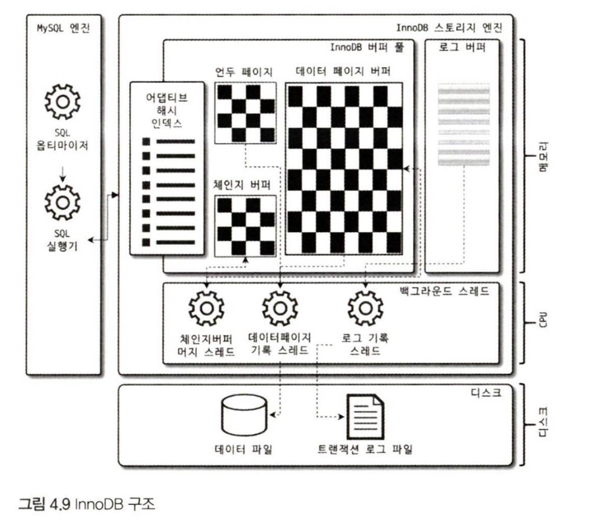

## 4.2.1 프라이머리 키에 의한 클러스터링

- InnoDB의 모든 테이블은 기본적으로 프라이머리 키를 기준으로 클러스터링되어 저장
    - 프라이머리 키가 클러스터링 인덱스이기 때문에 프라이머리 키를 이용한 레인지 스캔은 상당히 빨리 처리될 수 있음
- MyISAM 테이블에서는 프라이머리 키와 세컨더리 인덱스는 구조적으로 아무런 차이가 없음
    - 프라이머리 키는 유니크 제약을 가진 세컨더리 인덱스일 뿐

## 4.2.2 외래 키 지원

- 외래 키에 대한 지원은 InnoDB 스토리지 엔진 레벨에서 지원하는 기능으로 MyISAM이나 MEMORY 테이블에서는 사용못함
- InnoDB에서 외래 키는 부모 테이블과 자식 테이블 모두 해당 칼럼에 인덱스 생성이 필요
    - 변경 시에는 잠금 전파 → 데드락 발생할 경우가 많으므로 개발할 때도 외래 키의 존재에 주의해야 함

## 4.2.3 MCVV(Multi Version Concurrency Control)

- 큰 목적 : 잠금을 사용하지 않는 일관된 읽기를 제공
- InnoDB → Undo log를 이용해 이 기능을 구현
- Multiversion : 하나의 레코드에 대해 여러 개의 버전이 동시에 관리
- Isolation level 이 READ_COMMITTED인 MySQL서버에서 InnoDB 스토리지 엔진을 사용하는 테이블의 데이터 변경을 어떻게 사용하는가

    ```sql
    mysql> CREATE TABLE member (
        m_id INT NOT NULL,
        m_name VARCHAR(20) NOT NULL,
        m_area VARCHAR(100) NOT NULL,
        PRIMARY KEY (m_id),
        INDEX ix_area (m_area)
    );
    
    mysql> INSERT INTO member (m_id, m_name, m_area) VALUES (12, '홍길동', '서울');
    mysql> COMMIT;
    ```

  [InnoDB의 버퍼 풀과 데이터 파일의 상태]

  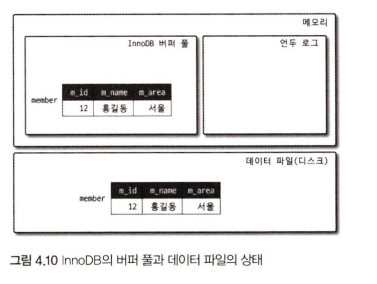

    ```sql
    mysql> UPDATE member SET m_area='경기' WHERE m_id=12;
    ```

  [Update 후 InnoDB 버퍼 풀과 데이터 파일 및 언두 영역의 변화]

  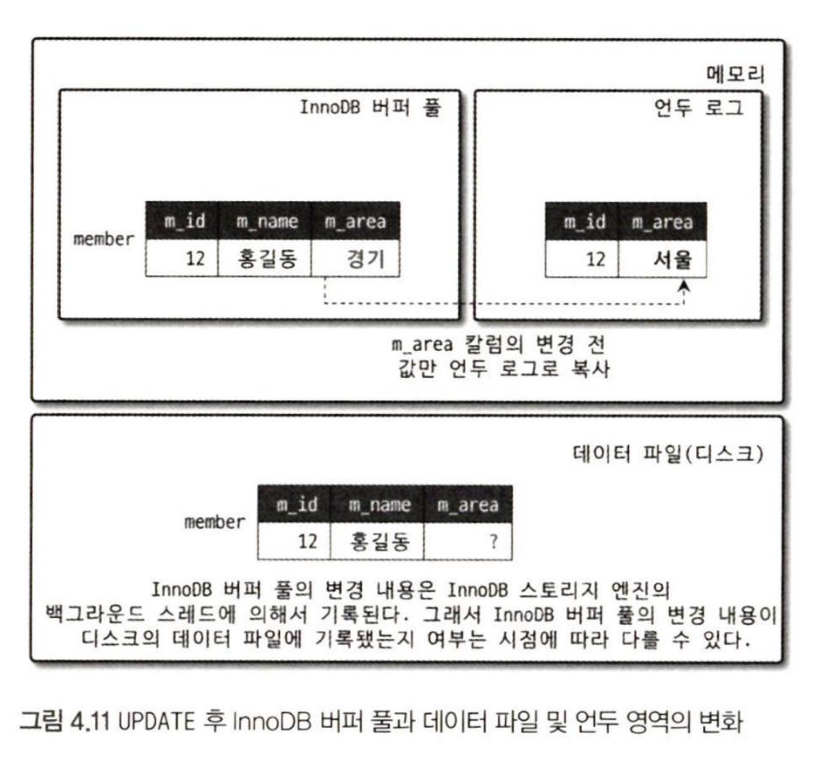

    - 커밋 실행 여부와 관계없이 InnDB의 버퍼 풀은 새로운 값인 ‘경기’로 업데이트 됨
    - 커밋이나 롤백이 안된 상태로 조회를 하게 된다면?

    ```sql
    mysql> SELECT * FROM member WHERE m_id=12;
    ```

    - 시스템 변수에 설정된 Isolation level에 따라 다를 것
        - READ_UNCOMMITTED인 경우 : InnoDB 버퍼 풀이나 데이터 파일로부터 변경되지 않은 데이터를 반환(→ 커밋됐든 아니든 변경된 상태의 데이터를 반환)
        - READ_COMMITED 이상의 격리 수준 : InnoDB 버퍼 풀이나 데이터 파일에 있느 ㄴ내용 대신 변경되기  이전의 내용을 보관하고 있는 언두 영역의 데이터를 반환

  → 이러한 과정을 DBMS에서는 MVCC라과 표현

  ⇒ 즉, 하나의 레코드에 대해 2개의 버전이 유지되고, 필요에 따라 어느 데이터가 보여지는지 여러 가지 상황에 따라 달라짐

    - 1️⃣ 데이터 파일 (Data File)

      > 실제 디스크에 저장된 영구 데이터
    >
    - 2️⃣ 버퍼 풀 (Buffer Pool)

      > 변경 전 데이터를 저장하는 ‘이전 버전 기록 공간’
    >
    - 3️⃣ 언두 영역 (Undo Area)

      > 디스크에 있는 데이터 페이지를 메모리로 가져와서 사용하는 캐시 영역
>

## 4.2.4 잠금 없는 일관된 읽기(Non-Locking Consistent Read)

- InnoDB 스토리지 엔진은 MVCC 기술을 이용해 잠금을 걸지 않고 읽기 작업을 수행함
- 격리 수준이 SERIALIZABLE이 아닌 READ_UNCOMMITTED나 READ_COMMITTED, REPEATABE_READ 수준인 경우 INSERT와 연결되지 않은 순수한 읽기 (SELECT)작업은 다른 트랜잭션의 변경 작업과 관계없이 바로 실행

  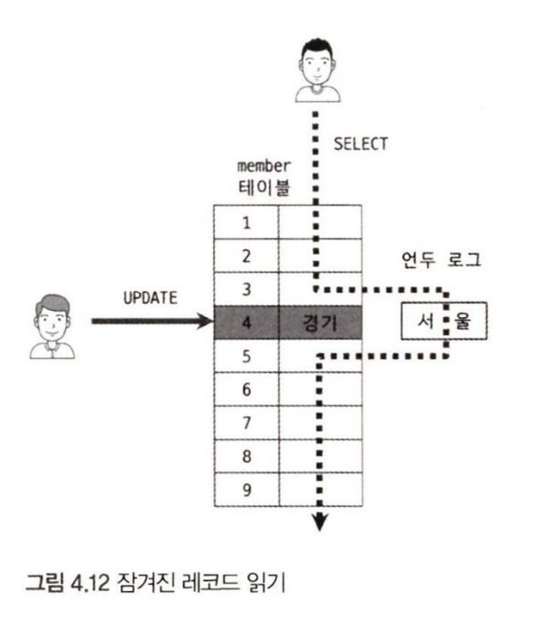


## 4.2.5 자동 데드락 감지

- InnoDB 스토리지 엔진은 내부적으로 잠금이 교착 상태에 빠지지 않았는지 체크하기 위해 잠금 대기 목록을 그래프 형태로 관리
    - 교착 상태에 빠진 트랜잭션들을 찾아 그중 하나를 강제 종료
        - 기준은 언두 로그 양
        - 언두 로그 레코드를 더 적게 가진 트랜잭션이 롤백 대상이 됨
        - 언두 처리할 내용이 적다는 이야기임(서버 부하 적음)
- `innodb_lock_wait_timeout`, `innodb_deadlock_detect` 등 다양한 시스템 변수 존재

## 4.2.6 자동화된 장애 복구

- InnoDB는 견고해서 데이터 파일이 손상되거나 MySQL서버가 시작되지 못하는 경우는 거의 x
    - 하드웨어 이슈가 발생할 수는 있음
    - `innodb_force_recovery` 시스템 변수를 이용
    - 1~6까지 존재

## 4.2.7 InnoDB 버퍼 풀

- InnDB 스트로지 엔진에서 가장 핵심적인 부분
    - 디스크의 데이터 파일이나 인덱스 정보를 메모리에 캐시해 두는 공간
    - 쓰기 작업을 지연시키고 일괄 작업하는 버퍼의 역할도 함

### 4.2.7.1 버퍼 풀의 크기 설정

1. 운영체제의 전체 메모리 공간이 8GB미만이라면 50% 정도만 InnoDB 버퍼 풀로 설정하고 나머지 메모리 공간은 MySQL 서버와 운영체제, 그리고 다른 프로그램이 사용할 수 있는 공간으로 확보
2. 그 이상이라면, 50%에서 시작해서 조금씩 올려가면 최적지점을 찾음
3. 50GB이상이라면, 대략 15GB에서 30GB정도를 운영체제와 다른 응용 프로그램을 위해서 남겨두고 InnoDB 버퍼 풀로 할당
- innodb_buffer_pool_size 시스템 변수로 크기를 설정(크리티컬한 설정이므로 한가할 때 하는걸 추천)

### 4.2.7.2 버퍼 풀의 구조

InnoDB 스토리지 엔진은 버퍼 풀이라는 거대한 메모리 공간을 페이지 크기의 조작으로 쪼개어 InnoDB 스토리지 엔진이 데이터를 필요로 할 때 해당 데이터 페이지를 읽어서 각 조각에 저장

- 버퍼 풀의 페이지 크기 조각을 관리하기 위해 3개의 자료 구조를 관리
    - LRU 리스트(LRU+MRU 하이브리드 방식)
    - 자세한 과정
        1. 필요한 레코드가 저장된 데이터 페이지가 버퍼 풀에 있는지 검사
           A. InnoDB 어댑티브 해시 인덱스를 이용해 페이지를 검색
           B. 해당 테이블의 인덱스(B-Tree)를 이용해 버퍼 풀에서 페이지를 검색
           C. 버퍼 풀에 이미 데이터 페이지가 있었다면 해당 페이지의 포인터를 MRU 방향으로 승급
        2. 디스크에서 필요한 데이터 페이지를 버퍼 풀에 적재하고, 적재된 페이지에 대한 포인터를 LRU 헤더 부분에 추가
        3. 버퍼 풀의 LRU 헤더 부분에 적재된 데이터 페이지가 실제로 읽히면 MRU 헤더 부분으로 이동(Read Ahead와 같이 대량 읽기의 경우 디스크의 데이터 페이지가 버퍼 풀로 적재는 되지만 실제 쿼리에서 사용되지는 않을 수도 있으며, 이런 경우에는 MRU로 이동되지 않음)
        4. 버퍼 풀에 상주하는 데이터 페이지는 사용자 쿼리가 얼마나 최근에 접근했는지에 따라 나이(Age)가 부여되며, 버퍼 풀에 상주하는 동안 쿼리에서 오랫동안 사용되지 않으면 데이터 페이지에 부여된 나이가 오래되고(‘Aging’이라고 함) 결국 해당 페이지는 버퍼 풀에서 제거된다. 버퍼 풀의 데이터 페이지가 쿼리에 의해 사용되면 나이가 초기화되어 다시 젊어지고 MRU의 헤더 부분으로 옮겨진다.
        5. 필요한 데이터가 자주 접근됐다면 해당 페이지의 인덱스 키를 어댑티브 해시 인덱스에 추가

  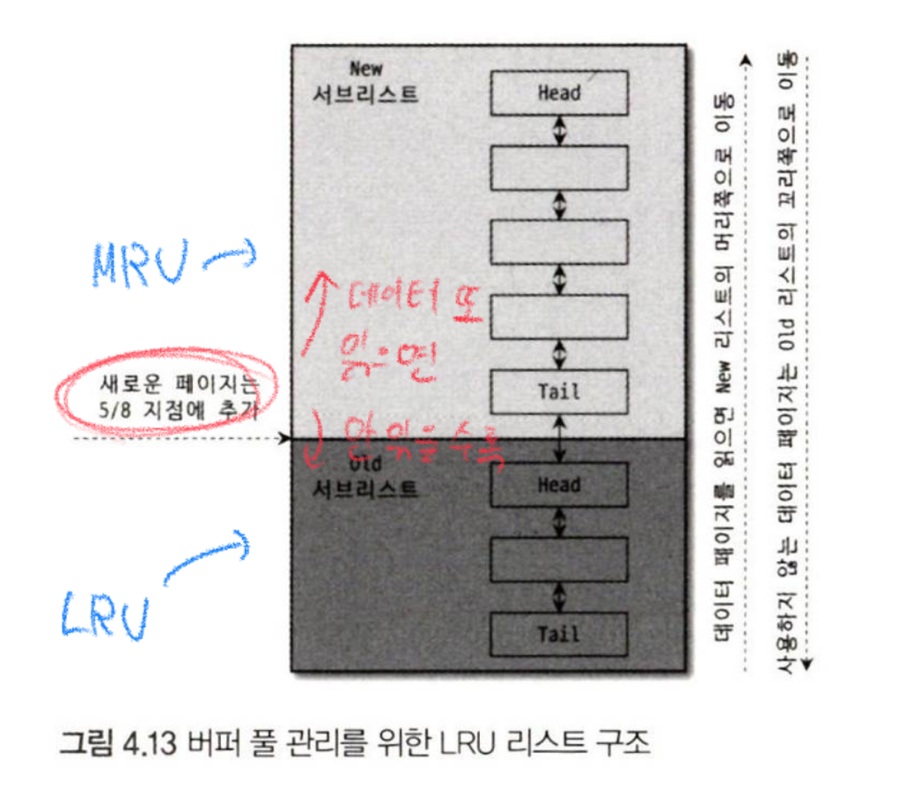

    - Flush 리스트
        - 디스크로 동기화되지 않은 데이터를 가진 데이터 페이지의 변경 시점 기준의 페이지 목록을 관리
    - Free 리스트 : 실제 사용자 데이터로 채워지지 않은 비어있는 페이지들의 목록

### 4.2.7.3 버퍼 풀과 리두 로그

- InnoDB `버퍼 풀`은 데이터베이스의 성능 향상을 위해
    1. 데이터 캐시
    2. 쓰기 버퍼링

  → 두가지 용도가 있음

- 버퍼 풀은 디스크에서 읽은 상태로 전혀 변경이 안된 Clean page와 Insert, Delete, Update 명령으로 변경된 데이터를 가진 Dirty Page가 있음x

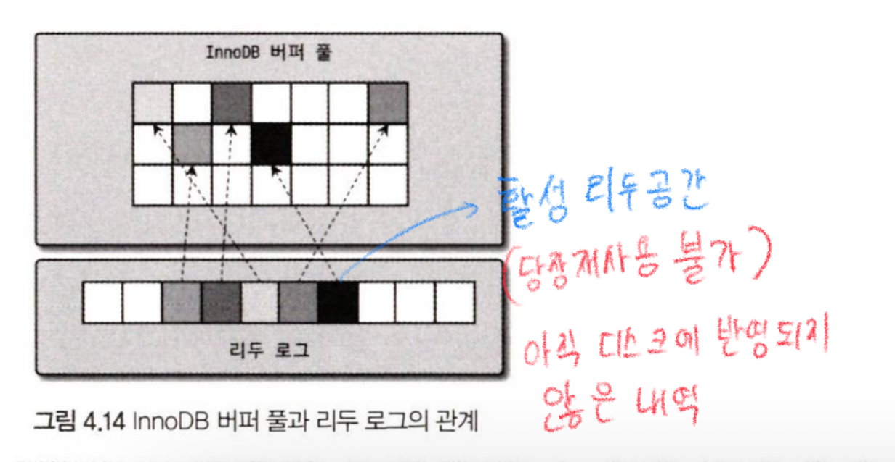

1️⃣ 리두 로그(Redo Log)의 기본 개념

> 💡 정의:
>
>
> **트랜잭션이 변경한 내용을 “다시 적용할 수 있도록” 기록한 로그.**
>
> 즉, “커밋된 변경사항을 잃지 않게 복구할 수 있도록” 만든 로그
>

“커밋된 트랜잭션의 변경 내용을 복구하기 위한 로그.”

요약 흐름도

```sql
(1) UPDATE 실행
   ↓
버퍼 풀에 더티 페이지 생성
   ↓
리두 로그에 변경 내용 기록 (LSN 증가)
   ↓
일정 시점에 CHECKPOINT 발생
   ↓
체크포인트 LSN 이전의 더티 페이지 → 디스크로 flush
   ↓
그에 해당하는 리두 로그 공간 → 재사용 가능
```

InnoDB는 버퍼 풀의 더티 페이지와 리두 로그를 **LSN으로 연결해 관리**하며, 체크포인트 시점 이전의 로그는 이미 디스크에 반영되어 재사용 가능하고, 체크포인트 이후의 로그(활성 리두 로그)는 복구용으로 남겨두는 구조

`LSN` = Log Sequence Number

### 4.2.7.4 버퍼 풀 플러시

버퍼 풀에서 아직 디스크로 기록되지 않은 더티 페이지들을 성능상의 악역향 없이 디스크에 동기화하기 위해 2개의 플러시 기능을 백그라운드에서 수행

**4.2.7.4.1 플러시 리스트 플러시**

주기적으로 플러시 리스트 플러시 함수를 호출해서 플러시 리스트에서 오랜전에 변경된 페이지 순서대로 디스크에 동기화하는 작업을 수행해야됨

(다양한 시스템 변수)

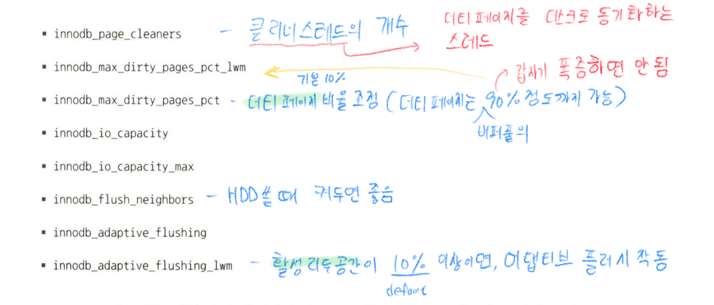

**4.2.7.4.2 LRU 리스트 플러시**

- LRU리스트에서 사용 빈도가 낮은 데이터 페이지를 제거
    - LRU리스트 플러시 함수가 사용됨
- `innodb_lru_scan_depth` 시스템 변수에 설정된 개수만큼의 페이지 스캔

### 4.2.7.5 버퍼 풀 상태 백업 및 복구

- 디스크의 데이터가 버퍼 풀에 적재돼 있는 상태 : 워밍업
- ib_buffer_pool 이라는 파일로 백업 데이터 생성됨
    - 몇십 MB이하임 (메타 정보만 가져와서 저장하기 때문)
- 버퍼 풀의 백업은 매우 빨리 완료됨
- 백업된 버퍼 풀의 내용을 다시 버퍼 풀로 복구하는 과정은 상당한 시간이 걸릴 수 있음(백업된 내용에서 각 테이블의 데이터 페이지를 다시 디스크에서 읽어와야 되기 때문)

## 4.2.8 Double Write Buffer

- 리두 로그는 공간 낭비를 막기 위해 페이지의 변경된 내용만 기록
    - 페이지가 일부만 기록되는 현상 발생할 수 있음

  → Double Wirte Buffer로 해결


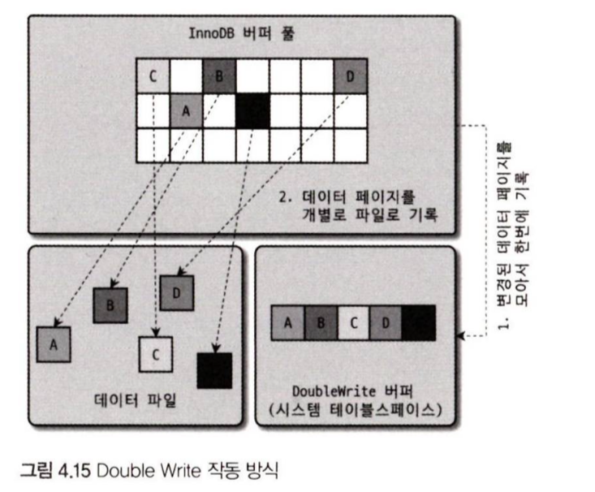

- 묶어서 DoubleWrite 버퍼에 기록
    - DoubleWrite 버퍼의 내용은 실제 데이터 파일의 쓰기가 중간에 실패할 때만 원래의 목적으로 사용됨

## 4.2.9 언두로그

- 트랜잭션과 격리 수준을 보장하기 위해 DML로 변경되기 이전 버전의 데이터를 별도로 백업함 → 언두로그
    - 트랜잭션 보장 : 롤백되면 트랜잭션 도중 변경 전 데이터로 복구해야됨(이때 이용)
    - 격리 수준 보장 : 특정 커넥션에서 변경하는 도중 다른 커넥션에서 조회하면 격리 수준에 맞게 변경중인 레코드를 읽지 않고 언두 로그에 백업해둔 데이터를 읽어서 반환

- 언두로그의 급격히 증가하는 경우
    1. 대용량의 데이터를 트랜잭션
        - 1억개의 Delete연산을 하는 트랜잭션이 있으면, 그 전의 1억개의 값을 저장하는 언두로그 필요
    2. 트랜잭션이 오랜 시간동안 실행될 때
        - 트랜잭션이 완료됐다고 언두로그 바로 삭제하는건 아님

       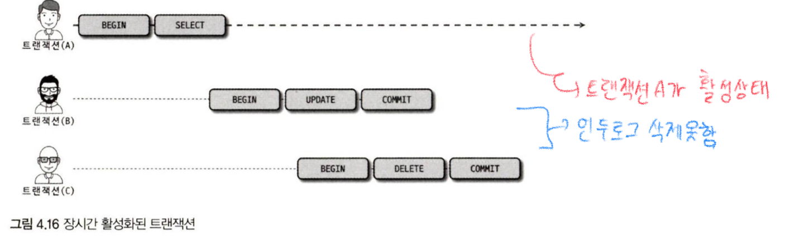

        - 언두로그의 용량이 커졌다고 문제가 안될 수는 있지만, 커지만큼 스캔해야될 데이터가 많아서 쿼리 성능이 떨어짐
- 5.5 버전은 언두로그가 한번 크기가 증가하면 못 줄였지만, 8.0부터는 순차적으로 줄이는 것이 가능해짐

언두로그 레코드 건수 확인

```sql
SELECT count
    FROM information_schema.innodb_metrics
    WHERE SUBSYSTEM='transaction' AND NAME='trx_rseg_history_len';
```

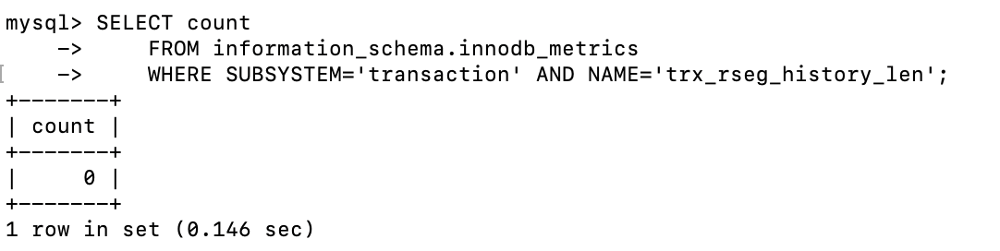

### 4.2.9.2 언두 테이블스페이스 관리

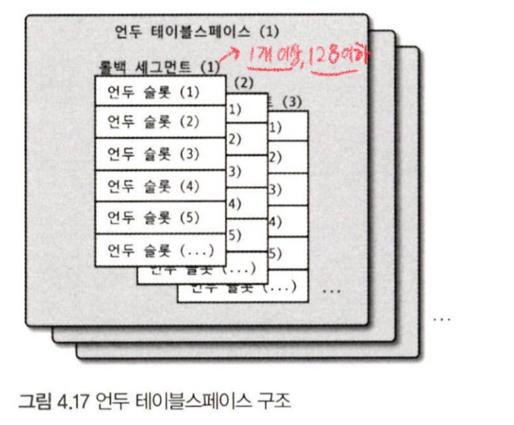

**최대 동시 트랜잭션 수** = (InnoDB 페이지 크기) /16 * (롤백 세그먼트 개수) * (언두 테이블스페이스 개수)

- 언두공간이 남는건 문제 x, 언두공간이 없다면 트랜잭션이 시작 조차 못함
- 언두 테이블스페이스의 불필요한 공간을 잘라내는 방법
    - 자동 : Purge Thread가 주기적으로 깨어나서 불필요해진 언두로그 삭제 → undo purge라고 함
    - 수동 :
        - 자동 모드로도 Undo Tablespace의 **공간 반납이 지연되거나 불충분할 때**
        - 관리자가 Undo Tablespace를 **비활성화(disable)** 하면

          → InnoDB가 내부적으로 “이 공간은 더 이상 사용 안 함” 판단

          → Purge Thread가 해당 Undo Tablespace를 찾아 불필요한 부분을 잘라내고 OS에 반납함


## 4.2.10 체인지 버퍼

- Insert 또는 Update될 때 인덱스 또한 업데이트돼야 함
- 버퍼 풀에 있다면 바로 하지만, 없다면 즉시 실행하지 않고 임시 공간에 저장해두고 바로 사용자에게 결과 반환
    - 임시 공간 : **체인지 버퍼**
- 기본적으로 버퍼 풀로 설정된 공간의 25%까지 사용할 수 있게 설정(필요하다면 50%까지)

체인지 버퍼가 사용중인 메모리 공간의 크기

```sql
SELECT EVENT_NAME, CURRENT_NUMBER_OF_BYTES_USED
    FROM performance_schema.memory_summary_global_by_event_name
    WHERE EVENT_NAME='memory/innodb/ibuf0ibuf';
```

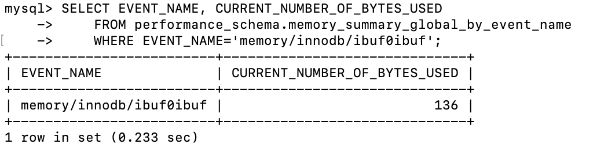

## 4.2.11 리두 로그 및 로그 버퍼

리두로그는 ACID중에 D(Duarble)과 연관있음

- MySQL서버가 비정상 종료되는 경우, 일관되지 않은 데이터 종류
    1. 커밋됐지만 데이터 파일에 기록되지 않은 데이터

       → 리두로그에 저장된 데이터를 데이터 파일에 복사

    2. 롤백됐지만 데이터 파일에 이미 기록된 데이터

       → 언두로그의 내용을 가져와 데이터 파일에 복사


### ~~4.2.11.1 리두 로그 아카이빙~~

## 4.2.12 어댑티브 해시 인덱스

- 인덱스라고 하면 테이블에 사용자가 생성해둔 B-Tree 인덱스를 의미
- 어댑티브 해시 인덱스는 B-Tree 검색 시간으르 줄여주기 위해 도입된 기능
- 해시 인덱스는 ‘인덱스 키 값’ 과 해당 인덱스 키 값이 저장된 ‘데이터 페이지 주소’의 쌍으로 관리
    - 인덱스 키 값 : `B-Tree 인덱스의 고유번호`와 `B-Tree 인덱스의 실제 키 값` 조합
    - 데이터 페이지 주소 : 실제 키 값이 저장된 데이터 페이지의 메모리 주소(InnoDB 버퍼 풀에 로딩된 페이지의 주소 의미)

      → 버퍼 풀에 올려진 데이터 페이지에 대해서만 관리


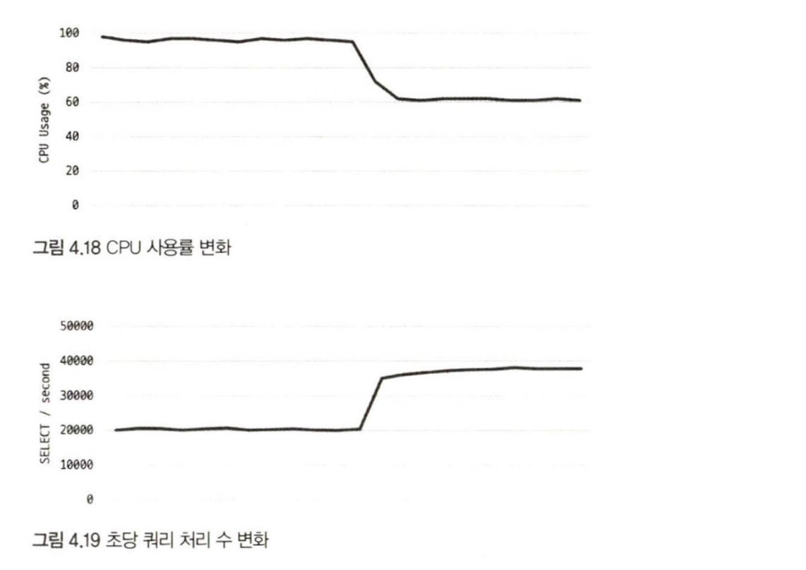

- 해시 인덱스가 성능 향상에 도움 안되는 경우
    - 디스크 읽기가 많은 경우
    - 특정 패턴의 쿼리가 많은 경(조인 또는 like 패턴)
    - 매우 큰 데이터를 가진 테이블의 레코드를 폭넓게 읽는 경우
- 도움 되는 경우
    - 디스크의 데이터가 InnoDB 버퍼 풀 크기와 비슷한 경우(디스크 읽기가 많지 않은 경우)
    - 동등 조건 검색(동등 비교, IN 연산자)이 많은 경우
    - 쿼리가 데이터 중에서 일부 데이터만 집중되는 경우
- !어댑티브 해시 인덱스의 도움을 받을수록 테이블 삭제 또는 변경 작업은 치명적임!

## 4.2.13 InnoDB와 MyISAM, MEMORY 스토리지 엔진 비교

- 8.0 부터는 MySQL 서버의 모든 기능을 InnoDB 스토리지 엔진만으로 구현할 수 있게 됨
    - MyISAM은 도태되는 상황→ 없어질 것으로 예상
