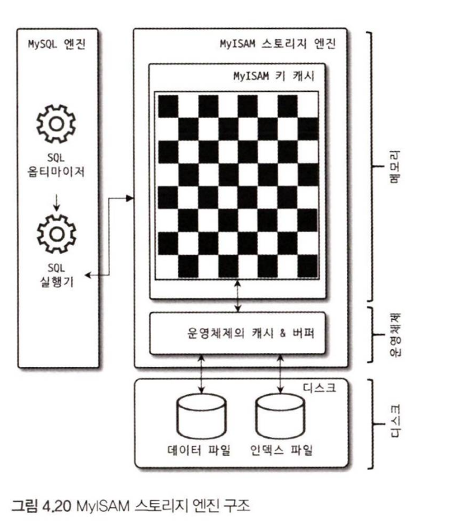
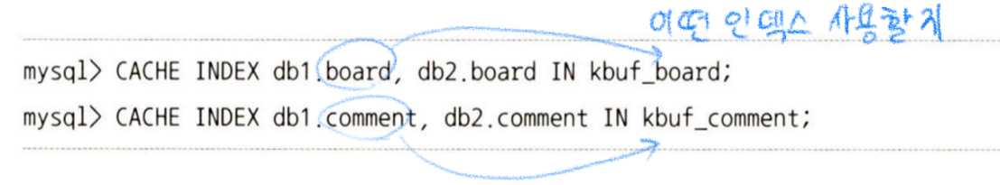

# 4.3 MyISAM 스토리지 엔진 아키텍쳐

## 4.3.1 키 캐시

- InnoDB의 버퍼 풀과 비슷한 역할 → MyISAM의 키 캐시
    - 하지만 인덱스만 대상으로 작동
    - 인덱스의 디스크 쓰기 작업에 대해서만 부분적으로 버퍼링 역할
- 기본 키 캐시말고 사용하라면, 만들고 지정을 해줘야 함

## 4.3.2 운영체제의 캐시 및 버퍼

- MyISAM 테이블의 데이터에 대해서 디스크로 부터 IO를 해결해 줄 만한 어떠한 캐시나 버퍼링 기능도 가지고 있지 않음
- 그래서 운영체제의 캐시 기능을 이용
    - 만약에 MySQL이 전체메모리를 사용한다면, MyISAM가 캐시용도로 사용할 메모리가 없어서 성능이 느려지게 됨

## 4.3.3 데이터 파일과 프라이머리 키(인덱스) 구조

InnoDB 스토리지 엔진을 사용하는 테이블은 프라이머리 키에 의해서 클러스터링되어 저장되는 반면, MyISAM 테이블은 프라이머리 키에 의한 클러스터링 없이 데이터 파일이 힙공간처럼 활용됨