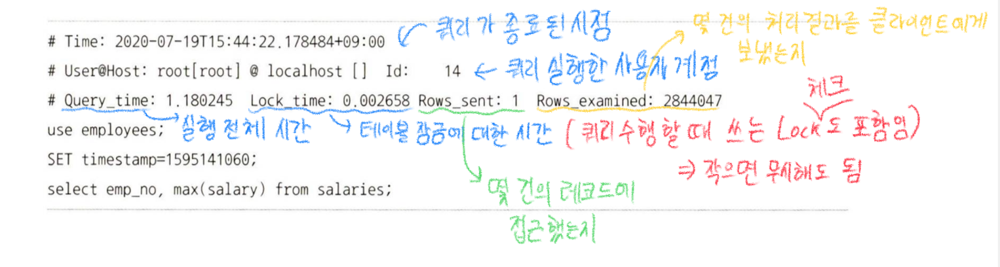
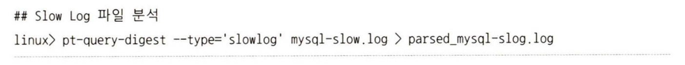
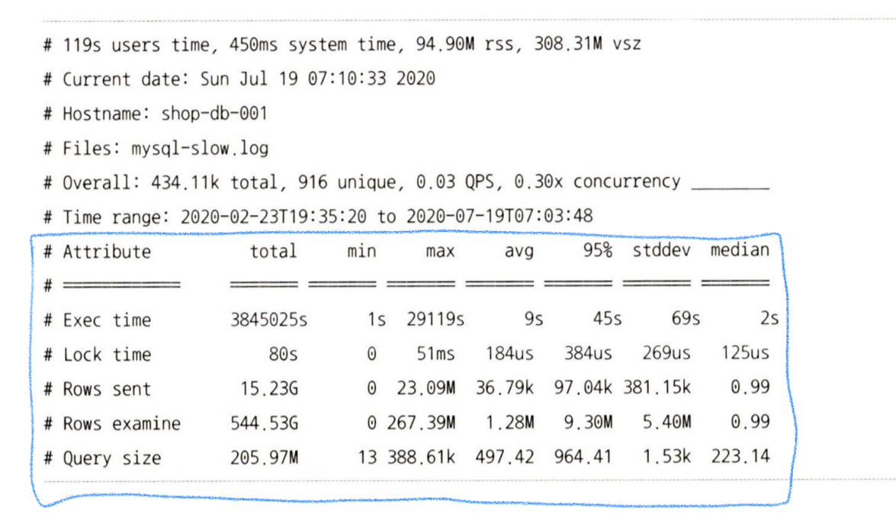
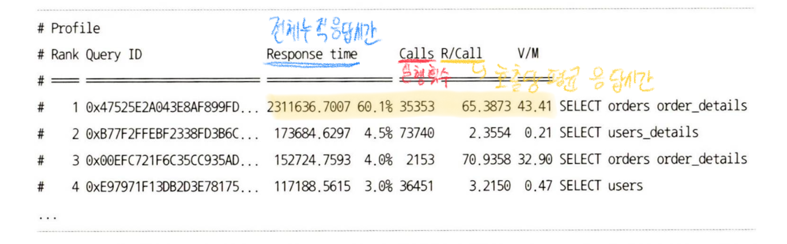

# 4.4 MySQL 로그 파일

## 4.4.3 슬로우 쿼리 로그

- MySQL 서버의 쿼리 튜닝은 서비스가 적용되기 전에 전체적으로 튜닝하는 경우, 서비스 운영중에 MySQL서버의 전체적인 성능 저하를 검사하거나 정기적인 점검을 위한 튜닝으로 나눔
    - 전자, 모든 모두 튜닝하면 됨
    - 후자의 경우 어떤 쿼리가 문제의 쿼리인지 판단하기 상당히 어려움

  → 슬로우 쿼리 로그가 많은 도움을 줌

- 슬로우 쿼리 로그 파일에는 `long_query_time` 이상의 시간이 소요된 쿼리가 모두 기록

→ 그래서 `Rows_sent`가 큰데 `Rows_examined`가 상당히 적다면, 더 적은 레코드만 접근하도록 튜닝해 볼 가치가 있음(GROUP_BY 나 COUNT().. 뭐 이런 집합 함수가 아닌 쿼리만 해당)

- 근데 로그파일의 내용이 상당히 많아서 다 검토하기 힘듦

  → Percona에서 개발한 Percona Toolkit `pt-query-digest` 쿼리 이용

### 4.4.3.1 슬로우 쿼리 통계

### 4.4.3.2 실행 빈도 및 누적 실행 시간순 랭킹

