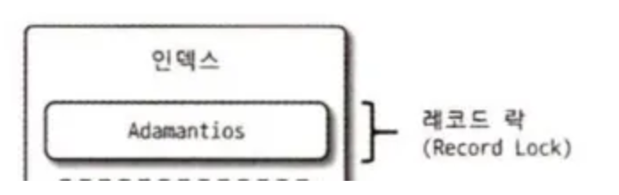
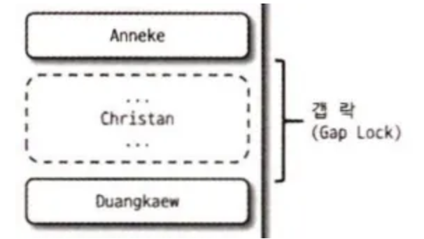
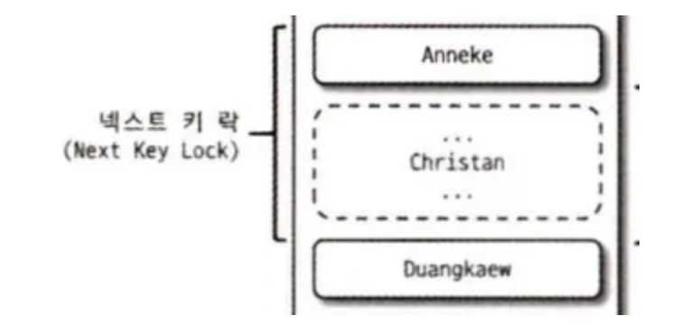
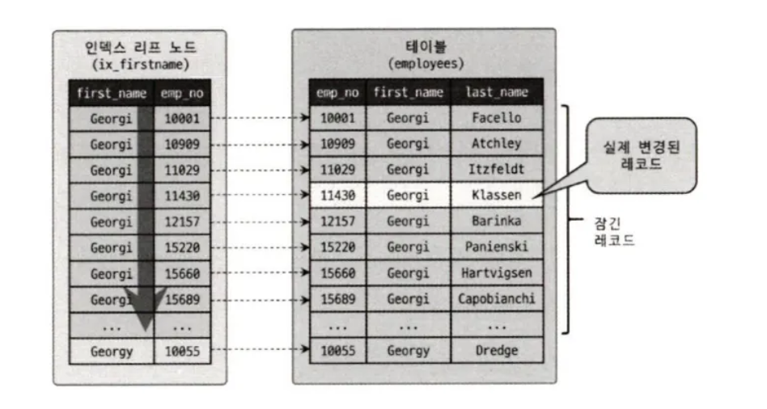

## 5.3 InnoDB 스토리지 엔진 잠금

**InnoDB 스토리지 엔진**은 MySQL 에서 제공하는 잠금과는 별개로 스토리지 엔진 내부에서 레코드 기반의 잠금 방식을 탑재하고있으며, 레코드 기반의 잠금 방식 때문에 MyISAM 보다 훨씬 뛰어난 동시성 처리를 제공할 수 있다.

### 5.3.1 InnoDB 스토리지 엔진의 잠금


<br>

- **레코드 락**
    
    
    
    > **레코드 자체만을 잠그는 것**
    > 
    - InnoDB 스토리지 엔진은 레코드 자체가 아니라, 인덱스의 레코드를 잠근다.
    - 인덱스가 하나도 없는 테이블의 경우, 내부적으로 자동 생성된 클러스터 인덱스를 이용해 잠금을 설정한다.
  
<br>

- **갭 락**
    
    
    
    > **레코드 자체가 아니라 레코드와 바로 인접한 레코드 사이의 간격만을 잠그는 것**
    > 
    - 다른 DBMS 와의 차이점
    - 레코드와 레코드 사이의 간격에 새로운 레코드가 생성(INSERT) 되는 것을 제어

<br>

- **넥스트 키 락**
    
    
    
    > **레코드 락과 갭 락을 합쳐 놓은 형태의 잠금**
    > 

<br>

- **자동 증가 락**
    - MySQL 에서는 자동 증가하는 숫자 값을 추출(채번)하기 위해 AUTO_INCREMENT 라는 칼럼 속성을 제공한다.
    - AUTO_INCREMENT 칼럼이 사용된 테이블에 동시에 여러 레코드가 INSERT 되는 경우, 저장되는 각 레코드는 중복되지 않고 저장된 순서대로 증가하는 일련번호 값을 가져야 한다.
        - InnoDB 스토리지 엔진에서는 이를 위해 내부적으로 AUTO_INCREMENT 락 (Auto increment lock) 이라고 하는 테이블 수준의 잠금을 사용
    - AUTO INCREMENT 락은 INSERT 와 REPLACE 쿼리 문장과 같이 새로운 레코드를 저장하는 쿼리에서만 필요하다. 그 외의 UPDATE, DELETE 등의 쿼리에서는 걸리지 않는다.
    - 트랜잭션과 관계없이 INSERT 나 REPLACE 문장에서 AUTO_INCREMENT 값을 가져오는 순간만 락이 걸렸다가 즉시 해제된다.
    - 테이블에 단 하나만 존재하기 때문에 두 개의 INSERT 쿼리가 동시에 실행되는 경우 하나의 쿼리가 AUTO_INCREMENT 락을 걸면 나머지 쿼리는 AUTO_INCREMENT 락을 기다려야 한다.
    - 명시적으로 획득하고 해제하는 방법은 없다.
    - AUTO_INCREMENT 잠금을 최소화하기 위해 자동 증가 값은 한 번 증가하면 절대 줄어들지 않는다.

<br>

### 5.3.2 인덱스와 잠금

**InnoDB의 잠금은 인덱스를 잠그는 방식으로 동작한다.**

즉 변경해야 할 레코드를 찾기 위해 검색한 인덱스의 레코드를 모두 락을 걸어야한다.

**예시**

```sql
-- // 데이터베이스의 employees 테이블에는 아래와 같이 first_name 칼럼만
-- // 멤버로 담긴 ix_firstname이라는 인덱스가 준비돼 있다.
-- //   KEY ix_firstname (first_name)

mysql> SELECT COUNT(*) FROM employees WHERE first_name='Georgi';
+----------+
|  253     |
+----------+

mysql> SELECT COUNT(*) FROM employees WHERE first_name='Georgi' AND last_name='Klassen';
+----------+
|  1       |
+----------+

-- // employees 테이블에서 first_name='Georgi'이고 last_name='Klassen'인 사원의 입사 일자를 오늘로 변경하는 쿼리를 실행
mysql> UPDATE employees SET hire_date=NOW() WHERE first_name='Georgi' AND last_name='Klassen';

```

위처럼 UPDATE 문장이 실행되면 1건의 레코드가 업데이트 된다. 하지만 이 1건의 업데이트를 위해 몇 개의 레코드에 락이 걸릴까?

위 UPDATE 문장의 조건에서 인덱스를 이용할 수 있는 조건은 first_name=’Georgi’ 이며, last_name 칼럼은 인덱스에 없기 때문에 first_name=’Georgi’ 인 레코드 253 건의 레코드가 모두 잠긴다.



만약 이 테이블에 인덱스가 하나도 없다면 테이블을 풀 스캔하면서 UPDATE 작업을 하게된다. 그러다보니 해당 테이블에 존재하는 모든 레코드를 잠그게 된다. 만약 100만건의 데이터가 존재했다면 100만건을 모두 잠그게되는 것이다.

즉 인덱스를 적절히 준비하지 않는다면 클라이언트간의 동시성이 상당히 떨어지는 문제점이 발생할 수 있다.