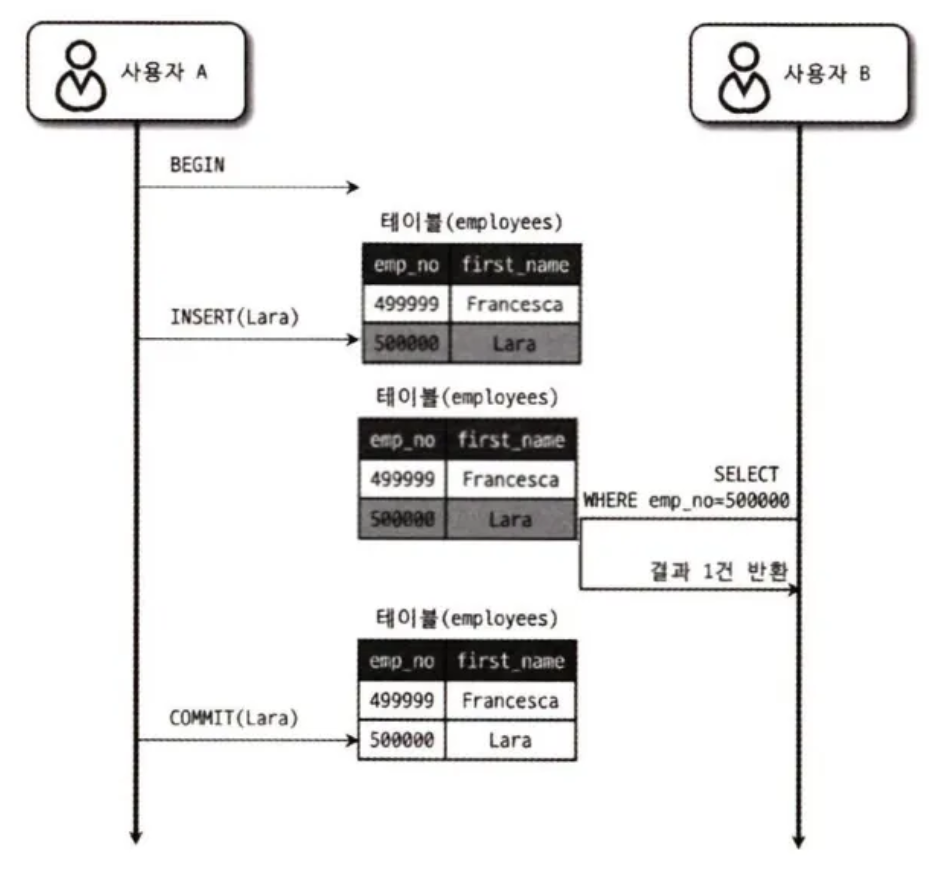
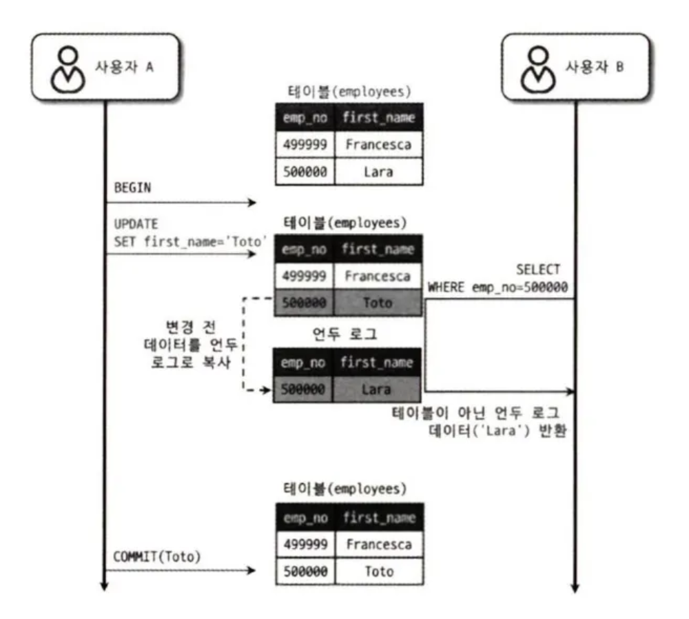
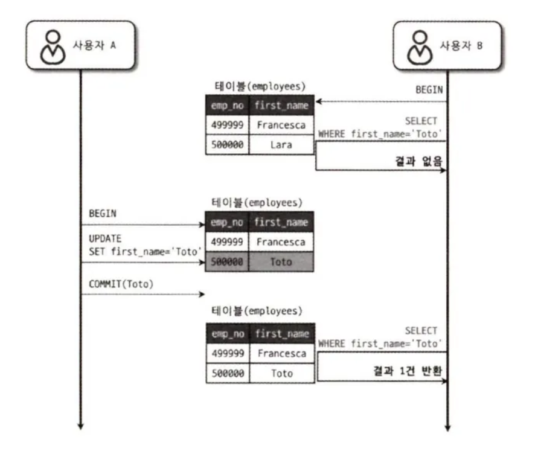
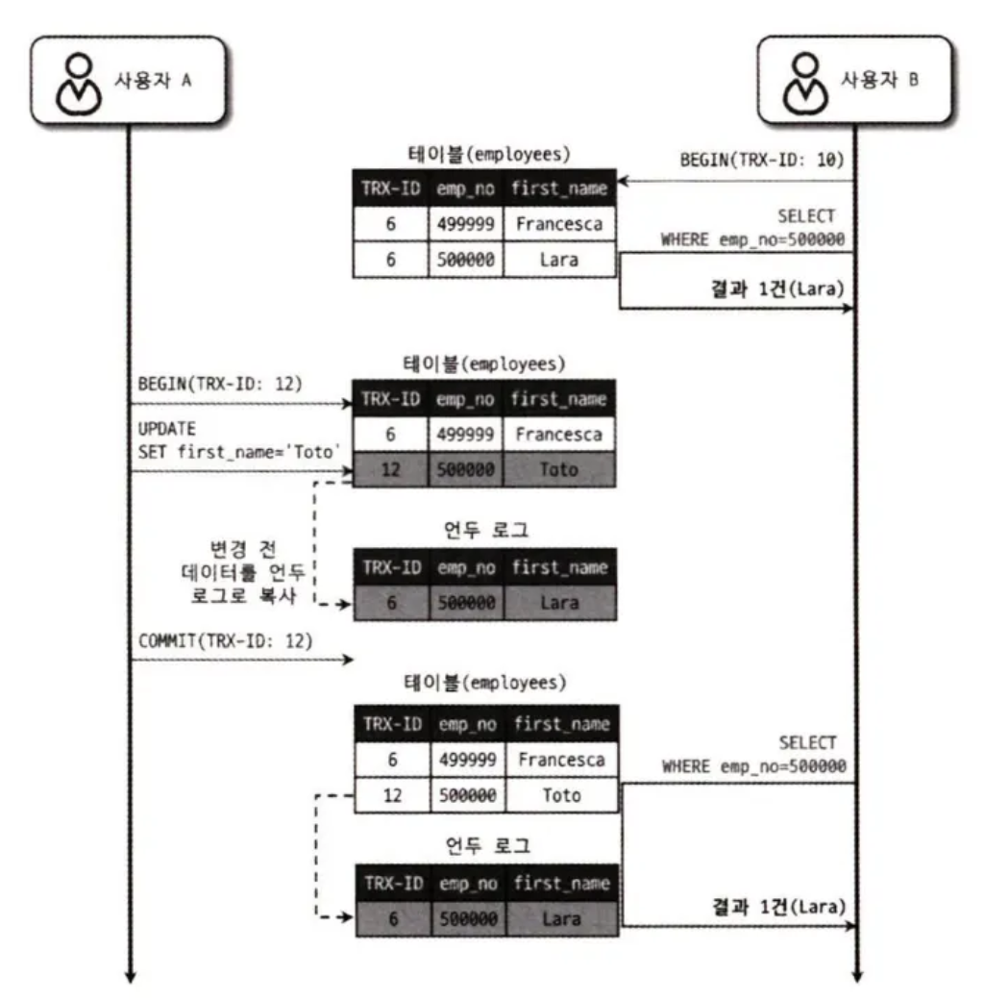
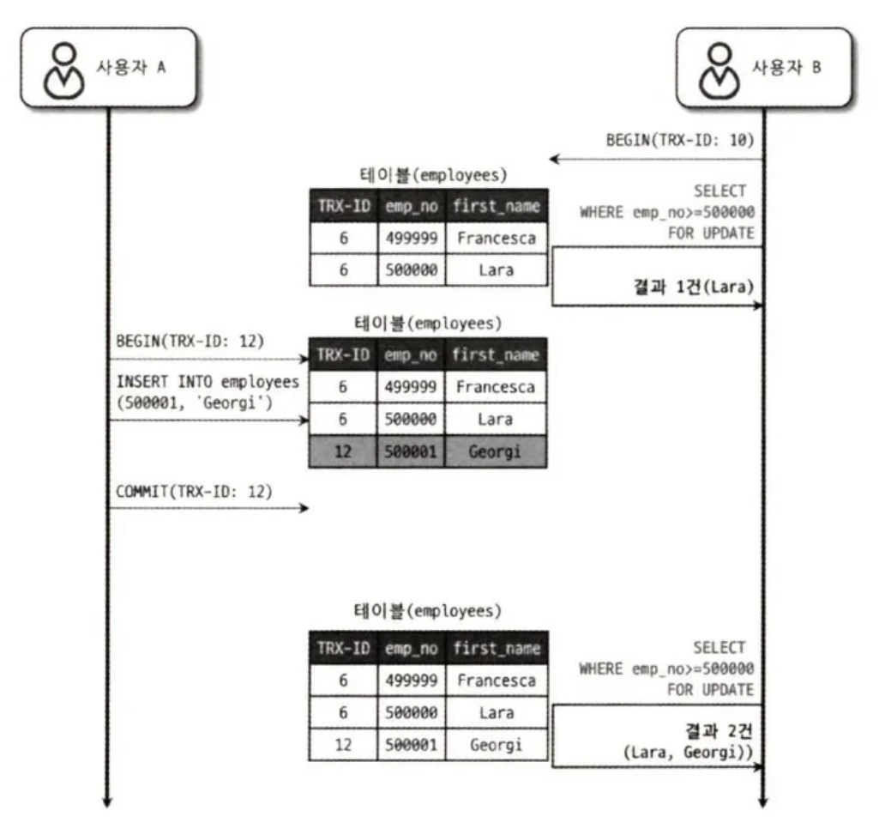

## 5.4 MySQL 의 격리 수준

**트랜잭션의 격리 수준** 

> **여러 트랜잭션이 동시에 처리될 때 특정 트랜잭션이 다른 트랜잭션에서 변경되거나 조회하는 데이터를 볼 수 있게 허용할지 말지를 결정하는 것**
> 
- **READ UNCOMMITTED**
- **READ COMMITTED**
- **REPEATABLE READ**
- **SERIALIZABLE**

 

**격리 수준 낮은 순 → 높은 순 == 동시성 처리 높은 순 → 낮은 순**

> **READ UNCOMMITTED → READ COMMITTED → REPEATABLE READ → SERIALIZABLE**
> 

격리 수준이 높아질수록 처리 성능이 많이 떨어질 것으로 생각하기 쉬운데, 사실 SERIALIZABLE 격리 수준이 아니라면 크게 성능의 개선이나 저하는 발생하지 않는다.

|  | DIRTY READ | NON-REPEATABLE READ | PHANTOM READ |
| --- | --- | --- | --- |
| READ UNCOMMITTED | 발생 | 발생 | 발생 |
| READ COMMITTED | 없음 | 발생 | 발생 |
| REPEATABLE READ | 없음 | 없음 | 발생 (InnoDB는 없음) |
| SERIALIZABLE | 없음 | 없음 | 없음 |

 

일반적인 온라인 서비스 용도의 데이터베이스는 READ COMMITTED 와 REPEATABLE READ 중 하나를 사용한다.

**MySQL 에서는 REPEATABLE READ 를 주로 사용**

 

### 5.4.1 READ UNCOMMITTED

> **각 트랜잭션에서의 변경 내용이 COMMIT 이나 ROLLBACK 여부에 상관 없이 다른 트랜잭션에서 보이는 격리 수준**
> 

**흐름**

1. 사용자 A 가 emp_no = 500000 이고, first_name 이 ‘Lara’ 인 새로운 사원을 INSERT.
2. 사용자 A 가 COMMIT 을 수행하기 전에 사용자 B 는 emp_no = 500000 인 사원을 검색.
    - 이 때 사용자 B 는 사용자 A 가 INSERT 한 사원의 정보를 아직 커밋되지 않은 상태에서도 조회가 가능하다.

이 때 사용자 A 가 처리 도중 알 수 없는 문제가 발생해 INSERT 된 내용을 롤백한다고 하더라도, 사용자 B 는 여전히 ‘Lara’ 가 정상적인 사원이라고 생각하고 계속 처리한다.

 

**Dirty Read**

> **어떤 트랜잭션에서 처리한 작업이 완료되지 않았는데도 다른 트랜잭션에서 볼 수 있는 현상**
> 

Dirty Read 현상은 READ UNCOMMITTED 에서만 발생한다. 이 현상은 데이터가 나타났다가 사라졌다 하는 현상을 초래하므로 애플리케이션 개발자와 사용자를 상당히 혼란스럽게 만들 수 있다.

 

→ READ UNCOMMITTED 는 RDBMS 표준에서는 트랜잭션의 격리 수준으로 인정하지 않을 정도로 정합성에 문제가 많은 격리 수준이다. 

따라서 **최소한 READ COMMITTED 이상의 격리 수준을 사용하자.**

 

### 5.4.2 READ COMMITTED

> **어떤 트랜잭션에서 데이터를 변경하더라도, COMMIT 이 완료된 데이터만 다른 트랜잭션에서 조회할 수 있도록 하는 격리 수준**
> 
- 오라클 DBMS 에서 기본으로 사용하는 격리 수준
- 온라인 서비스에서 가장 많이 선택되는 격리 수준

**흐름**

1. 사용자 A 가 emp_no = 500000 인 사원의 first_name 을 ‘Lara’ 에서 ‘Toto’ 로 변경
    - 이 때 새로운 값이 ‘Toto’ 는 employees 테이블에 즉시 기록
    - **기존의 값인 ‘Lara’ 는 언두 영역으로 백업**
2. 사용자 A 가 COMMIT 을 수행하기 전에 사용자 B 가 emp_no = 500000 인 사원을 검색.
    - 이 때 사용자 B 는 새롭게 변경된 값이 ‘Toto’ 가 아닌, ‘Lara’ 를 조회하게 된다.
    - **즉 사용자 B는 SELECT 를 employees 테이블이 아닌 언두 영역에 백업된 레코드에서 가져오게 된다.**
3. 사용자 A가 변경된 내용을 커밋할 시, 그 때부터는 다른 트랜잭션에서도 백업된 언두 레코드(’Lara’) 가 아닌 새롭게 변경된 ‘Toto’ 라는 값을 참조할 수 있게 된다.

 

**READ COMMITTED 의 문제점**

- NON-REPEATABLE READ ( = REPEATABLE READ 가 불가능하다) 라는 부정합의 문제점이 존재.

**NON-REPEATABLE READ 흐름**

1. 사용자 B 가 BEGIN 명령으로 트랜잭션을 시작하고, first_name 이 ‘Toto’ 인 사용자를 검색
    - 최초에는 일치하는 결과가 조회되지 않음
2. 이후 사용자 A 가 emp_no = 500000 인 사원의 이름을 ‘Toto’ 로 변경하고 커밋 수행
3. 사용자 B 가 똑같은 SELECT 쿼리로 다시 조회하면 이번에는 결과가 조회됨

흐름상으로 생각해보면 사용자 B 가 처음 조회한 시점에는 애초에 아직 UPDATE 쿼리가 실행된 적도 없고, 앞서 UPDATE 쿼리가 실행되었지만 아직 COMMIT 이 수행되지 않은 시점이거나 한 상황도 아니기 때문에 문제될 것이 없지 않나? 라고 생각이 들 수 있다.

하지만 REPEATABLE READ 의 정합성은 **`“하나의 트랜잭션 내에서 똑같은 SELECT 쿼리를 실행했을 때는 항상 같은 결과를 가져와야한다”`** 를 의미한다. 

즉 위의 케이스는 하나의 트랜잭션에서 동일한 SELECT 쿼리가 서로 다른 결과를 반환했기 때문에 REPEATABLE READ 의 정합성에 어긋나는 것이다.

 

**부정합 현상의 문제점**

이러한 부정합 현상은 웹 프로그램에서는 크게 문제되지 않을 수 있지만, 하나의 트랜잭션에서 동일 데이터를 여러 번 읽고 변경하는 작업이 금전적인 처리와 연결되면 문제가 될 수 있다.

예를 들어 A라는 트랜잭션에서 오늘 입금된 금액의 총합을 조회하는 상황일 때, B 라는 트랜잭션에서는 입금과 출금 처리가 계속 진행되는 상황이라고 가정해보자.

이 때 만약 REPEATABLE READ 가 보장되지 않는다면, 총합을 계산하는 쿼리가 실행될 때마다 서로 다른 결과가 가져와질 것이다.

 

**트랜잭션 내에서의 SELECT VS 트랜잭션 외에서의 SELECT**

- **READ COMMITED**
    - 트랜잭션 내에서의 SELECT 와 트랜잭션 외에서의 SELECT 문에 차이가 거의 없다.
    - 트랜잭션 내에서 SELECT 를 하던지, 트랜잭션 외에서 SELECT 를 하던지, 항상 COMMIT 된 데이터를 조회하게 된다.
- **REPEATABLE READ**
    - 트랜잭션 내에서의 SELECT 와 트랜잭션 외에서의 SELECT 문에 분명한 차이점이 존재한다.
    - **트랜잭션 내에서의 SELECT** : 다른 트랜잭션에서 데이터를 변경하고 COMMIT 한다고 하더라도, 나의 트랜잭션 내에서의 SELECT 문은 항상 동일한 결과를 반환한다.
        - 즉 SELECT 결과가 트랜잭션의 시작 시점에 묶이기 때문에, 트랜잭션 범위 안에서는 항상 일관된 결과를 유지한다
    - **트랜잭션 외에서의 SELECT** : SELECT 쿼리 실행 시점의 데이터를 조회한다. 즉 동일한 SELECT 쿼리가 서로 다른 결과를 반환할 수 있다.

 

### 5.4.3 REPEATABLE READ

> **동일 트랜잭션 내에서는 항상 동일한 결과를 보여줄 수 있도록 보장하는 격리 수준**
> 
- MySQL 의 InnoDB 스토리지 엔진에서 기본으로 사용되는 격리 수준
- READ COMMITTED 격리 수준에서 발생하는 NON-REPEATABLE READ 부정합이 발생하지 않는다.

InnoDB 스토리지 엔진은 트랜잭션이 롤백될 가능성에 대비해 변경되기 전 레코드를 언두(Undo) 공간에 백업해두고 실제 레코드 값을 변경한다.

이 때 모든 InnoDB 의 트랜잭션은 고유한 트랜잭션 번호를 가지며, 언두 영역에 백업된 모든 레코드에는 변경을 발생시킨 트랜잭션의 번호가 포함되어있다.

이렇듯 REPEATABLE READ 격리 수준에서는 실행중인 트랜잭션 가운데 가장 오래된 트랜잭션 번호보다 트랜잭션 번호가 앞선 언두 영역의 데이터는 삭제할 수 없다.

 

**예시**

- 위 시나리오가 실행되기 전에 employees 테이블은 번호가 6인 트랜잭션에 의해 INSERT 되었다고 가정. 그래서 employees 테이블의 초기 두 레코드는 트랜잭션 번호가 6으로 표기된 상황
- 사용자 A의 트랜잭션 번호 : 12
- 사용자 B의 트랜잭션 번호 : 10

 

**사용자 A가 emp_no = 500000 인 사원의 이름을 변경하는 과정에서 사용자 B가 emp_no = 500000 인 사원을 SELECT 할 때의 흐름**

1. 사용자 B 가 트랜잭션 을 시작하고 emp_no = 500000 인 사원을 조회함.
    - 이 때 first_name = ‘Lara’ 인 사원이 조회됨
2. 사용자 A 는 사원의 이름을 ‘Toto’ 로 변경하고 커밋을 수행함.
    - 이 때 employees 테이블에는 해당 레코드를 수정한 트랜잭션의 번호도 6 → 12 로 바뀌게 되고, first_name 역시 ‘Toto’ 로 변경되게됨.
    - 또한 변경 전 데이터를 언두 영역에 백업해둠.
3. 사용자 B가 다시 동일한 SELECT 쿼리를 통해 emp_no = 500000 인 사원을 조회함.
    - 이 때 employees 테이블의 레코드는 first_name 이 ‘Toto’ 로 되어있으나, 사용자 B의 트랜잭션은 employees 테이블로부터 데이터를 조회해오는 것이 아니라 언두 영역으로부터 데이터를 조회함. 따라서 사용자 A 의 트랜잭션에 의해 변경된 값인 ‘Toto’ 를 조회하는 것이 아니라 ‘Lara’ 를 조회하게됨
    - 이는 사용자 B 가 트랜잭션을 시작하면서 10번이라는 트랜잭션 번호를 부여받았는데, 그 때부터 사용자 B 의 10번 트랜잭션 안에서 실행되는 모든 SELECT 쿼리는 트랜잭션 번호가 10(자신의 트랜잭션 번호) 보다 작은 트랜잭션 번호에서 변경한 것만 보게 되는 특성 때문임
    - 즉 자신의 트랜잭션 번호보다 더 높은 12번(A의 트랜잭션 번호) 트랜잭션에서 수정한 사항인 ‘Lara’ → ‘Toto’ 가 사용자 B 의 10번 트랜잭션에서는 조회되지 않는 것임

 

**REPEATABLE READ 격리 수준에서의 부정합**

앞서 학습한 내용에 따르면 사용자 A 의 동작이 완료된 이후에 다시 SELECT 를 한다고 하더라도 사용자 B 는 매번 동일한 결과를 확인해야한다.

하지만 사용자 B 가 수행하는 두 번째 **`SELECT … FOR UPDATE`** 쿼리의 결과는 첫번째 SELECT 와 다른 결과를 반환한다.

SELECT … FOR UPDATE 쿼리는 SELECT 하는 레코드에 쓰기 잠금을 걸어야한다. 이 때 앞서 언급했듯이 두 번째 SELECT 문을 수행하는 시점에는 언두 레코드를 조회하게된다.

여기서 문제가 발생하는데, **언두 레코드에는 잠금을 걸 수 없다는 점**이다. 그러다보니 **`SELECT … FOR UPDATE`, `SELECT … LOCK IN SHARE MODE`**로 조회되는 레코드는 언두 영역의 변경 전 데이터를 가져오는 것이 아니라, 현재 레코드의 값을 가져오게된다.

 

**PHANTOM READ**

> **다른 트랜잭션에서 수행한 변경 작업에 의해 레코드가 보였다 안 보였다 하는 현상**
> 

 

### 5.4.4 SERIALIZABLE

> **가장 단순한 격리 수준이면서 가장 엄격한 격리 수준. 
한 트랜잭션에서 읽고 쓰는 레코드를 다른 트랜잭션에서는 절대 접근할 수 없도록 하는 것**
> 
- 동시 처리 성능이 다른 트랜잭션 격리 수준보다 떨어진다.

 

InnoDB 테이블에서 기본적으로 순수한 SELECT 작업 (INSERT … SELECT, CREATE TABLE … AS SELECT 와 같은 것 제외) 은 아무런 레코드 잠금도 설정하지 않고 실행된다.

하지만 트랜잭션의 격리 수준이 SERIALIZABLE 로 설정될 경우, 읽기 작업도 공유 잠금(읽기 잠금)을 획득해야만 하며, 동시에 다른 트랜잭션은 그러한 레코드를 변경하지 못하게 된다.

이러한 특성 때문에 일반적인 DBMS 에서 일어나는 PHANTOM READ 라는 문제가 발생하지 않지만, InnoDB 스토리지 엔진에서는 갭 락과 넥스트 키 락 덕분에 REPEATABLE READ 격리 수준에서도 이미 PHANTOM READ 가 발생하지 않기 때문에 굳이 SERIALIZABLE 을 사용할 필요성은 없어 보인다.