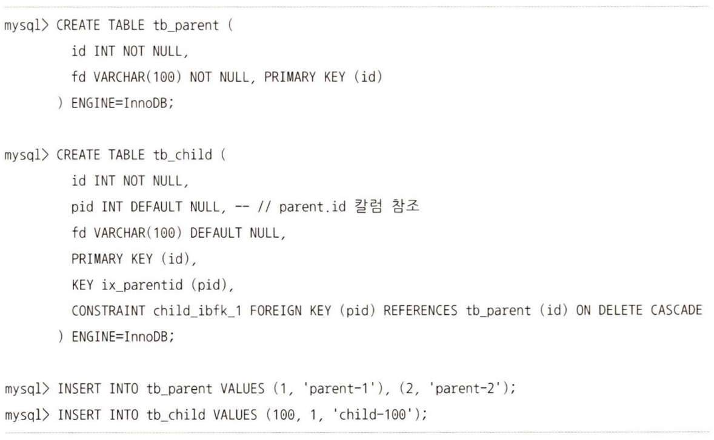
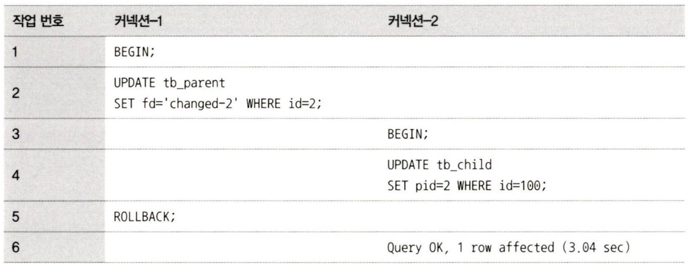
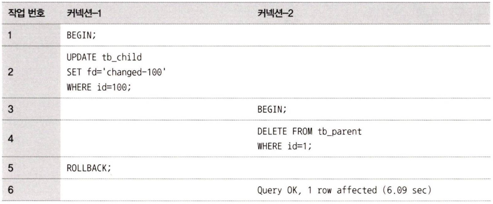

## 10. 외래키
MySQL에서 외래키는 InnoDB 스토리지 엔진에서만 생성할 수 있으며, 외래키 제약이 설정되면 자동으로 연관되는 테이블의 칼럼에 인덱스까지 생성된다. 외래키가 제거되지 않은 상태에서는 자동으로 생성된 인덱스를 삭제할 수 없다.

InnoDB의 외래키 관리에는 중요한 두 가지 특징이 있다.
- 테이블의 변경(쓰기 잠금)이 발생하는 경우에만 잠금 경합(잠금 대기)이 발생한다.
- 외래키와 연관되지 않은 칼럼의 변경은 최대한 잠금 경합(잠금 대기)을 발생시키지 않는다.

예시

### 10.1. 자식 테이블의 변경이 대기하는 경우

### 10.2. 부모 테이블의 변경 작업이 대기하는 경우

데이터베이스에서 외래 키를 물리적으로 생성하려면 이러한 현상으로 인한 잠금 경합까지 고려해 모델링을 진행하는 것이 좋다.