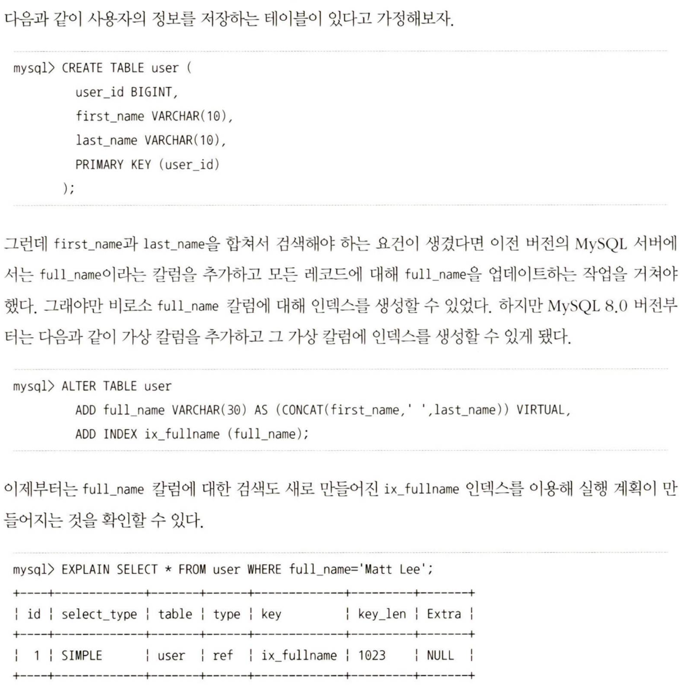
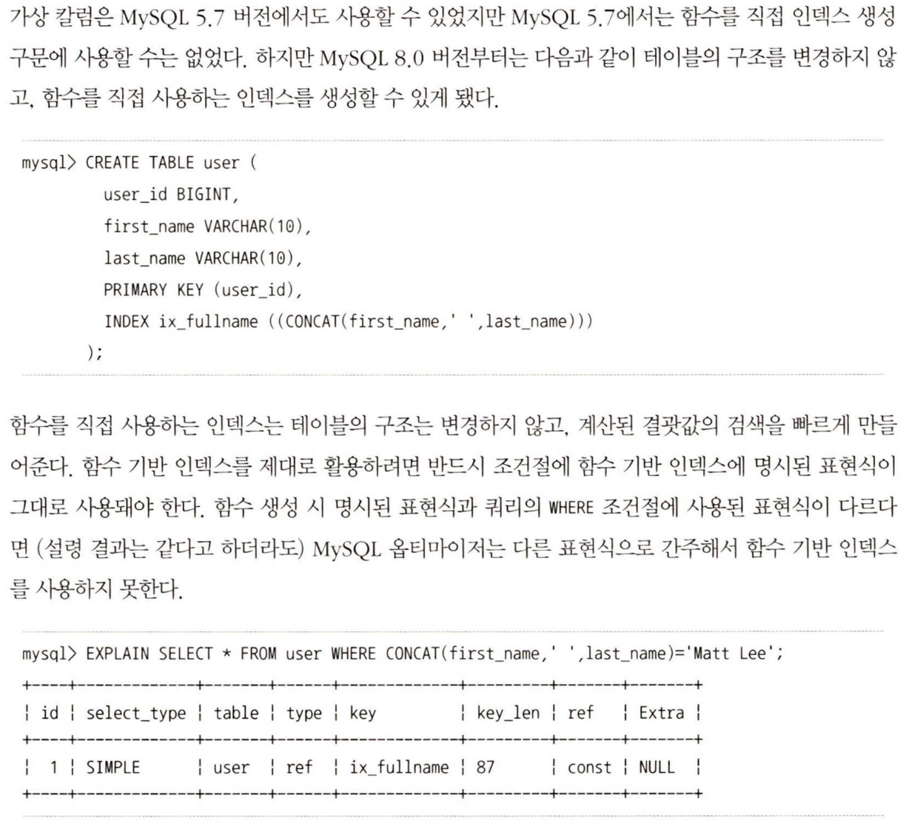

## 6. 함수 기반 인덱스
일반적인 인덱스를 칼럼의 값 일부(칼럼의 값 앞부분) 또는 전체에 대해서만 인덱스 생성이 허용된다. 하지만 때로는 칼럼의 값을 변형해서 만들어진 값에 대해 인덱스를 구축해야 할 때도 있는데, 이 경우 함수 기반 인덱스를 사용한다.
MySQL 서버의 함수 기반 인덱스는 인덱싱할 값을 계산하는 과정의 차이만 있을 뿐, 실제 인덱스의 내부 구조 및 유지관리 방법은 B-Tree 인덱스와 동일하다.

### 6.1. 가상 칼럼을 이용한 인덱스

### 6.2. 함수를 이용한 인덱스
