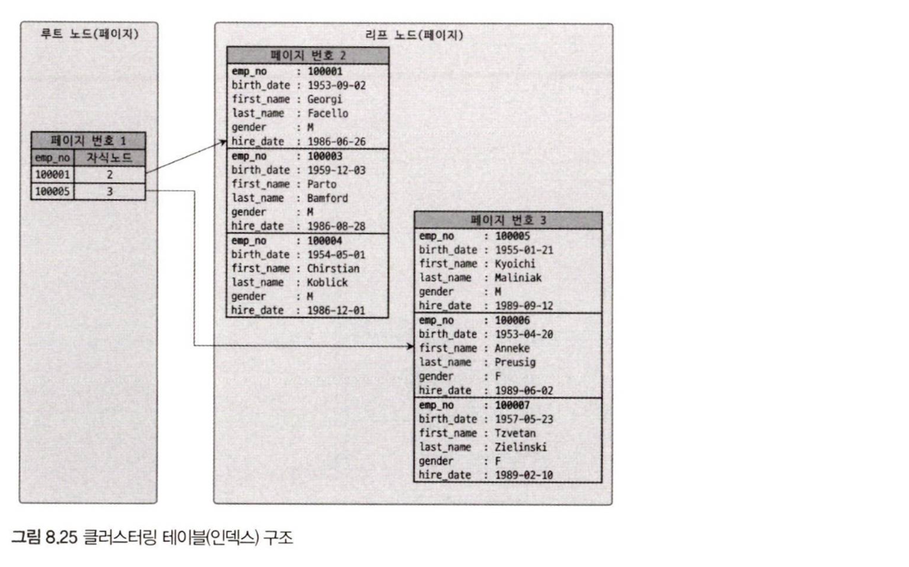
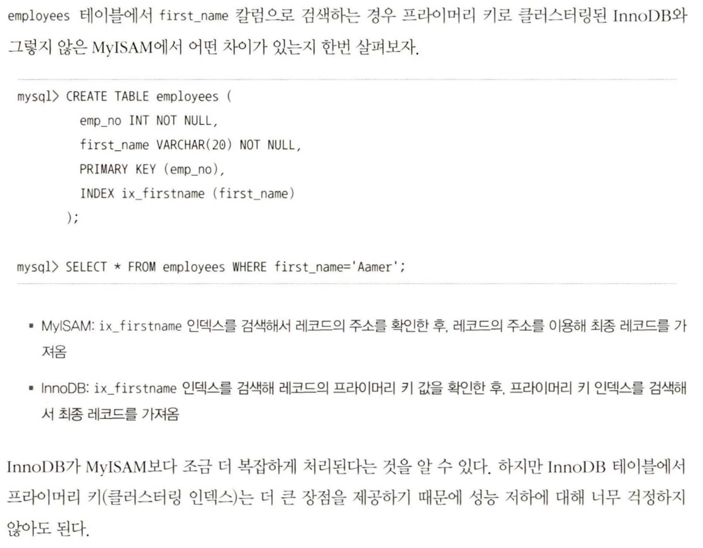
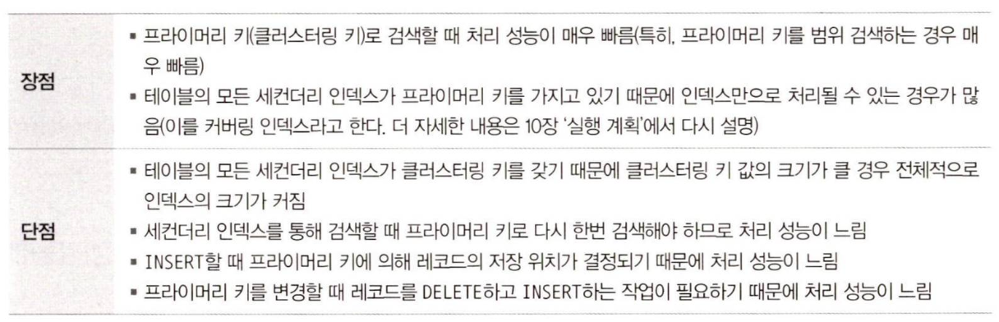

## 8. 클러스터링 인덱스
테이블의 레코드를 비슷한 것(프라이머리 키를 기준으로)들끼리 묶어서 저장하는 형태로 구현하는 것을 의미한다. 이는 주로 비슷한 값들을 동시에 조회하는 경우가 많다는 점에 착안한 것이다.

### 8.1 클러스터링 인덱스
- 클러스터링 인덱스는 프라이머리 키에서만 적용되는 내용이다.
- 프라이머리 키 값이 비슷한 레코드끼리 묶어서 물리적인 저장 위치에 저장하며, 프라이머리 키 값이 변경되면 저장 위치도 바뀌어야 한다.
- 클러스터링 테이블의 구조 : 테이블의 구조 자체는 B-Tree와 비슷하지만 세컨더리 인덱스를 위한 B-Tree의 리프 노드와 달리 레코드의 모든 칼럼이 같이 저장되어 있다. 즉, 클러스터링 테이블은 그 자체가 하나의 거대한 인덱스 구조로 관리된다.

- InnoDB 테이블은 항상 클러스터링 인덱스로 저장된다. 프라이머리 키가 없는 경우에는 InnoDB 스토리지 엔진이 다음 우선순위대로 프라이머리 키를 대체할 칼럼을 선택한다.

### 8.2 세컨더리 인덱스에 미치는 영향
- MyISAM이나 MEMORY 테이블 같은 클러스터링되지 않은 테이블은 INSERT될 때 처음 저장된 공간에서 절대 이동하지 않는다. 프라이머리 키나 세컨더리 인덱스의 각 키는 데이터 레코드가 저장된 주소(ROWID: 내부적인 레코드 아이디)를 이용해 실제 데이터 레코드를 찾아온다. 즉, MyISAM이나 MEMORY 테이블에서는 프라이머리 키와 세컨더리 인덱스는 구조적으로 아무런 차이가 없다. 
- InnoDB 테이블에서는 모든 세컨더리 인덱스가 해당 레코드가 저장된 주소가 아닌 프라이머리 키 값을 저장하도록 구현되어 있다.

### 8.3 클러스터링 인덱스의 장점과 단점

- 일반적으로 웹 서비스와 같은 온라인 트랜잭션 환경에서는 쓰기와 읽기의 비율이 2:8 또는 1:9 정도이기 때문에 조금 느린 쓰기를 감수하고 읽기를 빠르게 유지하는 것이 중요하다.

### 8.4 클러스터링 테이블 사용 시 주의사항
- 클러스터링 인덱스 키의 크기 : 프라이머리 키(클러스터링 키)의 크기가 커지면 세컨더리 인덱스도 자동으로 크기가 커지므로 프라이머리 키를 신중하게 선택해야 한다.
- 프라이머리 키는 AUTO-INCREMENT보다는 업무적인 칼럼으로 생성 : 프라이머리 키로 검색하는 경우(특히 범위로 많은 레코드를 검색하는 경우) 클러스터링되지 않은 테이블에 비해 매우 빠르게 처리된다.
- 프라이머리 키는 반드시 명시할 것 : InnoDB 테이블에서 프라이머리 키를 정의하지 않으면 엔진이 내부적으로 일련번호 칼럼을 추가하는데, 이 칼럼은 사용자가 전혀 접근할 수 없다.
- AUTO-INCREMENT 칼럼을 인조 식별자로 사용할 경우 : 여러 개의 칼럼이 복합으로 프라이머리 키가 만들어지는 경우 프라이머리 키의 크기가 길어질 때가 있는데, 프라이머리 키가 길어도 세컨더리 인덱스가 필요치 않다면 그대로 프라이머리 키를 사용하는 것이 좋다. 하지만 세컨더리 인덱스도 필요하고 프라이머리 키의 크기도 길다면 AUTO-INCREMENT 칼럼을 추가하고, 이를 프라이머리 키로 설정하는 것이 좋다. 이렇게 프라이머리 키를 대체하기 위해 인위적으로 추가된 프라이머리 키를 인조 식별자(Surrogate Key)라고 한다.