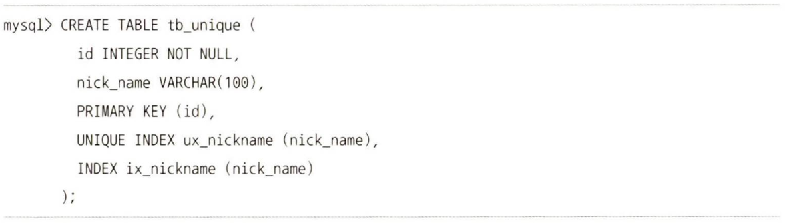

## 9. 유니크 인덱스
유니크는 사실 인덱스라기보다는 '테이블이나 인덱스에 같은 값이 2개 이상 저장될 수 없음'을 의미하는 제약 조건에 가깝다고 볼 수 있다. MySQL에서는 인덱스 없이 유니크 제약만 설정할 방법이 없으므로 유니크 인덱스를 사용한다.

### 9.1. 유니크 인덱스와 일반 세컨더리 인덱스의 비교
유니크 인덱스와 유니크하지 않은 일반 세컨더리 인덱스는 사실 인덱스의 구조상 아무런 차이점이 없다.
- 인덱스 읽기
    유니크 인덱스가 빠르다고 생각할 수 있지만 성능상의 차이는 미미하다.
- 인덱스 쓰기
    유니크 인덱스의 키 값을 쓸 때는 중복된 값이 있는지 없는지 체크하는 과정이 한 단계 더 필요하므로 유니크하지 않은 세컨더리 인덱스의 쓰기보다 느리다. MySQL에서는 유니크 인덱스에서 중복된 값을 체크할 때는 읽기 잠금을 사용하고, 쓰기를 할 때는 쓰기 잠금을 사용하는데 이 과정에서 데드락이 아주 빈번히 발생한다.

### 9.2. 유니크 인덱스 사용 시 주의사항
꼭 필요한 경우 유니크 인덱스를 생성하는 것은 당연하지만 성능이 더 좋아질 것으로 생각하고 불필요하게 유니크 인덱스를 생성하지는 않는 것이 좋다.

- 하나의 테이블에서 같은 칼럼에 유니크 인덱스와 일반 인덱스를 중복해서 생성하지 않도록 한다. MySQL의 유니크 인덱스는 일반 다른 인덱스와 같은 역할을 하므로 중복해서 인덱스를 생성할 필요는 없다.
    
- 똑같은 칼럼에 대해 프라이머리 키와 유니크 인덱스를 모두 생성하지 않도록 한다. 이 역시 불필요한 중복이다.