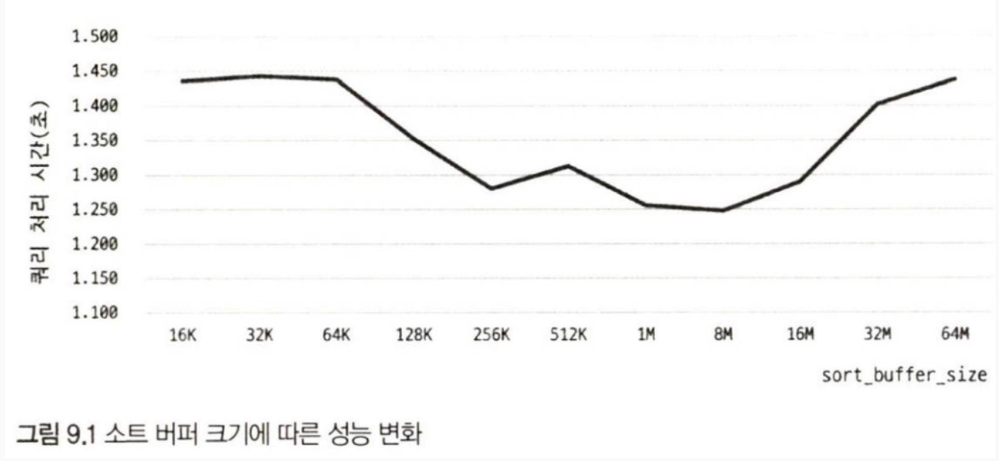

## 2. 기본 데이터 처리

### 2.1. 풀 테이블 스캔과 풀 인덱스 스캔

- 풀 테이블 스캔 : **인덱스를 사용하지 않고** 테이블의 데이터를 처음부터 끝까지 읽어서 요청된 작업을 처리

MySQL에서는 다음 조건에서 풀 테이블 스캔 실행

- 테이블의 레코드 건수가 너무 작아서 인덱스 사용보다 풀 스캔이 더 빠른 경우
- where이나 on에 인덱스 이용할 조건 없는 경우
- 조건이 일치하는 레코드가 너무 많은 경우

**MyISAM** 스토리지 엔진은 풀 테이블 스캔시 페이지를 하나씩 읽어옴.
**InnoDB** 스토리지 엔진은 특정 테이블의 연속된 데이터 페이지가 읽히면 백그라운드 쓰레드에 대해 **Read Ahead** 작업 진행.

> **Read Ahead**란? 어떤 영역의 데이터가 앞으로 필요해지리라는 것을 예측해서, 요청이 오기 전에 미리 디스크에서 읽어 **InnoDB 버퍼 풀**에 가져다 두는 것.

MySQL은 `innodb_read_ahead_threshold`시스템 변수를 사용하여 InnoDB 엔진이 **언제 Read Ahead를 시작할지** 임계값 설정 가능하다. Read Ahead는 풀 데이터 스캔과 풀 인덱스 스캔에서 동시에 사용된다.

- 풀 인덱스 스캔 : 인덱스를 처음부터 끝까지 스캔하는 것을 의미.

### 2.2. 병렬 처리

> 병렬 처리 : **하나의 쿼리**를 여러 스레드가 작업을 나누어 **동시에 처리**한다는 것을 의미. 

### 2.3. ORDER BY 처리(Using filesort)

정렬을 처리하는 두 가지 방법
- index
- Filesort

index 정렬의 한계점 : 아래와 같은 상황에서 모든 정렬을 인덱스를 이용하도록 튜닝하기란 거의 불가능하다.
- 정렬 기준이 너무 많아서 요건별로 모두 인덱스를 생성하는 것이 불가능한 경우
- GROUP BY의 결과 또는 DISTINCT같은 처리 결과를 정렬하는 경우
- UNION의 결과와 같이 임시 테이블의 결과를 다시 정렬해야 하는 경우
- 랜덤하게 결과 레코드를 가져와야 하는 경우

Filesort 특징 : 정렬해야 할 레코드가 많지 않으면 메모리에서 Filesort가 처리, 하지만 정렬 작업이 쿼리 실행 시 처리되므로 레코드 **대상 건수가 많아질수록 쿼리의 응답 속도가 느림.**

인덱스를 이용하지 않고 별도의 정렬 처리를 수행했는지는 실행 계획의 Extra 칼럼에 "Using filesort" 메세지로 표시됨.

#### Sort Buffer

> MySQL이 정렬을 수행하기 위한 별도의 메모리 공간을 말한다.
> Sort Buffer의 최대 공간은 `sort_buffer_size`라는 시스템 변수로 설정할 수 있다.

**정렬이 문제가 되는 상황**이란?
- 정렬해야 할 레코드 건수가 Sort Buffer로 할당된 공간보다 크다면?
	- 정렬해야 할 레코드를 여러 조각으로 나눠서 처리
	- 이 과정에서 임시 저장을 위해 **디스크 사용** (아주 큰 문제 발생)

메모리의 소트 버퍼에서 정렬 수행, 결과를 디스크에 임시 저장, 다음 레코드를 가져와서 정렬,  ....(반복)
-> 각 버퍼의 크기 만큼 정렬된 레코드를 다시 병합하면서 정렬을 수행(Multi-merge).
이 작업이 모두 디스크 I/O를 유발하며, 레코드 건수가 많을수록 이 반복 작업의 횟수가 많아진다.
의외인 점은, Sort Buffer크기를 크게 설정하면 디스크를 사용하지 않아서 더 빨라질 것으로 생각할 수도 있지만, 실제로는 큰 차이 보이지 않음.

#### 정렬 알고리즘

1. 싱글 패스 정렬 방식
Sort Buffere에 정렬 기준 칼럼을 포함해 **SELECT 대상이 되는 칼럼 전부를 담아서 정렬**을 수행하는 방식.
예를들어,  first_name으로 정렬을 원하는데, emp_no, last_name 등의 값을 전부 담는 방식이다.

2. 투 패스 정렬 방식
**정렬 대상 칼럼과 PK값만 소트 버퍼에 담아서 정렬을 수행**하고, 정렬된 순서대로 다시 PK로 테이블을 읽어서 SELECT할 칼럼을 가져오는 방식.

> 싱글 패스 방식은 DB를 한번만 읽어도 되지만, Sort buffer용량을 많이 소모한다.
> 투 패스 정렬 방식은 Sort buffer용량을 최소한으로 차지하지만, DB를 2번 읽고 다소 느리다.

최신 버전에서는 일반적으로 싱글 패스 정렬 방식을 사용한다. 하지만 다음 경우에는 투 패스 정렬을 사용한다.
- 레코드의 크기가 `max_lenght_for_sort_data` 시스템 변수에 설정된 값보다 클 때
- `BLOB`이나 `TEXT` 타입의 칼럼이 `SELECT` 대상에 포함할 때

#### 정렬 처리 방법의 성능 비교

1. 스트리밍 방식
서버 쪽에서 처리할 데이터가 얼마인지에 관계없이 조건에 일치하는 레코드가 **검색될 때마다 바로바로 클라이언트로 전송해주는 방식**을 의미한다. 마지막 레코드를 언제 받을지 알 수는 없지만, 이는 배제한다.

2. 버퍼링 방식
ORDER BY나 GROUP BY 같은 처리는 쿼리의 결과가 스트리밍되는 것을 불가능하게 한다. 우선 WHERE 조건에 일치하는 모든 레코드를 가져온 후, 정렬하거나 그루핑해서 차례대로 보내야 하기 때문이다.

#### 내부 임시 테이블 사용

MySQL 엔진이 스토리지 엔진으로부터 받아온 레코드를 정렬하거나 그루핑할 때는 내부 임시 테이블을 활용한다. 이는 CREATE 명령어로 만든 테이블이 아닌, 정말로 "임시적으로" 생성되는 테이블이다. 처음에는 메모리에 생성되었다가 테이블 크기가 커지면 디스크로 옮겨진다.
이 테이블은 쿼리의 처리가 완료되면 자동으로 삭제되며, 다른 세션 등에서 절때 확인/접근할 수 없다.

내부 임시 테이블을 사용하는 쿼리의 상황은 다음과 같다.

- ORDER BY, GROUP BY에 명시된 컬럼이 다른 쿼리
- ORDER BY나 GROUP BY에 명시된 컬럼이 JOIN의 순서상 첫 번째 테이블이 아닌 쿼리
- UNION이나 UNION DISTINCT가 사용된 쿼리

