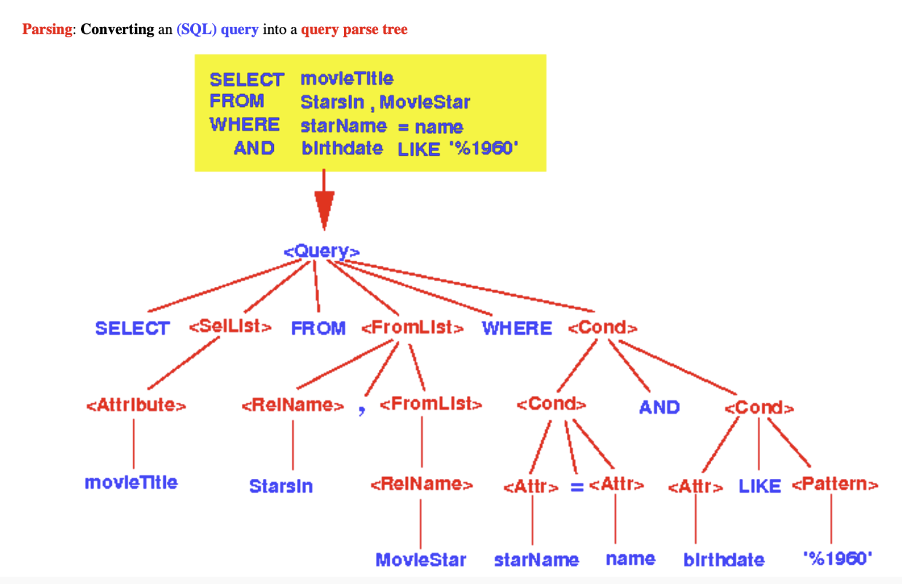

## 3. 고급 최적화
MySQL 서버의 옵티마이저가 실행 계획을 수립할 때 통계 정보와 옵티마이저 옵션을 결합해서 최적의 실행 계획을 수립한다. 
옵티마이저 옵션은 크게 조인 관련된 옵티마이저 옵션과 옵티마이저 스위치로 구분할 수 있다.

### 3.1. 옵티마이저 스위치 옵션

1. 사용자로부터 요청된 SQL 문장을 잘게 쪼개서 MySQL 서버가 이해할 수 있는수준으로 분리(파스 트리)한다.
	- SQL문장이 잘못되었다면 이 단계에서 오류 발생
	- SQL 파스 트리가 만들어지는 단계 
		

2. SQL의 파싱 정보(파스 트리) 를 확인하면서 어떤 테이블부터 읽고 어떤 인덱스를 이용해 테이블을 읽을지 선택한다.
	- 불필요한 조건 제거 및 복잡한 연산 단순화
	- 여러 테이블의 조인이 있는 경우 어떤 순서로 테이블을 읽을지 결정
	- 각 테이블에 사용된 조건과 인덱스 통계 정보를 이용해 사용할 인덱스 결정
	- 가져온 레코드들을 임시 테이블에 넣고 다시 한번 가공해야 하는지 결정

3. 두 번째 단계에서 결정된 테이블의 읽기 순서나 선택된 인덱스를 이용해 스토리지 엔진으로부터 **데이터를 가져온**다.

### 3.2. 조인 최적화 알고리즘
1. 규칙 기반 최적화(초기 오라클 DBMS)
	- 테이블의 레코드 건수나 선택도 등을 고려하지 않고 옵티마이저에 내장된 우선순위에 따라 실행 계획 수립
	- 통계 정보를 조사하지 않고 실행 계획이 수립

2. 비용 기반 최적화(현재 대부분의 DBMS)
	- 쿼리를 처리하 위한 여러 가지 가능한 방법 만듦.
	- 각 단위 작업 비용 정보와, 대상 테이블의 예측된 통계 정보를 이용해 실행 계획별 비용 산출.
	- 최소 비용 계획 실행.
