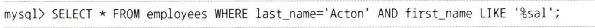
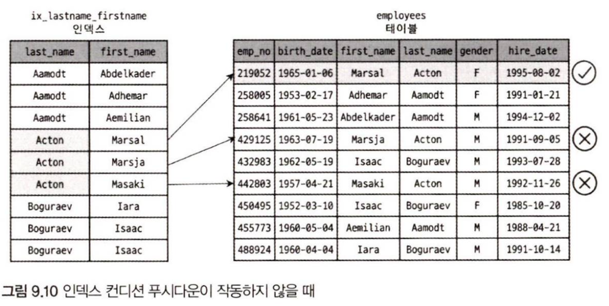
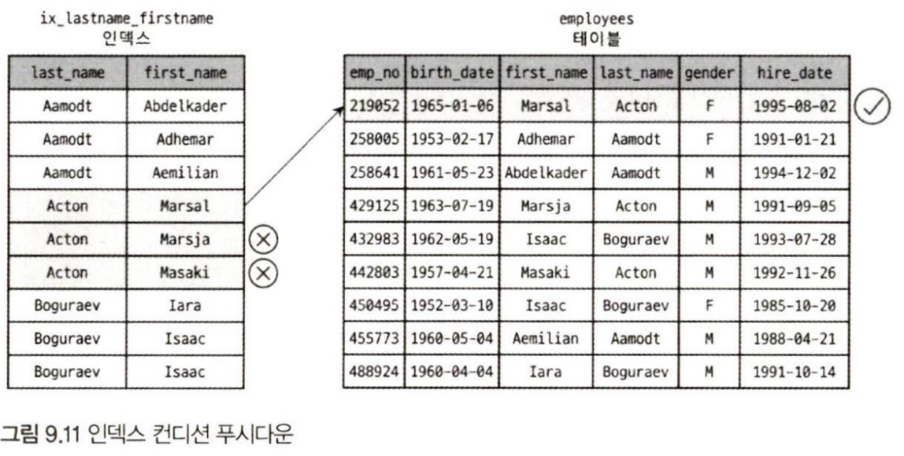
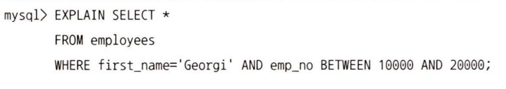
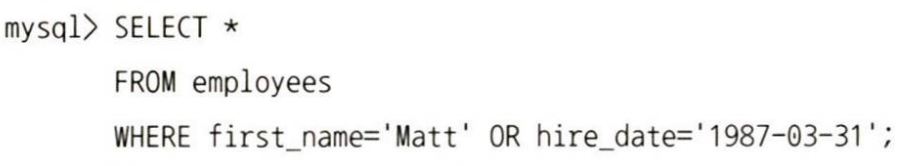
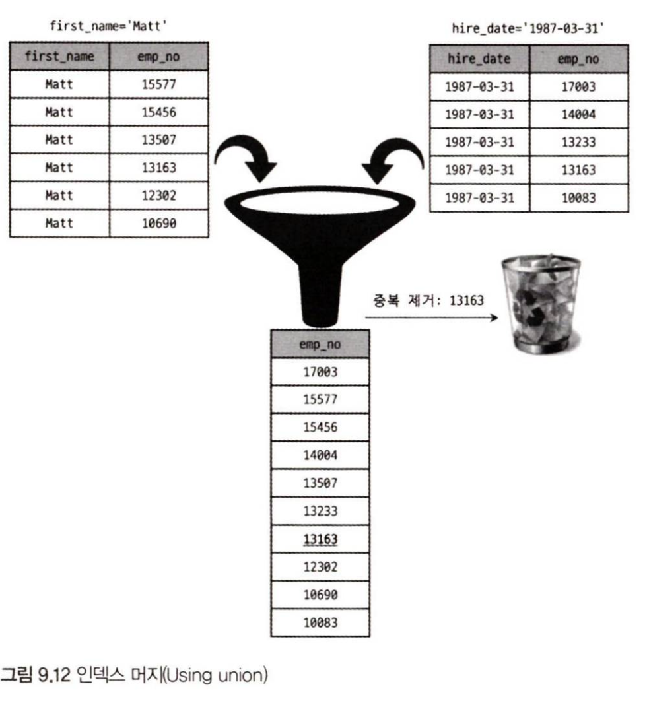
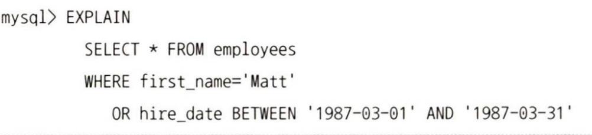
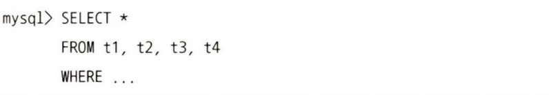
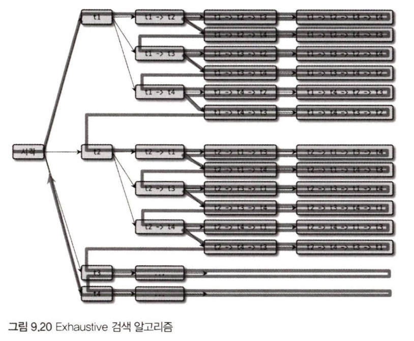
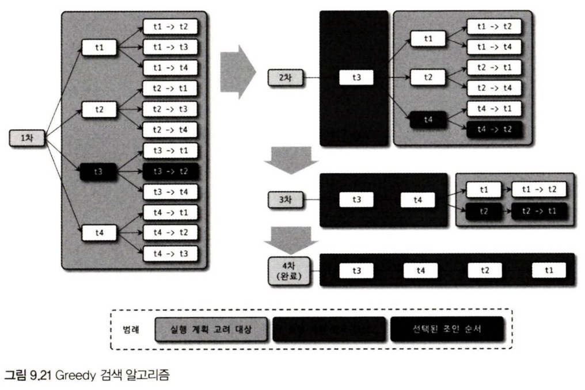

## 3. 고급 최적화
MySQL 서버의 옵티마이저가 실행 계획을 수립할 때 통계 정보와 옵티마이저 옵션을 결합해서 최적의 실행 계획을 수립한다. 
옵티마이저 옵션은 크게 조인 관련된 옵티마이저 옵션과 옵티마이저 스위치로 구분할 수 있다.

### 3.1. 옵티마이저 스위치 옵션
optimizer_switch 시스템 변수를 이용해 여러 최적화 옵션들을 on/off할 수 있다.

1. MRR과 배치 키 액세스(mrr & batched_key_access)
	- 네스티드 루프 조인(Nested Loop Join) : MySQL 서버에서 지금까지 지원하던 조인 방식으로, 드라이빙 테이블(조인에서 제일 먼저 읽는 테이블)의 레코드를 한 건 읽어서 드리븐 테이블(조인되는 테이블에서 드라이빙이 아닌 테이블들)의 일치하는 레코드를 찾아 조인을 수행한다.
조인 처리는 MySQL 엔진이 처리하고, 실제 디스크에 접근하여 레코드를 검색하고 읽는 부분은 스토리지 엔진이 담당한다.
네스티드 루프 조인 방식을 이용할 경우, 드라이빙 테이블의 한 레코드를 읽을 때마다 디스크에 접근하게 된다.
	- MRR(Multi-Range Read) : 조인 대상 테이블 중 하나로부터 레코드를 읽어 조인 버퍼에 버퍼링하고, 조인 버퍼가 가득 차면 스토리지에 한 번에 요청한다.
	- BKA(Batched Key Access) 조인 : MRR을 응용해서 실행되는 조인 방식

2. 블록 네스티드 루프 조인(block_nested_loop)
	- 네스티드 루프 조인 : 조인의 연결 조건이 되는 칼럼에 모두 인덱스가 있는 경우 사용되는 조인 방식이다. 이중 반복문처럼 작동한다고 해서 네스티드 루프 조인이라고 한다.
	- 블록 네스티드 루프 조인 : 조인 버퍼가 사용되는 네스티드 루프 조인 방식이다.

3. 인덱스 컨디션 푸시다운(index_condition_pushdown)
	- 인덱스를 범위 제한 조건으로 사용하지 못한다고 하더라도 인덱스에 포함된 칼럼의 조건이 있다면 모두 같이 모아서 스토리지 엔진으로 전달하도록 한다.
	
	employees 테이블에 ix_lastname_firstname (last_name, first_name)이라는 인덱스가 존재한다.
	이 때 위 쿼리에서 last_name='Acton' 조건은 인덱스를 레인지 스캔으로 사용할 수 있지만, first_name LIKE '%sal'조건은 인덱스 레인지 스캔으로 범위를 좁힐 수 없다. 따라서 first_name LIKE '%sal' 조건은 데이터를 모두 읽은 후 하나씩 비교해보는 조건(체크 조건 또는 필터링 조건이라 함)으로만 사용된다.
	
	인덱스 컨디션 푸시다운이 작동하지 않을 때 last_name='Acton' 조건만 이용하여 레코드를 읽은 후 first_name LIKE '%sal' 조건에 부합되는지 여부를 비교하게 된다. 가져온 3건의 레코드 중 1건만 조건에 일치한다.
	
	MySQL 5.6 버전부터는 위와 같이 인덱스를 이용해 최대한 필터링까지 완료해서 꼭 필요한 레코드 1건만 스토리지로부터 가져오도록 할 수 있다.
	
4. 인덱스 확장(use_index_extensions)
	- 모든 세컨더리 인덱스는 리프 노드에 프라이머리 키 값을 가진다.
	- 옵티마이저가 인덱스에 프라이머리 키에 포한되는 칼럼들이 숨어있다는 것을 인지하고 실행 계획을 수립하도록 한다.
   
5. 인덱스 머지(index_merge)
	- 하나의 테이블에 대해 2개 이상의 인덱스를 이용해 쿼리를 처리하는 방식이다.
	- 한 테이블에 대한 WHERE 조건이 여러 개 있더라고 하나의 인덱스에 포함된 칼럼에 대한 조건만으로 인덱스를 검색하고 나머지 조건은 읽어온 레코드에 대해 체크하는 형태로만 사용하는 것이 일반적이다.
	- 하지만 쿼리에 사용된 각각의 조건이 서로 다른 인덱스를 사용할 수 있고 그 조건을 만족하는 레코드 건수가 많을 것으로 예상되면 MySQL 서버는 인덱스 머지 실행 계획을 선택한다.

6. 인덱스 머지 - 교집합(index_merge_intersection)
	
	위 쿼리처럼 여러 조건이 AND로 연결된 경우 사용한다.
	employees 테이블의 first_name 칼럼과 emp_no 칼럼 모두 각각 인덱스를 가지고 있다. 이에 따라 옵티마이저는 두 인덱스를 머지하여 실행하기로 결정한다. 이 쿼리는 두 인덱스를 각각 검색해서 그 결과의 교집합만 반환한다.

7. 인덱스 머지 - 합집합(index_merge_union)
	
	위 쿼리처럼 여러 조건이 각각의 인덱스를 사용하되 OR 연산자로 연결된 경우 사용한다.
	두 인덱스를 각각 검색한 결과를 'Union'알고리즘으로 병합하여 두 집합의 합집합을 반환한다.

	

8. 인덱스 머지 - 정렬 후 합집합(index_merge_sort_union)
	'Union'알고리즘은 두 결과 집합의 중복을 제거하기 위해 정렬된 결과를 필요로 한다. 위 예시에서는 정렬이 필요치 않았지만 정렬이 필요한 경우에는 'Sort union' 알고리즘을 이용한다.
	
	위 쿼리에서 첫 번째 조건은 결과가 emp_no로 정렬되어 출력되지만, 두 번째 조건은 emp_no 칼럼으로 정렬되지 않는다.
	따라서 MySQL 서버는 두 집합의 결과에서 중복을 제거하기 위해 각 집합을 emp_no 칼럼으로 정렬한 다음 중복 제거를 수행한다.

9. 세미 조인(semijoin)

### 3.2. 조인 최적화 알고리즘
MySQL에는 조인 쿼리의 실행 계획 최적화를 위한 알고리즘이 2개 있다.

예시 쿼리

	- Exhaustive 검색 알고리즘
	
	MySQL 5.0과 그 이전 버전에서 사용되던 조인 최적화 기법으로, From 절에 명시된 모든 테이블의 조합에 대해 실행 계획의 비용을 계산해서 최적의 조합 1개를 찾는 방법이다. n개의 테이블이 있는 경우 가능한 조인 조합이 n!개가 되므로 n이 커질수록 시간이 크게 증가한다.

	- Greedy 검색 알고리즘
	
	Greedy하게 조인 순서를 결정하는 방식이다. optimizer_search_depth 시스템 변수에 설정된 값에 따라 최적화의 비용이 달라진다.

	- optimizer_search_depth 시스템 변수 : Greedy 검색 알고리즘과 Exhaustive 검색 알고리즘 중 어떤 것을 사용할지 결정하는 시스템 변수이다. 0~62까지의 정숫값을 설정할 수 있는데, 1~62까지의 값을 설정하면 그 개수만큼은 Exhaustive 알고리즘을 사용하고 이후에는 Greedy 방식을 사용한다. 0으로 설정하면 최적의 값을 옵티마이저가 자동으로 결정한다.

	- optimizer_prune_level 시스템 변수 : Heuristic 검색의 작동 여부를 0 또는 1로 지정할 수 있다. 
	* Heuristic 검색의 가장 핵심적인 내용은 다양한 조인 순서의 비용을 계산하는 도중 이미 계산했던 조인 순서의 비용보다 큰 경우에는 언제든지 중간에 포기할 수 있다는 것이다. 이외에도 아우터 조인으로 연결되는 테이블을 우선순위에서 제거하는 등 경험 기반의 최적화도 포함된다.